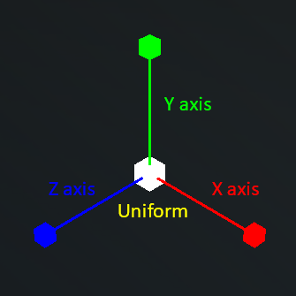
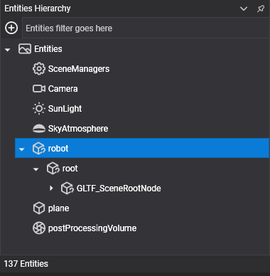

# Scene Editor

**Evergine** supports a complete **Scene Editor**. It allows for creating entities, modifying them, and adding/removing components. It contains the following sections:

- Scene Toolbar
- Scene Viewport
- Entities Hierarchy
- Entity Details

## Scene Toolbar

The scene toolbar contains useful controls for adjusting the scene during editing.

| Control | Description |
| ------- | ----------- |
|  | Camera selection. Allows the **Scene Viewport** to visualize one of the scene cameras. **Perspective** is the default value, representing the **Evergine Studio** camera. |
|  | Sets the transform manipulation in **Translation Mode**.|
|  | Sets the transform manipulation in **Rotation Mode**. |
|  | Sets the transform manipulation in **Scale Mode**. |
|  /  | Toggles the transform manipulation from local axis to global axis. |
|  | When enabled, translation manipulation is done by steps of a custom value (0.5, 1, 5, 10, 50, 100). |
|  | When enabled, rotation manipulation is done by steps of a custom value (5, 10, 15, 30, 45, 60, and 90 degrees). |
|  | When enabled, scale manipulation is done by steps of a custom value (0.001, 0.01, 0.1, 0.5, 1, 5, and 10). |
|  | Opens a dialog with the properties of the editor scene camera (more details below). |
|  | Toggles the visibility of the grid in the viewport. |

### Editor Camera Properties

This dialog sets the properties of the **Editor Camera**. This camera is the default camera when editing your scene. The properties shown in this panel are the same as those that appear when editing a **Camera3D** component. More information is in [this article](../../graphics/cameras.md).

## Scene Viewport

This area allows navigating the camera through the scene, as well as selecting, transforming, and manipulating all the entities of the scene (Cameras, Lights, and other types).

At the top of the viewport is the **Scene Toolbar**, where the user can adjust how the viewport behaves.

### Controls

| Action | Description |
| ------ | ----------- |
| **Left Mouse** | Selects an entity. |
| **Right Mouse** | Rotates the camera. |
| **Right Mouse + Arrows / WASD** | Moves the camera. |
| **Right Mouse + Mouse Wheel** | Changes camera speed up/down.|
| **Right Mouse + Shift** | Doubles the camera speed.|
| **Middle Mouse** | Pans the camera. |
| **Mouse Wheel** | Zooms in/out with the camera. |
| **Ctrl + D** | Duplicates the selected entity.|
| **G** | Toggles grid visibility. |
| **W** | Sets translating manipulation mode. |
| **E** | Sets rotating manipulation mode. |
| **R** | Sets scaling manipulation mode. |

### Basic Manipulation

When selecting an entity, a **Bounding Selection Box** will appear, along with a **manipulator** for adjusting the entity's **Transform3D**.

There are 3 different transform manipulations, selected by the above keys (W, E, and R), or through the **Toolbar**:

#### Translation

 

Moves the entity through the scene. It allows for translating the entity:

- **3 main axes** (X, Y, and Z) as a one-dimensional translation.
- **3 main surfaces** (XY, XZ, and YZ) as two-dimensional translations.

#### Rotation

 

Rotates the entity around one rotation axis. These axes are:

- **X axis**
- **Y axis**
- **Z axis**
- **Screen Axis**, rotating the entity around the camera (using the camera forward as the axis).

#### Scale

 

Scales the entity along one or more axes:

- **X axis**
- **Y axis**
- **Z axis**
- **Uniform**, scaling proportionally so the entity's proportions remain the same.

>[!NOTE]
> Scaling manipulations always use the local axis.

## Entities Hierarchy

This panel shows the entity tree of the scene. Every node represents an **entity**, so it reflects the entity hierarchy. When a node has children, it means that entity has some child entities.

#### Operations

- **Entities can be rearranged**. This will cause the entities to be relocated under another parent. When this operation is made, the overall world transform (scale, rotation, and translation) tries to remain constant during the process.
- **Entities can be removed**. Pressing the **Delete** button will delete the selected entity and all its children.
- **Double-clicking an entity** will focus on it in the **Scene Viewport**.
- **Clicking the**  **button** will show the **Add Entity dialog**. More details are in the [Using Entities](../component_arch/entities/using_entities.md) article.
- The bottom bar shows the **total number of entities** in the scene (_137 in the above image_).

## Entity Details

This panel shows all the properties of a selected entity. It displays all the entity parameters like **name**, **tag**, and enable status, and also shows an accordion panel of their components. Here are some specific controls:

#### Controls

| Control | Description |
| ------- | ----------- |
|  | Toggles the entity as a static entity. |
|  | Collapses the visibility of all the components. |
|  | Expands the visibility of all the components. |

More details are in the [Using Entities](../component_arch/entities/using_entities.md) article.