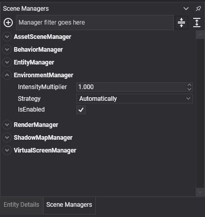
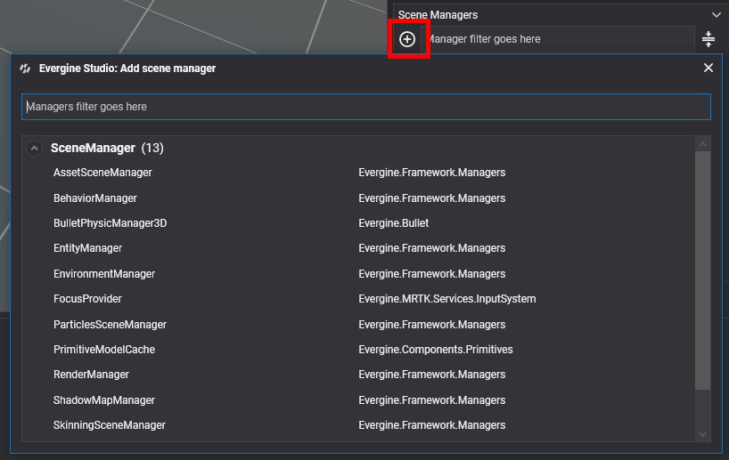
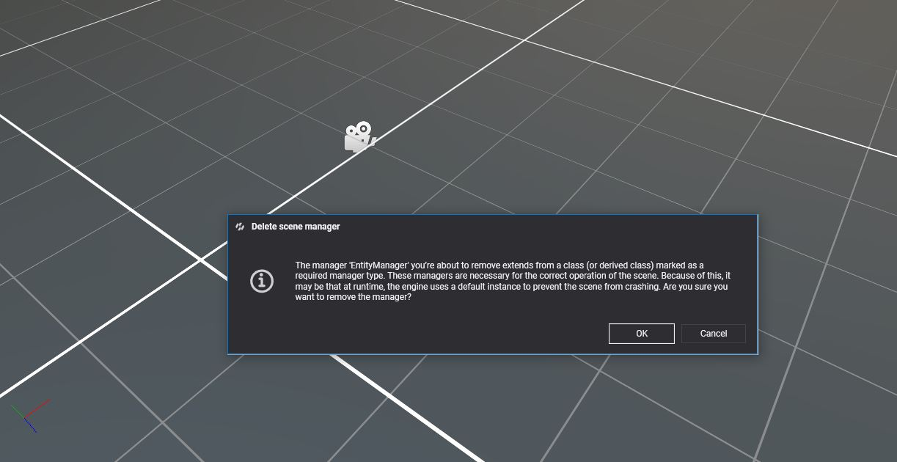

# Scene Managers

---



**Scene managers** are the subsystems of a scene. Each one controls one aspect of it for all entities at once: the `EntityManager` owns the entities, the `BehaviorManager` updates every behavior, the `RenderManager` draws every drawable. They are not attached to an entity because they belong to the whole scene, and components find them and register with them as they are attached.

Write your own scene manager when some state or logic belongs to a scene rather than to an entity, and when many components need to share it: a spawner, a level timer, a spatial index of your own.

All scene managers of a scene are reached through the `Scene.Managers` property, which is also available as `this.Managers` inside components and other scene managers.

## Default Scene Managers

Every scene registers these managers:

| Scene manager | Access property | Description |
| ------------ | ----------------|-------------|
| **EntityManager** | `this.Managers.EntityManager` | Owns the entities of the scene. See [EntityManager](../component_arch/entities/entity_manager.md). |
| **AssetSceneManager** | `this.Managers.AssetSceneManager` | Tracks the assets used by the scene. See [below](#assetscenemanager). |
| **BehaviorManager** | `this.Managers.BehaviorManager` | Updates every behavior of the scene, in `UpdateOrder`. See [Behaviors](../component_arch/components/behaviours.md). |
| **RenderManager** | `this.Managers.RenderManager` | Renders the scene: cameras, lights and drawables. See [Rendering](../../graphics/rendering_overview.md). |
| **EnvironmentManager** | `this.Managers.EnvironmentManager` | Controls the environment lighting of the scene: reflection probes, radiance and irradiance maps. See [Environment](../../graphics/environment/index.md). |
| **PhysicsManager** | `this.Managers.FindManager<PhysicsManager>()` | Manages the physics simulation. All the bodies, colliders and constraints are registered with this manager. More information in the [Physics Manager](../../physics/physics_manager.md) article. |

>[!NOTE]
> The **PhysicsManager** scene manager is not registered by default, although in the project template, it's loaded in the **RegisterManagers** method of the template scene class.

> [!TIP]
> `this.Managers.RenderManager` is typed as `BaseRenderManager`, the base class of every render manager. Members such as `DebugLines` and `LineBatch3D` belong to the `RenderManager` class, so bind it with `[BindSceneManager] private RenderManager renderManager;` when you need them.

### AssetSceneManager

The **AssetSceneManager** keeps track of the assets loaded for the scene. When the scene is disposed, it releases them, freeing their GPU memory. See [Use Assets](../../evergine_studio/assets/use.md).

## Create a Custom Scene Manager

Add a class to your project that derives from one of these base classes:

| Base class | Description |
| --- | --- |
| `SceneManager` | A manager with the [lifecycle](../lifecycle_elements.md) callbacks (`OnAttached()`, `OnActivated()`, `Start()`, `OnDetached()` and the rest) but no per-frame call. |
| `UpdatableSceneManager` | A `SceneManager` with an abstract `Update(TimeSpan gameTime)` method, called once per frame while the scene is playing. |

This manager keeps the time of day of a level. Behaviors and lights read it instead of each keeping their own clock:

```csharp
using System;
using Evergine.Framework.Managers;

namespace MyProject
{
    public class DayNightManager : UpdatableSceneManager
    {
        // Real seconds that a full day lasts.
        public float DayLengthInSeconds { get; set; } = 120;

        // From 0 (midnight) to 1 (the next midnight).
        public float TimeOfDay { get; private set; } = 0.25f;

        public override void Update(TimeSpan gameTime)
        {
            // gameTime is already scaled by Scene.Speed, so slow motion also slows the day.
            this.TimeOfDay = (this.TimeOfDay + ((float)gameTime.TotalSeconds / this.DayLengthInSeconds)) % 1;
        }
    }
}
```

Scene managers can use `[BindSceneManager]` to depend on other managers and `[BindService]` to depend on services. See [Bindings](../bindings/index.md).

## Using Scene Managers

### Register a Scene Manager

Register managers in the `RegisterManagers()` method of your [scene class](create_scenes.md), after calling the base implementation:

```csharp
public override void RegisterManagers()
{
    base.RegisterManagers();

    // Registered under its own type: DayNightManager.
    this.Managers.AddManager(new DayNightManager());
}
```

`AddManager<T>(T sceneManager)` registers the manager under the type `T` instead, which is useful when the code that looks it up only knows a base class. Only one manager can be registered per type: adding a second one logs a warning and the new instance is ignored.

A manager added to a scene that is already running is attached, activated and started straight away.

### Remove a Scene Manager

```csharp
// Remove a manager by instance.
this.Managers.RemoveManager(myManagerInstance);

// Or by the type it was registered with. For example, the next line will remove the PhysicsManager.
this.Managers.RemoveManager<PhysicsManager>();
```

`RemoveManager()` destroys the manager. Use `DetachManager()` instead to take it out of the scene without destroying it.

### Get a Scene Manager

#### With the [BindSceneManager] Attribute

Components and other scene managers can bind the manager they need (see [Bind Scene Managers](../bindings/bind_scenemanagers.md)):

```csharp
using System;
using Evergine.Framework;
using Evergine.Framework.Graphics;
using Evergine.Mathematics;

namespace MyProject
{
    public class SunController : Behavior
    {
        [BindSceneManager]
        private DayNightManager dayNight;

        [BindComponent]
        private Transform3D transform;

        protected override void Update(TimeSpan gameTime)
        {
            // Rotate the sun a full turn per day around the X axis.
            float angle = this.dayNight.TimeOfDay * MathF.PI * 2;
            this.transform.LocalRotation = new Vector3(angle, 0, 0);
        }
    }
}
```

#### With FindManager

`FindManager<T>()` returns the first registered manager that is a `T` or derives from it, or `null`. Pass `isExactType: true` to match only the exact type:

```csharp
DayNightManager dayNight = this.Managers.FindManager<DayNightManager>();

// This, for example, will return the PhysicsManager registered before.
PhysicsManager physics = this.Managers.FindManager<PhysicsManager>();

// The default managers also have shortcut properties.
EntityManager entityManager = this.Managers.EntityManager;
```

`FindManagers<T>()` returns all of them, and `RegisteredManagers` lists every manager of the scene.

## Scene Managers in Evergine Studio

Evergine Studio shows the managers of the open scene in the **Scene Managers** panel. It works like the **Entity Details** panel does for components: select a manager to edit its properties, and the values are saved with the scene.

<!-- CAPTURE: scene_managers_panel.png; the Scene Managers panel of Evergine Studio with the default managers of the template scene listed and the RenderManager selected, showing its properties -->

To add a manager, click the add button and search for it. The list includes the managers of Evergine and every manager in your project.



If one of your managers must not appear in that list, mark it with `[Discoverable(false)]`:

```csharp
using Evergine.Framework;
using Evergine.Framework.Managers;

namespace MyProject
{
    [Discoverable(false)]
    public class MyInternalManager : SceneManager
    {
    }
}
```

To remove a manager from the scene, right-click it and select the remove option. Some managers are required for the engine to work, and Evergine Studio asks for confirmation before removing one of them.


