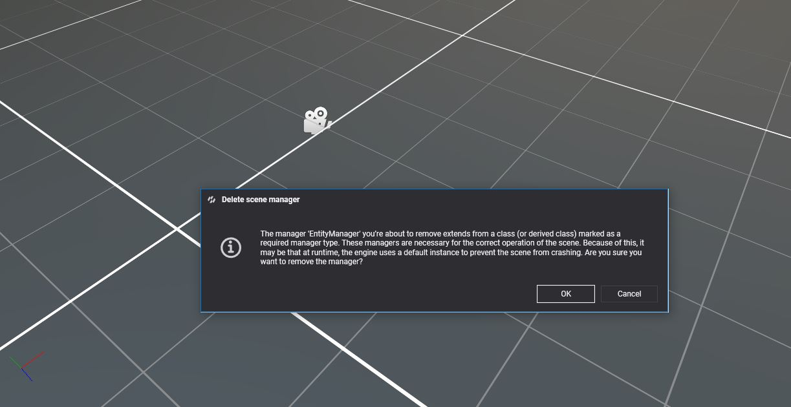

# Scene Managers

In **Evergine**, the **SceneManagers** are elements that control important aspects of the scene. They are not based on entities because they behave as global elements of the scene and cannot be attached to a specific entity.

All SceneManagers in a scene can be accessed using the `Scene.Managers` property. This allows for registering and accessing SceneManagers.

## Default SceneManagers.

**Evergine** scenes are created with some **SceneManagers** by default. These are:

| SceneManager | Access Property | Description |
| ------------ | ----------------|-------------|
| **EntityManager** | `this.Managers.EntityManager` | Controls the entities of the scene. More information in the [EntityManager](../component_arch/entities/entity_manager.md) article. |
| **AssetsSceneManager** | `this.Managers.AssetsSceneManager` | Controls the assets of the scene. More information below. |
| **BehaviorManager** | `this.Managers.BehaviorManager` | Manages the behavior update execution of the scene and their priority order. |
| **RenderManager** | `this.Managers.RenderManager` | Handles the **Rendering** of the scene. More information in the [Rendering](../../graphics/rendering_overview.md) article. |
| **EnvironmentManager** | `this.Managers.EnvironmentManager` | Controls the environmental information of the scene, including reflection probes, environmental radiance, and irradiance maps. More information in the [Environment](../../graphics/environment/index.md) article. |
| **PhysicsManager3D** | `this.Managers.PhysicsManager3D` | Manages the physics simulation. All the rigid or static bodies are registered with this manager. More information in the [Physics Manager and Bullet](../../physics/physicmanager_bullet.md) article. |

>[!NOTE]
> The **PhysicsManager3D** scene manager is not registered by default, although in the project template, it's loaded in the **RegisterManagers** method of the template scene class.

### Assets Scene Manager

The **AssetsSceneManager** controls all the assets loaded in the scene. When the scene is disposed, the **AssetsSceneManager** automatically unloads all the assets of the scene, releasing all the GPU memory in the process. More information in the [Use Assets](../../evergine_studio/assets/use.md) article.

## Create Custom SceneManager

In the previous section, we've covered all the default **SceneManagers** of the scene. However, you can create your own **SceneManager**.

To do this:
- Create a new class in the **Evergine** project in the **Visual Studio Solution**.
- Set the new class to inherit from the **SceneManager** class.

The newly created scene manager can use all the **lifecycle** methods like **OnAttached**, **OnDetached**, etc. More information in the [Life Cycle](../lifecycle_elements.md) article.

### UpdatableSceneManager

In addition, instead of creating a class that inherits from **SceneManager**, we can choose to inherit from **UpdatableSceneManager**. This class has an **Update** method that will be called in every frame. This is useful for managers that need to update some components in real-time. For example, **PhysicsManager3D** controls the physics simulation using this method.

## Using SceneManagers

### Register a Scene Manager
We can register a new **SceneManager** from code like this:

```csharp
// We can register a scene manager directly using the actual instance.
this.Managers.AddManager(new MyManager());

// Alternatively, we can register by type, which is useful when dealing with abstract classes.
this.Managers.AddManager<PhysicsManager3D>(new BulletPhysicsManager3D());
```

### Unregister a Scene Manager

We can also unregister a scene manager by calling the following function:

```csharp
// We can remove the manager using its instance.
this.Managers.RemoveManager(myManagerInstance);

// Or by type. For example, the next line will remove the BulletPhysicsManager3D manager that we registered in the previous section.
this.Managers.RemoveManager<PhysicsManager3D>();
```

### Obtaining a SceneManager

We can obtain a registered **SceneManager** in several ways.

#### Using [BindSceneManager] Attribute

With the [BindSceneManager] attribute in your Component or another custom SceneManager (See the [Binding article](../bindings/index.md)):

```csharp
public class MyComponent : Component 
{    
    [BindSceneManager]
    public RenderManager RenderManager;

    protected override void Start()
    {
        // Once the component is attached, the RenderManager property has been bound...
        this.RenderManager.DebugLines = true;
    }
}
```

#### Searching the SceneManager Directly

Using the `SceneManager.FindManager<T>()` you can find your desired manager:

```csharp
MyManager manager = this.Managers.FindManager<MyManager>();

// This, for example, will return the BulletPhysicsManager3D registered before.
PhysicsManager3D physics = this.Managers.FindManager<PhysicsManager3D>();

// For default SceneManagers, you can access them using quick properties :)
RenderManager renderManager = this.Managers.RenderManager;
```

## Scene Managers in Evergine Studio

Until _Evergine 2022.2.16_, the default scene template included an entity named _SceneManagers_ to configure some built-in managers. From now on, this entity is no longer included when you create a new scene, as scene managers are included in a separate panel.

 

In that panel, you have a user interface very similar to the _Entity Details_ panel, where you can manage components for an entity. In this case, you can manage scene managers for your scene. The behavior is the same: to add a new manager, just use the add button and search for the element you want.


By default, the managers search window will scan all available managers in your project and Evergine core libraries. If you don't want one of your custom managers to be selectable, mark your class with the _[Discoverable(false)]_ attribute.

```csharp
[Discoverable(false)]
public class MyManager : SceneManager
{
}
```

To remove a manager from a scene, just right-click over the element and select the remove option. There are a few managers that are required for the engine to work correctly, so you should be careful about removing them. A confirmation message will be displayed if you try to remove one of those managers.



### Migrating Older Scenes

For scenes created with _Evergine 2022.2.16_ or below, _Evergine Studio_ will ask you for an asset update once you open the scene file. It will automatically copy your custom values for shadows and environment managers located in the obsolete _SceneManagers_ entity to scene managers saved within your scene.

 

It is recommended to confirm the scene update when requested, but this process cannot be undone if, for some reason, you decide to go back to _Evergine 2022.2.16_. Once the scene asset is updated, the _SceneManagers_ entity will be removed and replaced by entries in the managers file section.