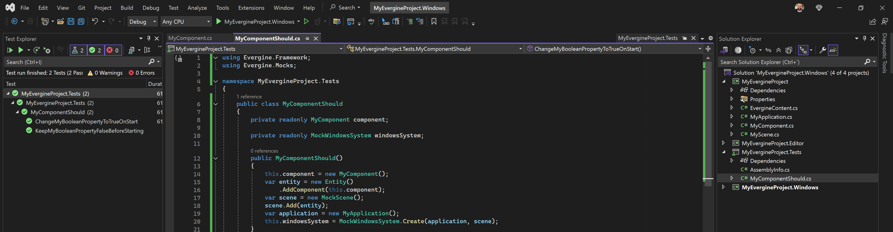
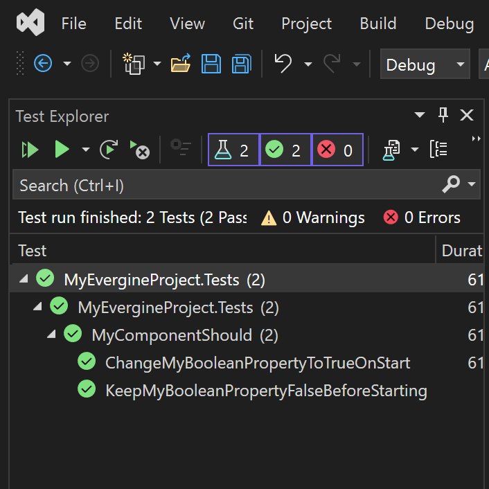

# Testing



In all of its forms, testing has became a good practice in the software industry. From speeding debugging scenarios up, to avoiding regressions, for having two examples, it has demostrated how efficient the technique is once we developers embrace it.

Testing applications made with Evergine can be difficult from the instant some of its pieces are involved: components, behaviors, drawables, services and so on. In the end, Evergine is highly coupled to a graphics backend, thus a GPU, and such are not usually available in every machine, nor help to automate the testing scenario.

## Approach

We officially provide Evergine.Mocks, distributed in its own NuGet package, which enables testing applications made with Evergine (inspired on [Xamarin.Forms.Mocks](https://github.com/jonathanpeppers/Xamarin.Forms.Mocks)). Its single goal is to enable testing logic, leaving out of scope drawables or anything related to rendering.

Most of our applications contain a bunch of components (it-self, or behaviors/drawables) which contain logic. Such components, usually, consume other artifacts from outside:
- other components
- services
- managers
- entities from its hierarchy

Beacause of this, isolating a component for testing is quite complicated. However, we can rely on a mock Windows System which, in a headless fashion, replicates the same behavior the app would have.

Evergine.Mocks is independant on the testing framework, although we always rely on [xUnit](https://xunit.net).

## Requirements

- Leave Application.Initialize() empty: refactor its entire logic into a separate public method, called from each WindowsSystem
   - This is needed to avoid tests setting the ScreenContext up and navigating to an actual Scene by default

```csharp
windowsSystem.Run(
    () =>
    {
        // Pull initialization logic from here...
        application.Initialize();
        // to here
        application.NavigateToMainScene();
    },
    () =>
    {
        [...]
    });
```

- Execute tests sequentially: Evergine currently does not support running tests in parallel
   - For example, you can configure it with xUnit by adding a new file AssemblyInfo.cs (if it is not already present) with the following line in it:

     ```csharp
     [assembly: Xunit.CollectionBehavior(DisableTestParallelization = true)]
     ```

## Create your first test

0. Make sure you have already followed above requirements
1. Create a project to hold the tests (we use to name it equal to the Evergine project, plus ".Tests" at the end) targetting the same .NET version as the Evergine's one (the one referenced by every launcher). Choose one option:
   - Visual Studio already has the template xUnit Test Project ready to use
   - Create a new Class Library project and add xUnit
2. Add a project reference to the Evergine's one
3. Add Evergine.Mocks package reference (double check it shares the same version as the rest of Evergine dependencies)
4. Back to the Evergine project, create the following component:

```csharp
public class MyComponent : Component
{
    public bool MyBooleanProperty { get; private set; }

    protected override void Start()
    {
        base.Start();
        this.MyBooleanProperty = true;
    }
}
```

5. Back to the tests project, add the following class:

```csharp
public class MyComponentShould
{
    private readonly MyComponent component;

    private readonly MockWindowsSystem windowsSystem;

    public MyComponentShould()
    {
        this.component = new MyComponent();
        var entity = new Entity()
            .AddComponent(this.component);
        var scene = new MockScene();
        scene.Add(entity);
        var application = new MyApplication();
        this.windowsSystem = MockWindowsSystem.Create(application, scene);
    }

    [Fact]
    public void KeepMyBooleanPropertyFalseBeforeStarting()
    {
        // Arrange

        // Act

        // Assert
        Assert.False(this.component.MyBooleanProperty);
    }

    [Fact]
    public void ChangeMyBooleanPropertyToTrueOnStart()
    {
        // Arrange

        // Act
        this.windowsSystem.RunOneLoop(TimeSpan.FromSeconds(1d / 60));

        // Assert
        Assert.True(this.component.MyBooleanProperty);
    }
}
```

6. Run tests at the Test Explorer panel (View, Test Explorer) by clicking on the play button:


