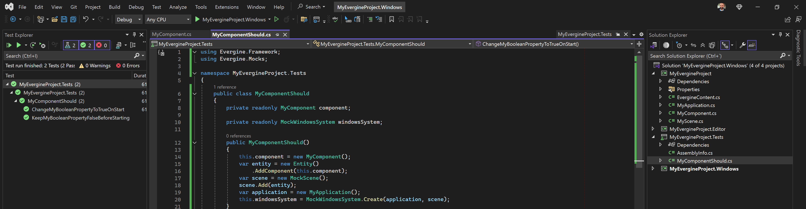
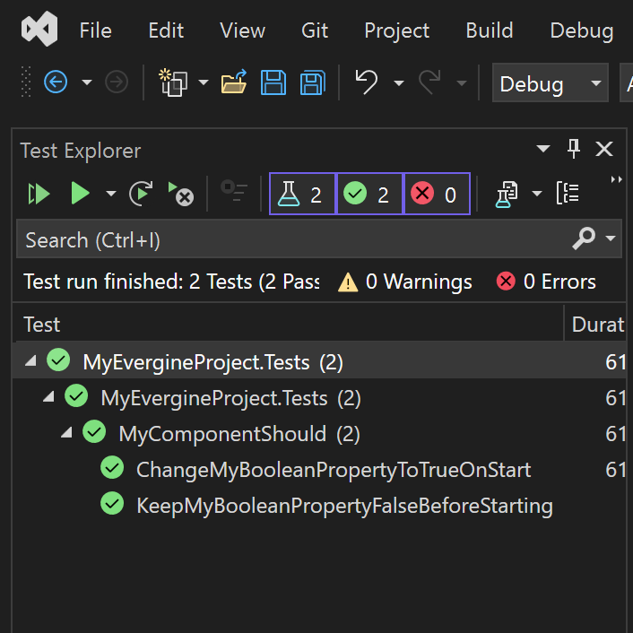

# Testing

---



Unit tests catch regressions early and make debugging faster, but Evergine code is hard to test in isolation: a component depends on its entity, on other components, on scene managers and on services, and all of them expect a running application with a window and a GPU. Test machines and build agents usually have neither.

**Evergine.Mocks** solves this. It is a NuGet package that runs a real Evergine application headless, inside a unit test, with a mock window, mock input devices and a mock GPU. Your components, behaviors and services run exactly as they do in the app, through their full [lifecycle](lifecycle_elements.md), and you advance the application one frame at a time from the test.

Evergine.Mocks does not depend on a test framework. The examples on this page use [xUnit](https://xunit.net).

## What Evergine.Mocks Provides

| Type | Namespace | Description |
| --- | --- | --- |
| `MockWindowsSystem` | `Evergine.Mocks` | A window system without a real window. `Create(application, scene)` sets up the application with a mock window and a mock GPU, initializes it and navigates to your scene. `RunOneLoop(elapsedTime)` then runs one `UpdateFrame()` and `DrawFrame()`. |
| `MockScene` | `Evergine.Mocks` | A scene you fill from the test with `Add(entity)`. The entities are added to the `EntityManager` when the scene is created. |
| `MockKeyboardDispatcher` | `Evergine.Mocks` | Simulates the keyboard: `Press(key)`, `Release(key)` and `Type(text)`. Reached through `MockWindowsSystem.KeyboardDispatcher`. |
| `MockMouseDispatcher` | `Evergine.Mocks` | Simulates the mouse: `Enter(x, y)`, `Move(x, y)`, `Press(button)`, `Release(button)`, `Scroll(direction)` and `Leave(x, y)`. Reached through `MockWindowsSystem.MouseDispatcher`. |
| `MockTouchDispatcher` | `Evergine.Mocks` | Simulates touch: `TouchDown(id, position)`, `TouchMove(id, position)`, `TouchUp(id, position)` and `ResetTouches()`. Reached through `MockWindowsSystem.TouchDispatcher`. |
| `MockGPUGraphicsContext` | `Evergine.Mocks.Rendering` | A `GraphicsContext` that needs no GPU. See [The Mock GPU](#the-mock-gpu). |

## Prepare Your Application

`MockWindowsSystem.Create()` calls `Initialize()` on your application and then navigates to the scene you give it. If `Initialize()` also navigates to your main scene, as the one in the project template does, both scenes would be loaded. Move the navigation out of `Initialize()` into its own method:

```csharp
public partial class MyApplication : Application
{
    public MyApplication()
    {
        // ... the services registered by the project template ...
    }

    public override void Initialize()
    {
        base.Initialize();

        // No navigation here, so tests can choose the scene.
    }

    public void NavigateToMainScene()
    {
        var screenContextManager = this.Container.Resolve<ScreenContextManager>();
        var assetsService = this.Container.Resolve<AssetsService>();

        var scene = assetsService.Load<MyScene>(EvergineContent.Scenes.MyScene_wescene);
        screenContextManager.To(new ScreenContext(scene));
    }
}
```

Then call it from the launcher of every profile, right after `Initialize()`. In the Windows launcher:

```csharp
windowsSystem.Run(
    () =>
    {
        application.Initialize();
        application.NavigateToMainScene();
    },
    () =>
    {
        var gameTime = clockTimer.Elapsed;
        clockTimer.Restart();

        application.UpdateFrame(gameTime);
        application.DrawFrame(gameTime);
    });
```

> [!TIP]
> If you prefer not to touch the launchers, give the test project an application class of its own that registers the same services and leaves `Initialize()` without navigation.

## Create the Test Project

1. Add a test project to the solution, named after your project with a `.Tests` suffix (for example `MyProject.Tests`). Target the same .NET version as the base project, `net10.0` in the current templates. The **xUnit Test Project** template of Visual Studio is a good starting point.
2. Add a project reference to the base project of your application.
3. Add a package reference to `Evergine.Mocks`, with the same version as the other Evergine packages of your project.

The project file ends up like this:

```xml
<Project Sdk="Microsoft.NET.Sdk">
  <PropertyGroup>
    <TargetFramework>net10.0</TargetFramework>
    <IsPackable>false</IsPackable>
    <IsTestProject>true</IsTestProject>
  </PropertyGroup>
  <ItemGroup>
    <PackageReference Include="Microsoft.NET.Test.Sdk" Version="18.3.0" />
    <PackageReference Include="xunit" Version="2.9.3" />
    <PackageReference Include="xunit.runner.visualstudio" Version="3.1.5" />
    <!-- Use the Evergine version of the rest of your project. -->
    <PackageReference Include="Evergine.Mocks" Version="x.x.x.x" />
  </ItemGroup>
  <ItemGroup>
    <ProjectReference Include="..\MyProject\MyProject.csproj" />
  </ItemGroup>
</Project>
```

4. Run the tests one at a time. `Application.Current` is static, so two tests running in parallel would share it. With xUnit, add a file such as `AssemblyInfo.cs` with this line:

```csharp
[assembly: Xunit.CollectionBehavior(DisableTestParallelization = true)]
```

## Test a Component

This component, in the base project, sets a flag when it starts:

```csharp
using Evergine.Framework;

namespace MyProject
{
    public class MyComponent : Component
    {
        public bool IsReady { get; private set; }

        protected override void Start()
        {
            base.Start();
            this.IsReady = true;
        }
    }
}
```

The test builds an entity with the component, puts it in a `MockScene`, and creates the application. Nothing runs until the test calls `RunOneLoop()`, so it can check the state before and after the first frame:

```csharp
using System;
using Evergine.Framework;
using Evergine.Mocks;
using Xunit;

namespace MyProject.Tests
{
    public class MyComponentShould
    {
        private static readonly TimeSpan OneFrame = TimeSpan.FromSeconds(1d / 60);

        private readonly MyComponent component;

        private readonly MockWindowsSystem windowsSystem;

        public MyComponentShould()
        {
            this.component = new MyComponent();

            var entity = new Entity()
                .AddComponent(this.component);

            var scene = new MockScene();
            scene.Add(entity);

            var application = new MyApplication();
            this.windowsSystem = MockWindowsSystem.Create(application, scene);
        }

        [Fact]
        public void NotBeReadyBeforeTheFirstFrame()
        {
            Assert.False(this.component.IsReady);
        }

        [Fact]
        public void BeReadyAfterTheFirstFrame()
        {
            this.windowsSystem.RunOneLoop(OneFrame);

            Assert.True(this.component.IsReady);
        }
    }
}
```

xUnit creates a new instance of the test class for every test, so each test gets a fresh application and scene.

Run the tests from the **Test Explorer** panel (**View > Test Explorer**) by clicking the run button:



## Test Input

Behaviors that read the keyboard, the mouse or touch get their input from the mock dispatchers, which you drive from the test. This behavior moves its entity up while the up arrow is held:

```csharp
using System;
using Evergine.Common.Input.Keyboard;
using Evergine.Framework;
using Evergine.Framework.Graphics;
using Evergine.Framework.Services;

namespace MyProject
{
    public class Elevator : Behavior
    {
        [BindService]
        private GraphicsPresenter graphicsPresenter;

        [BindComponent]
        private Transform3D transform;

        // Units per second.
        public float Speed { get; set; } = 1;

        protected override void Update(TimeSpan gameTime)
        {
            var keyboard = this.graphicsPresenter.FocusedDisplay?.KeyboardDispatcher;

            if (keyboard?.IsKeyDown(Keys.Up) == true)
            {
                var position = this.transform.Position;
                position.Y += this.Speed * (float)gameTime.TotalSeconds;
                this.transform.Position = position;
            }
        }
    }
}
```

The test presses the key between two frames and checks the result. A fixed frame time makes the expected movement exact:

```csharp
using System;
using Evergine.Common.Input.Keyboard;
using Evergine.Framework;
using Evergine.Framework.Graphics;
using Evergine.Mocks;
using Xunit;

namespace MyProject.Tests
{
    public class ElevatorShould
    {
        private static readonly TimeSpan OneSecond = TimeSpan.FromSeconds(1);

        private readonly Transform3D transform;

        private readonly MockWindowsSystem windowsSystem;

        public ElevatorShould()
        {
            this.transform = new Transform3D();

            var entity = new Entity()
                .AddComponent(this.transform)
                .AddComponent(new Elevator() { Speed = 2 });

            var scene = new MockScene();
            scene.Add(entity);

            this.windowsSystem = MockWindowsSystem.Create(new MyApplication(), scene);

            // The first frame starts the scene and its behaviors.
            this.windowsSystem.RunOneLoop(OneSecond);
        }

        [Fact]
        public void StayStillWithoutInput()
        {
            this.windowsSystem.RunOneLoop(OneSecond);

            Assert.Equal(0, this.transform.Position.Y);
        }

        [Fact]
        public void RiseWhileUpIsHeld()
        {
            this.windowsSystem.KeyboardDispatcher.Press(Keys.Up);
            this.windowsSystem.RunOneLoop(OneSecond);

            Assert.Equal(2, this.transform.Position.Y, precision: 3);
        }
    }
}
```

The mouse works the same way. Call `Enter()` first: it puts the pointer over the window, which is what `MouseDispatcher.IsMouseOver` reports to behaviors that check it:

```csharp
var mouse = this.windowsSystem.MouseDispatcher;

mouse.Enter(0, 0);
mouse.Press(MouseButtons.Left);
mouse.Move(100, 0);

this.windowsSystem.RunOneLoop(OneSecond);
```

## The Mock GPU

`MockWindowsSystem.Create()` registers a `MockGPUGraphicsContext` as the application's `GraphicsContext`, together with a mock swap chain and a display named `DefaultDisplay` of 1280 × 720 pixels. The mock context creates buffers, textures, shaders, pipeline states and command buffers that accept every call and do nothing with it.

That is enough for the whole render path to run: cameras compute their projection for the display, renderers submit their meshes, and drawables receive their `Draw()` calls, so rendering components can be part of a test instead of being left out. What you can assert on is state, such as the aspect ratio of a `Camera3D` or the objects a drawable created, not the pixels on screen: nothing is ever rasterized.

```csharp
[Fact]
public void ComputeTheAspectRatioOfTheDisplay()
{
    var camera = new Camera3D();
    var scene = new MockScene();
    scene.Add(new Entity().AddComponent(new Transform3D()).AddComponent(camera));

    var windowsSystem = MockWindowsSystem.Create(new MyApplication(), scene);
    windowsSystem.RunOneLoop(TimeSpan.FromSeconds(1d / 60));

    Assert.Equal(1280f / 720f, camera.AspectRatio, precision: 3);
}
```

> [!NOTE]
> `MockGPUGraphicsContext` reports `GraphicsBackend.DirectX11` as its backend, so code that branches on `GraphicsContext.BackendType` follows the DirectX 11 path in tests.

You can also create a `MockGPUGraphicsContext` yourself to test code that works directly with the [Low-level API](../graphics/low_level_api/index.md), without an application at all.
