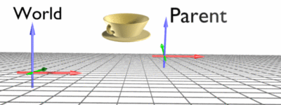

# Transform3D

---


`Transform3D` is the [component](component_arch/components/index.md) that places an entity in the 3D world. It stores the position, orientation and scale of the entity, both relative to its parent and in world space, and almost every other component depends on it: cameras, lights, renderers and physics bodies all read their placement from the `Transform3D` of their entity.

Every entity created in Evergine Studio has one, and entities created from code need one as soon as they must appear anywhere in the scene.

## Parent and Child Hierarchy

When an entity is the child of another entity, it moves, rotates and scales with its parent. Think of your arm and your body: when your body moves, your arm moves with it. Your hand is a child of your arm, and your fingers are children of your hand. See [Entity Hierarchy](component_arch/entities/entity_hierarchy.md).

## Local and World Space

Every transform value exists in two coordinate systems, or spaces:

* **World space** is the coordinate system of the whole scene. Its origin is the center of the scene, with no rotation and a scale of one.
* **Local space** is relative to the parent entity. For an entity without a parent, local space and world space are the same.

In the arm example, the world position of your hand is where it is in the room; its local position is where it is relative to your arm.



`Transform3D` keeps both in sync. Set a local property and the matching world property changes, and the other way round, so you can place a child at a world position and let the component compute the local one.

## Properties

### Local Space

| Property | Type | Default | Description |
| --- | --- | --- | --- |
| **LocalPosition** | `Vector3` | `Vector3.Zero` | The position relative to the parent. |
| **LocalOrientation** | `Quaternion` | `Quaternion.Identity` | The orientation relative to the parent. |
| **LocalRotation** | `Vector3` | `Vector3.Zero` | The orientation relative to the parent, as Euler angles in radians (pitch in X, yaw in Y, roll in Z). |
| **LocalScale** | `Vector3` | `Vector3.One` | The scale relative to the parent. |
| **LocalTransform** | `Matrix4x4` | `Matrix4x4.Identity` | The transformation relative to the parent, combining the local position, orientation and scale (a TRS matrix). |

> [!NOTE]
> Evergine calls quaternion properties **Orientation** and Euler angle properties **Rotation**. Both describe the same value.

> [!TIP]
> The orientation is stored as a quaternion. Prefer the `Orientation` properties: the `Rotation` ones convert to and from Euler angles on every access.

### World Space

| Property | Type | Description |
| --- | --- | --- |
| **Position** | `Vector3` | The position in world space. |
| **Orientation** | `Quaternion` | The orientation in world space. |
| **Rotation** | `Vector3` | The orientation in world space, as Euler angles in radians. |
| **Scale** | `Vector3` | The scale in world space. |
| **WorldTransform** | `Matrix4x4` | The matrix that transforms from local space to world space. |
| **WorldInverseTransform** | `Matrix4x4` | The inverse of `WorldTransform`: it takes a world position into the local space of this entity. |

> [!NOTE]
> The world values of a child depend on its parent, so moving, rotating or scaling the parent changes them even if the child's own local values stay the same.

### Direction Vectors

These read-only properties give the axes of the entity as unit vectors, already rotated. They are the simplest way to move an entity along its own axes.

| Property | Description |
| --- | --- |
| **Forward** / **Backward** | The direction the entity faces, and its opposite, in world space. |
| **Up** / **Down** | The up direction of the entity, and its opposite, in world space. |
| **Right** / **Left** | The right direction of the entity, and its opposite, in world space. |
| **LocalForward**, **LocalUp**, **LocalRight**, ... | The same directions in the local space of the parent. |

### Hierarchy

| Property | Description |
| --- | --- |
| **ParentTransform** | The `Transform3D` of the nearest ancestor that has one, or `null`. |
| **ChildrenTransform** | The `Transform3D` components of the children. |

## Methods

| Method | Description |
| --- | --- |
| **LookAt(Vector3 targetPosition)** | Rotates the entity so that its `Forward` points at the target, using `Vector3.Up` as the up vector. In world space. |
| **LookAt(Vector3 targetPosition, Vector3 up, bool forward = true)** | The same with a custom up vector. With `forward: false`, the entity points its `Backward` at the target. |
| **LocalLookAt(Vector3 targetPosition, Vector3 up, bool forward = true)** | The same, with the target and the result in local space. |
| **RotateAround(Vector3 point, Vector3 axis, float angle)** | Rotates the entity around a point in world space, changing both its position and its orientation. `angle` is in radians. |
| **RotateAround(Vector3 point, Quaternion quaternion)** | The same, with the rotation given as a quaternion. |
| **SetLocalTransform(Vector3 localPosition, Quaternion localOrientation, Vector3 localScale)** | Sets the three local values at once. |

> [!TIP]
> When you change position, orientation and scale together, call `SetLocalTransform()` instead of setting the three properties one by one: the transform, and every child below it, is invalidated once instead of three times.

## Events

Subscribe to these events to react when the transform changes. The local events are raised when the entity's own local values change. The world events are also raised when a parent moves, rotates or scales, because that changes the world values of its children.

| Event | Raised when |
| --- | --- |
| **LocalPositionChanged** | `LocalPosition` changes. |
| **LocalOrientationChanged** | `LocalOrientation` changes. |
| **LocalScaleChanged** | `LocalScale` changes. |
| **LocalTransformChanged** | `LocalTransform` changes. |
| **PositionChanged** | `Position` changes. |
| **OrientationChanged** | `Orientation` changes. |
| **ScaleChanged** | `Scale` changes. |
| **TransformChanged** | `WorldTransform` changes. |

## Examples

### Move Along the Entity's Own Axes

`Forward` and `Right` already include the orientation of the entity, so moving along them moves "ahead" and "sideways" whatever the entity is facing:

```csharp
using System;
using Evergine.Framework;
using Evergine.Framework.Graphics;
using Evergine.Mathematics;

namespace MyProject
{
    public class Patrol : Behavior
    {
        [BindComponent]
        private Transform3D transform;

        // Units per second.
        public float Speed { get; set; } = 2;

        // Radians per second.
        public float TurnSpeed { get; set; } = 0.5f;

        protected override void Update(TimeSpan gameTime)
        {
            float seconds = (float)gameTime.TotalSeconds;

            // Walk ahead while slowly turning, which traces a circle.
            this.transform.Position += this.transform.Forward * this.Speed * seconds;
            this.transform.Orientation *= Quaternion.CreateFromAxisAngle(Vector3.Up, this.TurnSpeed * seconds);
        }
    }
}
```

### Orbit and Face a Target

`RotateAround()` moves the entity around a point, and `LookAt()` keeps it facing that point:

```csharp
using System;
using Evergine.Framework;
using Evergine.Framework.Graphics;
using Evergine.Mathematics;

namespace MyProject
{
    public class OrbitCamera : Behavior
    {
        [BindComponent]
        private Transform3D transform;

        public Vector3 Target { get; set; } = Vector3.Zero;

        // Radians per second.
        public float AngularSpeed { get; set; } = 0.5f;

        protected override void Update(TimeSpan gameTime)
        {
            float angle = this.AngularSpeed * (float)gameTime.TotalSeconds;

            this.transform.RotateAround(this.Target, Vector3.Up, angle);
            this.transform.LookAt(this.Target, Vector3.Up);
        }
    }
}
```

### Convert Between Spaces

Set the world position of a child directly, and read back the local position that `Transform3D` computed for it:

```csharp
var parent = new Entity("Parent")
    .AddComponent(new Transform3D() { Position = new Vector3(10, 0, 0) });

var childTransform = new Transform3D();
var child = new Entity("Child").AddComponent(childTransform);
parent.AddChild(child);

this.Managers.EntityManager.Add(parent);

// Place the child at the world origin...
childTransform.Position = Vector3.Zero;

// ...which is ten units to the left of its parent.
Vector3 local = childTransform.LocalPosition; // (-10, 0, 0)
```
