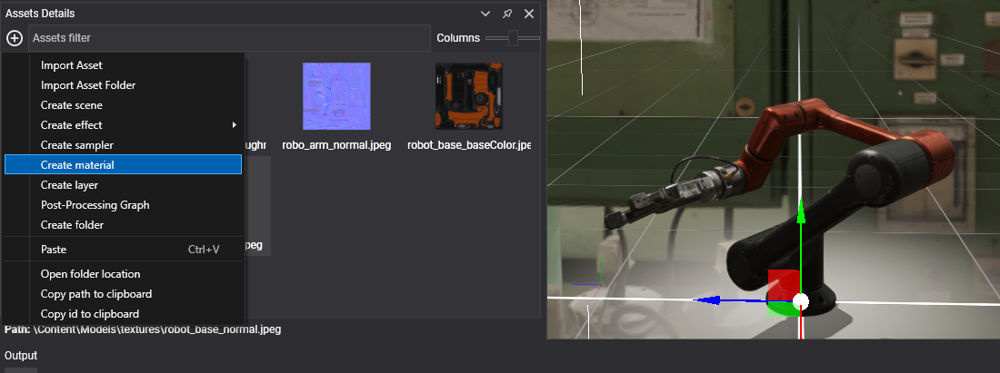
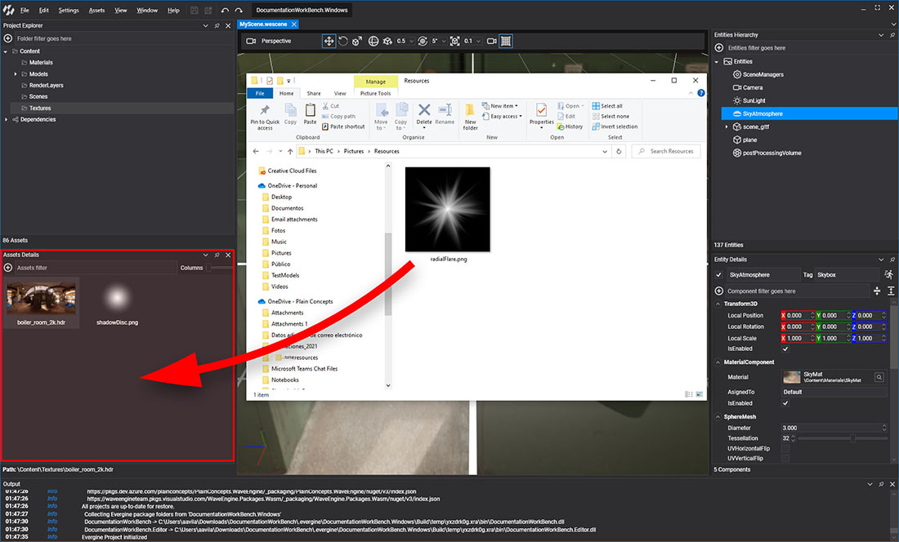
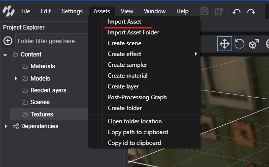
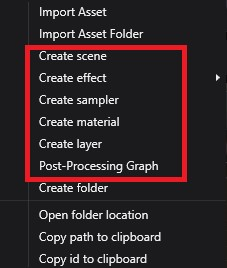
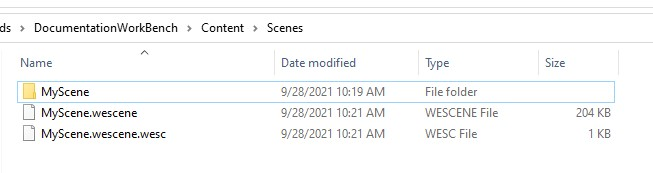

# Create Assets

<!-- CAPTURE: assets/Images/create_asset.mp4; 15 s video: drag a .png from File Explorer into Assets Details, then + > Create material, rename it, double-click it and assign the texture in the Material Editor -->

There are two ways to add an asset to a project, depending on its type:

* **Import** a source file (an image, a 3D model, a sound, a font or any other file). Evergine Studio creates the asset that wraps it.
* **Create** an Evergine asset, such as a scene, a material or an effect, directly from Evergine Studio.

In both cases the new asset is added to the folder currently selected in the **Project Explorer** panel.

## Import a source file

### Drag and drop

Drag one or more files from _File Explorer_ and drop them on the **Assets Details** panel. Evergine Studio copies each file into the current folder and creates the matching asset.

### Import Asset menu

You can also pick the files in a dialog with **Import Asset**, or copy a whole folder with **Import Asset Folder**. Both options are available in three places:

* The **Assets** menu of the main menu bar.
* The  button of the **Assets Details** panel.
* The context menu that opens when you right-click an empty area of the **Assets Details** panel.

### Asset type by extension

The extension of the file decides which asset is created:

| Asset type | Metafile extension | Source file extensions |
| --- | --- | --- |
| Texture | `.wetx` | `.jpg`, `.jpeg`, `.png`, `.bmp`, `.webp`, `.tga`, `.dds`, `.ktx`, `.ktx2`, `.hdr` |
| Model | `.wemd` | `.gltf`, `.glb`, `.fbx`, `.obj`, `.dae`, `.3ds` |
| Sound | `.wesn` | `.wav`, `.mp3`, `.ogg` |
| Font | `.weft` | `.ttf`, `.otf` |
| File | `.wefile` | Any other extension |

> [!NOTE]
> If the folder already contains a file with the same name, the imported file is renamed with a number suffix. For example, a second _texture.jpg_ becomes _texture(1).jpg_, and a third one _texture(2).jpg_.

## Create an Evergine asset

Assets that have no external source are created from the same three places: the **Assets** menu, the  button, and the context menu of the **Assets Details** panel.

<!-- CAPTURE: assets/Images/assetsMenu.jpg; replace with the develop Assets menu, which adds Generative assets and Create particle system -->

| Menu item | Asset | Metafile extension | Files created |
| --- | --- | --- | --- |
| **Create scene** | Scene | `.wesc` | `MyScene.wescene` with the entities, `MyScene.wescene.wesc`, and a `MyScene` folder for sub-assets such as the environment probe. |
| **Create effect > Graphics Effect** | Effect | `.wefx` | `MyGraphicEffect.wefx` and a `MyGraphicEffect/Sources` folder with `Shader.fx`. |
| **Create effect > Compute Effect** | Effect | `.wefx` | `MyComputeEffect.wefx` and its `Sources` folder. |
| **Create effect > Library Effect** | Effect | `.wefx` | `MyLibraryEffect.wefx` and its `Sources` folder. |
| **Create particle system** | Particle System | `.weps` | `MyParticleSystem.weps` |
| **Create sampler** | Sampler | `.wesp` | `MySampler.wesp` |
| **Create material** | Material | `.wemt` | `MyMaterial.wemt` |
| **Create layer** | Render Layer | `.werl` | `MyLayer.werl` |
| **Post-Processing Graph** | Post-Processing Graph | `.wepp` | `MyPostProcessingGraph.wepp` |
| **Create folder** | Folder | `.wedir` | A folder and its `.wedir` metafile. |

Prefabs are created differently: right-click an entity in the **Scene Hierarchy** panel of the Scene Editor and choose **Create prefab**. Evergine Studio saves the entity and its children as `<name>.weprefab`, with the metafile `<name>.weprefab.weprf`. See [Prefabs](../../basics/component_arch/prefabs/index.md).

To create a 3D model from a text prompt or a picture, use **Generative assets** in the same menu. See [Generate AI-Driven Assets](generate.md).

## Metafiles

Every asset has a **metafile**: a YAML file that stores its ID, its properties and one set of settings per [profile](../settings/project_profiles.md). The metafile is named after the file it describes, plus the extension of the asset type:

| File on disk | What it is |
| --- | --- |
| `Logo.png` | Source file of a texture. |
| `Logo.png.wetx` | Metafile of that texture. `EvergineContent.Textures.Logo_png` holds its ID. |
| `Floor.wemt` | A material. It has no source file, so the metafile is the whole asset. |

This is how a scene looks on disk: the `.wescene` file with the entities, its `.wesc` metafile, and the folder with the scene sub-assets.

Effects keep their source in a folder named after the asset:

> [!IMPORTANT]
> Keep the source file and its metafile together. If you move or rename assets outside Evergine Studio, move both files, or the asset loses its ID and every reference to it.
