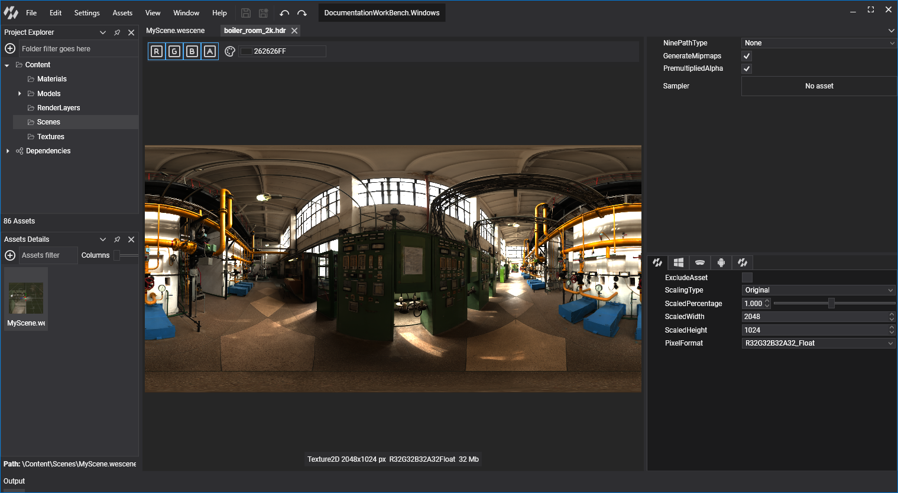
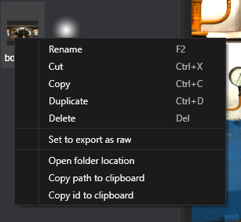
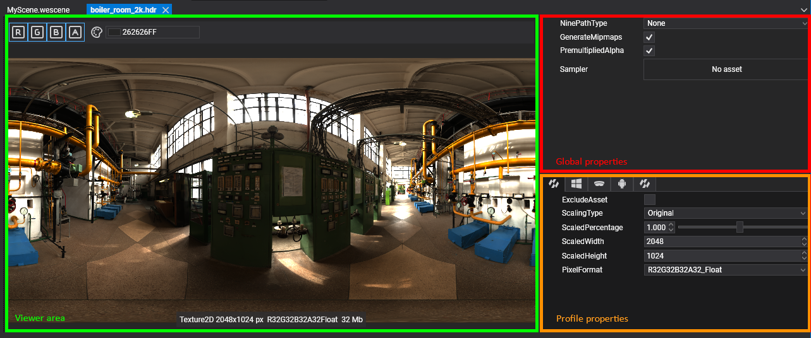
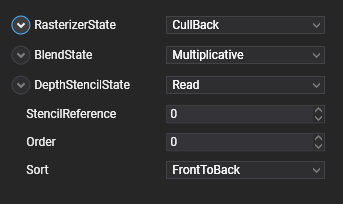
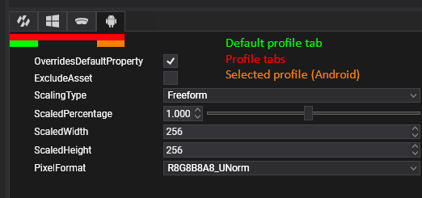
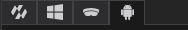
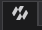

# Edit Assets

Each asset type has properties you can change in Evergine Studio, and most of them can take different values per **profile**. For example, you can halve the resolution of a texture or pick a different `PixelFormat` for the _Android_ profile while keeping the full-size texture on _Windows_.

This page covers the actions common to all assets and the parts every asset editor shares. The editor of each asset type is described in its own section; see the [list of asset editors](../interface.md#asset-editors).

## Context menu actions

Right-click an asset in the **Assets Details** panel to open its context menu.

| Action | Shortcut | Description |
| --- | --- | --- |
| **Rename** | F2 | Renames the asset. Its metafile is renamed with it and the ID does not change. |
| **Cut** | Ctrl+X | Marks the asset to be moved with **Paste**. |
| **Copy** | Ctrl+C | Marks the asset to be copied with **Paste**. |
| **Paste** | Ctrl+V | Available on folders. Moves or copies the cut or copied assets into the folder. |
| **Duplicate** | Ctrl+D | Creates a copy of the asset in the same folder, with a new ID. |
| **Delete** | Del | Deletes the asset, its metafile and its source file. |
| **Create Asset** | | Available on folders. Opens the same import and create items as the **Assets** menu. |
| **Set to export as raw** | | Copies the source file to the application output as is, instead of exporting the processed version. Load it with `LoadRaw<T>` (see [Use Assets](use.md#load-raw-assets)). The item changes to **Unset to export as raw** on raw assets. |
| **Open folder location** | | Opens _File Explorer_ in the folder that contains the asset. |
| **Copy path to clipboard** | | Copies the full path of the asset metafile. |
| **Copy id to clipboard** | | Copies the asset ID, the same `Guid` that `EvergineContent` exposes. |

> [!NOTE]
> Assets that belong to a dependency, such as the ones in **Evergine.Core**, are read-only. You can use them in your scenes and assets, but you cannot rename, move or modify them.

## Open an asset editor

Double-click an asset in the **Assets Details** panel, or select it and press **Enter**, to open its editor as a new tab in the document area. Assets marked to export as raw do not have an editor.

Editors differ by asset type, but most of them share three areas:

* The **viewer area**.
* The **global properties**.
* The **profile properties**.

Save your changes with **File > Save** (Ctrl+S), or **File > Save All** (Ctrl+Shift+S) to save every open editor.

### Viewer area

The viewer shows a live preview of the asset, often with a toolbar to change how it is displayed. For example:

* Show or hide the red, green, blue and alpha channels of a texture, or pick its mipmap level.
* Play and pause an animation of a model, or show its wireframe, normals and bounding box.
* Choose the geometry and background used to preview a material.

### Global properties

Global properties apply to the asset in every profile. This is the **Render Layer** editor, for example:

### Profile properties

Assets whose export can change per platform, such as textures, models and effects, have a **profile properties** area:

* **Profile tabs**:  The first tab  holds the default values. Then there is one tab per [project profile](../settings/project_profiles.md), with the icon of its platform.
* **OverridesDefaultProperty**: in a profile tab, enable it to give that profile its own values. While it is disabled, the profile uses the default values.
* **ExcludeAsset**: skips the asset when exporting that profile, so it is not included in the application. Use it for content that only makes sense on some platforms.
