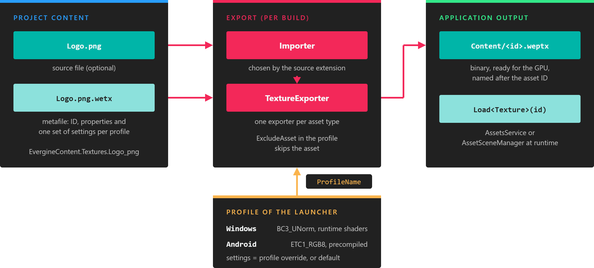

# Export Assets

*Exporting turns each asset into a binary file that is ready to load on the target platform.*

Evergine does not load source files such as `.png` or `.fbx` at runtime. When you build a launcher project, each asset is **exported**: its source file is imported, processed with the settings of the target profile, and written to a binary file that the engine can load quickly. An exported model, for example, contains vertex and index data that is copied straight into GPU buffers.

> [!NOTE]
> Evergine _can_ import some source files at runtime with `AssetsService.Load<T>(name, stream)`, which is useful for content downloaded by the application. That path relies on the importers of the `Evergine.Assets` assembly, is slower, uses more memory, and ignores the properties you set in Evergine Studio. See [Use Assets](use.md#load-an-asset-from-a-stream).

## When assets are exported

Assets are exported as part of the build of each launcher project, such as `MyProject.Windows`. The build uses the profile of that launcher, writes the exported files to an intermediate folder so that unchanged assets are not exported again, and copies them to the `Content` folder next to the application binaries. **File > Build & Run** in Evergine Studio builds and starts a Windows profile, and exports its assets on the way.

The exported files are named after the asset ID, for example `Content/01221b69-9685-4f0d-9862-6be704bd3cd2.weptx`. Your code does not need these names: it loads assets through the IDs in `EvergineContent`.

## Export pipeline

For every asset in the `Content` folder of the project and of its add-ons, the export does the following:

1. Reads the asset **metafile**.
2. Looks for the settings of the **profile** being built. If the asset overrides that profile (**OverridesDefaultProperty** in its editor), those values are used; otherwise the **default** profile values are used.
3. Skips the asset if **ExcludeAsset** is enabled in the chosen settings.
4. Imports the **source file**, if the asset has one, with the importer that matches its extension.
5. Runs the **exporter** of the asset type, which writes `<asset id>.<exported extension>` to the output.

Assets marked with **Set to export as raw** take a shortcut: the source file is copied to the output with its original name and folder, and a small `<asset id>.wepidx` index file records where it is, so `LoadRaw<T>` can find it by ID.

## Exported file extensions

| Asset type | Metafile | Exported file |
| --- | --- | --- |
| Texture | `.wetx` | `.weptx` |
| Model | `.wemd` | `.wepmd` |
| Sound | `.wesn` | `.wepsn` |
| Font | `.weft` | `.wepft` |
| Scene | `.wesc` | `.wepsc` |
| Prefab | `.weprf` | `.wepprf` |
| Effect | `.wefx` | `.wepfx` |
| Material | `.wemt` | `.wepmt` |
| Render Layer | `.werl` | `.weprl` |
| Sampler | `.wesp` | `.wepsp` |
| Particle System | `.weps` | `.wepps` |
| Post-Processing Graph | `.wepp` | `.weppp` |
| Reflection probe (scene sub-asset) | `.werp` | `.weprp` |
| File, or any asset exported as raw | `.wefile` | The original file, plus `.wepidx` |

## Per-profile export

Because the profile is chosen at export time, the same project produces different content for each platform. Typical uses are:

* Compressing textures with a GPU format that the platform supports, such as `BC3_UNorm` on Windows or `ETC1_RGB8` on Android. The default formats come from the profile; see [Manage Profiles](../settings/project_profiles.md).
* Scaling textures down on mobile devices.
* Precompiling effects for platforms that cannot compile shaders at runtime, such as Web and Android.
* Excluding assets that a platform does not use.

Set these values in the profile tabs of each asset editor, as described in [Edit Assets](edit.md#profile-properties).
