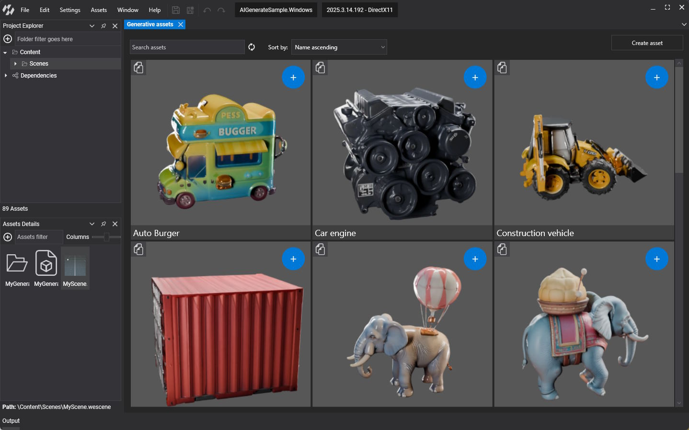
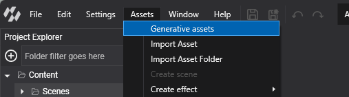
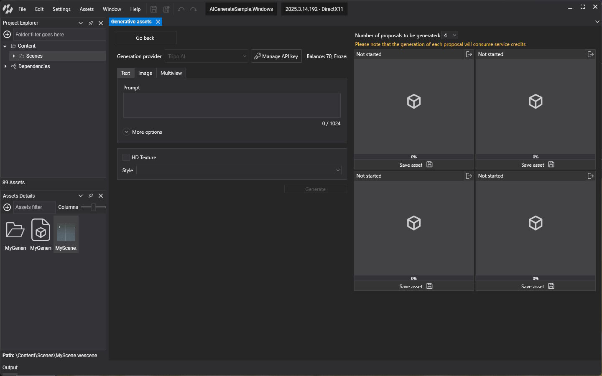
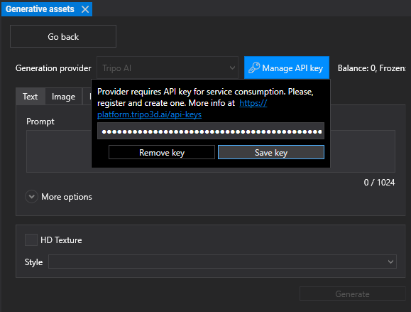
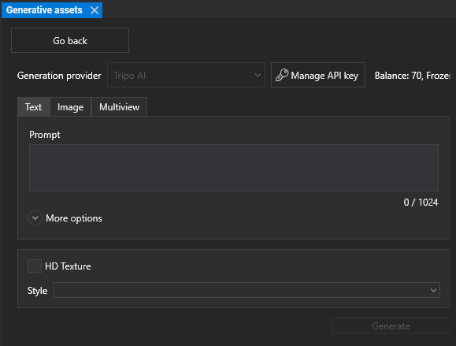
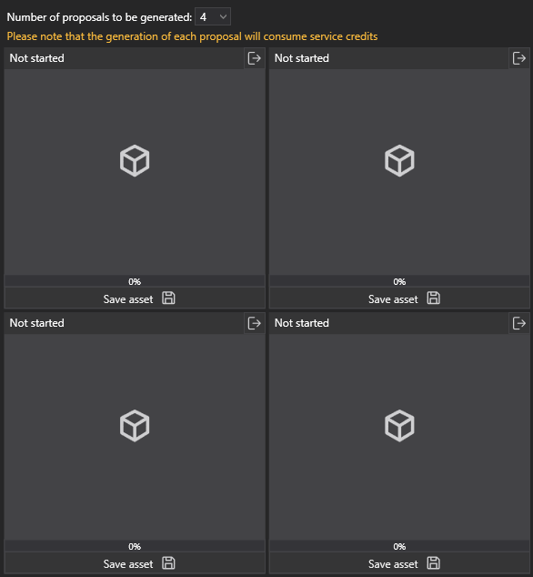

# Generate AI-Driven Assets

Evergine Studio can create 3D models with generative AI and add them to your project as regular **Model** assets. You describe the model with a text prompt, a reference image, or several pictures of the same object, and the generation service returns textured models you can preview, save to a personal gallery, and use in your scenes.

The current generation provider is [Tripo AI](https://platform.tripo3d.ai/). Generating models requires a Tripo AI account and API key, and each generation consumes credits from that account.

## Open the generative assets view

Select **Assets > Generative assets** in the main menu. The item is also available from the  button and the context menu of the **Assets Details** panel. The view opens as a new tab.

## Gallery

The view starts on the **gallery**, which lists the models you saved on this computer.

* Use **Search assets** and **Sort by** (name or creation date, ascending or descending) at the top to find a model.
* The button at the top left of a card reuses its prompt: it opens the generation view with the same text or images filled in.
* The **+** button at the top right of a card copies the model into the folder currently selected in the **Assets Details** panel.
* Right-click a card to rename or remove it.

Click **Create asset** to open the generation view.

## Generate a model

### Set up the API key

1. Create an API key on the [Tripo AI platform](https://platform.tripo3d.ai/api-keys).
2. In the generation view, click **Manage API key**.
3. Paste the key and click **Save key**. **Remove key** removes the stored key.

Once the key is valid, the view shows the balance of your Tripo AI account next to the button, so you can check the available credits before you generate.

### Choose the input

Pick the model version in the **Models** list, then choose one of the three input tabs:

| Tab | Input |
| --- | --- |
| **Text** | A **Prompt** that describes the model. Open **More options** to add a **Negative prompt** with features the model must not have. |
| **Image** | One reference image (`.jpg`, `.jpeg` or `.png`). Drop it on the area or click **Select image**. |
| **Multiview** | Up to four pictures of the same object: a front image, plus optional left, back and right images. |

### Additional options

* **HD Texture** requests detailed textures. It is available with the three inputs.
* **Style** applies a preset look, such as Cartoon, Clay, SteamPunk, Alien, Barbie, Christmas, Gold or Bronze.

### Generate several proposals

**Number of proposals to be generated** lets you ask for 1, 2 or 4 models from the same input. Evergine Studio runs them in parallel, and each proposal shows its own status and progress (_Not started_, _Queued_, _In progress_, _Finished_ or _Failed_).

> [!IMPORTANT]
> Each proposal is a separate generation and consumes its own credits. Four proposals cost four times as much as one.

If the service rejects a request, Evergine Studio shows the reason: an invalid API key, a rate limit, exhausted credits, or a prompt that the content policy does not allow.

## Save a model

Click **Save asset** under a finished proposal and enter a name. You can save the model **in the gallery**, **in the project**, or both. Saving in the project copies the model into the folder selected in the **Assets Details** panel, where it becomes a regular Model asset that you can drag into a scene.
