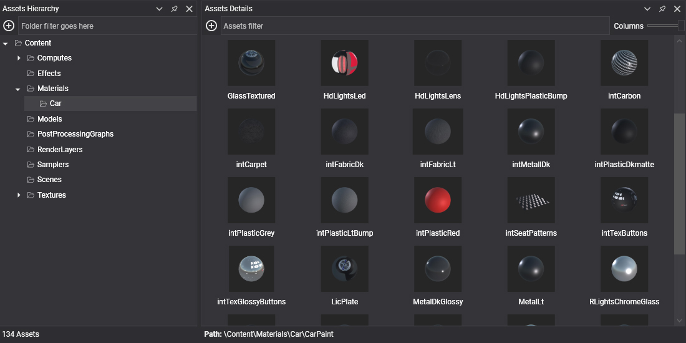

# Assets

An **asset** is any piece of content that your project uses: a 3D model, a texture, a sound, or an engine object such as a material, a sampler or a render layer. Evergine Studio shows the assets of the project in the **Project Explorer** and **Assets Details** panels, lets you edit them in dedicated editors, and exports them to an optimized binary format when you build the application.

Every asset is described by a small YAML **metafile** that stores its ID, its properties and the per-profile settings. Components and other assets reference an asset through that ID, so you can rename or move it without breaking anything.

*A source file (when there is one) and its metafile are combined with the settings of the target profile and exported to a binary file named after the asset ID.*

## Types of assets

### Assets with a source file

These assets wrap a file created with another application, such as _Blender_, _Photoshop_ or an audio editor. Import the file into Evergine Studio and it creates the asset for you.

| Asset | Description | Source file extensions |
| --- | --- | --- |
| [Texture](../../graphics/textures/index.md) | An image used as a texture. | `.jpg`, `.jpeg`, `.png`, `.bmp`, `.webp`, `.tga`, `.dds`, `.ktx`, `.ktx2`, `.hdr` |
| [Model](../../graphics/models/index.md) | A 3D model with meshes, materials, skeletons and animations. | `.gltf`, `.glb`, `.fbx`, `.obj`, `.dae`, `.3ds` |
| [Sound](../../audio/index.md) | Audio used for music and sound effects. | `.wav`, `.mp3`, `.ogg` |
| [Font](../../graphics/fonts/index.md) | A font used to render text. | `.ttf`, `.otf` |
| File | Any other file. It is copied to the application output as is, and you read it with `LoadRaw<T>`. | Any other extension |

### Assets created in Evergine Studio

These assets have no external source. You create them from the **Assets** menu, and some of them can also be built from code.

| Asset | Description |
| --- | --- |
| [Scene](../../basics/scenes/index.md) | The main asset of an application. It stores an entity hierarchy with its components and the scene managers. |
| [Prefab](../../basics/component_arch/prefabs/index.md) | A reusable entity hierarchy that can be instanced in any scene. Created from an entity in the **Scene Hierarchy** panel. |
| [Effect](../../graphics/effects/index.md) | A shader written in HLSL, with Evergine metatags. Evergine translates it to the shading language of each graphics backend. It can be a graphics, compute or library effect. |
| [Material](../../graphics/materials/index.md) | Describes how a surface is rendered. It references an effect and sets its parameters, such as textures and colors. |
| [Render Layer](../../graphics/renderlayers/index.md) | Rasterizer, blend and depth-stencil state shared by materials. Every material uses one. |
| [Sampler](../../graphics/samplers.md) | How a texture is sampled: filtering and addressing (wrap, clamp, mirror). |
| [Particle System](../../graphics/particles/index.md) | The emitter, shape and forces of a particle effect. |
| [Post-Processing Graph](../../graphics/postprocessing_graph/index.md) | A node graph of compute effects applied to the rendered image, such as tone mapping, antialiasing or ambient occlusion. |

## Where assets live

Assets are stored in the `Content` folder of your project, and Evergine Studio shows that folder as the root of the **Project Explorer**. Add-ons such as **Evergine.Core** add their own content under **Dependencies**. Dependency assets are read-only, marked with a lock icon, but you can use them in your scenes and materials like any other asset.

## In this section

* [Create Assets](create.md)
* [Generate AI-Driven Assets](generate.md)
* [Edit Assets](edit.md)
* [Export Assets](export.md)
* [Use Assets](use.md)
