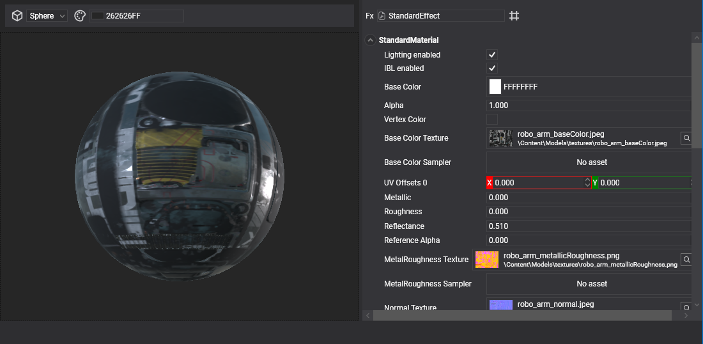
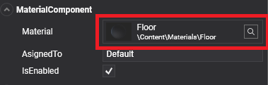
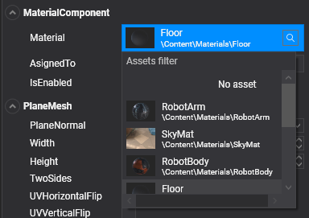

# Use assets



We can use an asset in our project in these ways:

* Reference it in an entity **Component**.
* Reference it from another asset.
* Load it from code.

## Reference an asset from components

Many components can use assets. For example, `MeshComponent` uses **Model** assets, and `Sprite` uses **Texture** assets.

When a component uses an asset, it will show an **Asset Selection Control** in its section in the **Entity Details** panel.



When a **Scene** is loaded in Evergine, all assets referenced by components will be loaded automatically.

To add an asset to that component, we need to click on it and an **Asset Picking Dialog** will appear, allowing us to select a desired asset. 



* The user can also fill the **Asset filter** textbox to filter all the assets, making it easier in big projects.
* Clicking the **lens icon**  will select the asset in the **Asset Details** panel. This is useful to locate and edit a specific asset used in your scene.
* Clicking on an asset in the list will select it and set it as the property value of the component.
* To clear the asset reference, simply select the **No Asset**  option from the list (it's the first one).

> [!NOTE]
> The dialog will only show assets of the same type as defined by the component property or field.

Alternatively, assets can be dragged directly from the Assets Details panel and dropped onto a compatible Asset Selection Control. While dragging, compatible asset pickers provide visual feedback indicating that the asset can be assigned.

## Reference an asset by other assets

In the same way as components, assets can reference other assets. For example, a **Material** can reference a **Texture**, and a **Texture** can reference a **SamplerState** asset.

You can reference those assets in the same way you add them to components (see above).

## Reference assets by code

An asset can be loaded and accessed at runtime in two ways, depending on the asset scope:

* **AssetsService**: For loading global assets used in more than one **Scene**.
* **AssetsSceneManager**: For loading assets in a **Scene**.

### AssetsService loading

**AssetsService** is a _Service_ that manages all the assets in the application. When loading an asset using this service, we are also responsible for unloading it when it's no longer needed.

```csharp
var assetsService = Application.Current.Container.Resolve<AssetsService>();

Texture textureAsset;    

// Asset loading.

// Load asset by ID (using EvergineContent).
textureAsset = assetsService.Load<Texture>(EvergineContent.Textures.SampleTexture_png);

// Load asset by path.
textureAsset = assetsService.Load<Texture>("SampleTexture.wetx");

// Load asset by stream (we need to provide an asset name anyway).
textureAsset = assetsService.Load<Texture>("SampleTexture.wetx", stream);

// Asset unloading.

// Unload asset by ID.
assetsService.Unload(EvergineContent.Textures.SampleTexture_png);

// Unload asset by path.
assetsService.Unload("SampleTexture.wetx");
```

### AssetsSceneManager loading

**AssetsSceneManager** is a _SceneManager_ that controls all the assets in a specific **Scene**. All the assets loaded through this _SceneManager_ will be unloaded when the **Scene** is disposed (when navigating to other scenes, for example).

Its methods are very similar to those of **AssetsService**.

```csharp
var assetSceneManager = this.Managers.AssetSceneManager;

Texture textureAsset;    

// Asset loading.

// Load asset by ID (using EvergineContent).
textureAsset = assetSceneManager.Load<Texture>(EvergineContent.Textures.SampleTexture_png);

// Load asset by path.
textureAsset = assetSceneManager.Load<Texture>("SampleTexture.wetx");

// Load asset by stream (we need to provide an asset name anyway).
textureAsset = assetSceneManager.Load<Texture>("SampleTexture.wetx", stream);

// Asset unloading.

// Unload asset by ID.
assetSceneManager.Unload(EvergineContent.Textures.SampleTexture_png);

// Unload asset by path.
assetSceneManager.Unload("SampleTexture.wetx");
```

### Raw assets loading

**Raw assets** are files that are included in the application output without being processed or converted to an Evergine asset format. They can also be accessed at runtime using their generated **EvergineContent** ID.

Unlike regular assets, Evergine does not know how the contents of a raw asset should be interpreted. For this reason, raw assets are loaded using the `LoadRaw<T>` method, which receives a loader function responsible for reading the asset from a `Stream` and returning the desired object.

For example, a raw text file can be loaded as follows:

```csharp
var assetsService = Application.Current.Container.Resolve<AssetsService>();

string text = assetsService.LoadRaw(
    EvergineContent.Data.Sample_txt,
    stream =>
    {
        using var reader = new StreamReader(stream, leaveOpen: true);
        return reader.ReadToEnd();
    });
```

The loader can return any type, so the same mechanism can be used to deserialize JSON files, read binary data, or pass the stream to a custom file reader:

```csharp
MyConfiguration configuration = assetsService.LoadRaw(
    EvergineContent.Data.Configuration_json,
    stream => JsonSerializer.Deserialize<MyConfiguration>(stream));
```

> [!IMPORTANT]
> Raw assets are **not cached** by `AssetsService`. Every call to `LoadRaw<T>` opens the raw asset and executes the provided loader again.
>
> If the loaded data needs to be reused, the application is responsible for caching the returned value and managing its lifetime. This avoids keeping potentially large raw files or their resulting objects in memory unnecessarily.

> [!NOTE]
> The `Stream` passed to the loader is owned and managed by Evergine and is only valid while the loader is being executed. The loader should consume the stream and return the resulting value instead of storing or returning the stream itself.

Raw assets do not use the regular Evergine asset loading pipeline and therefore do not need to be unloaded using `AssetsService.Unload`.


### Force new instance when loading

By default, when an asset is loaded either in the **AssetsService** or the **AssetsSceneManager**, only one instance of the asset is generated. This saves _GPU memory_ and time. 

However, on certain occasions, we want to load a *different instance* of an already loaded asset. For example, we may want to load and use a **Material** and change it without affecting the other instances.

In this case, we can use the **forceNewInstance** parameter in the Load method.

```csharp
// Forces a new instance to load.
Texture textureAsset = assetSceneManager.Load<Texture>(EvergineContent.Textures.SampleTexture_png, true); 
Texture textureAsset = assetsService.Load<Texture>(EvergineContent.Textures.SampleTexture_png, true);
```