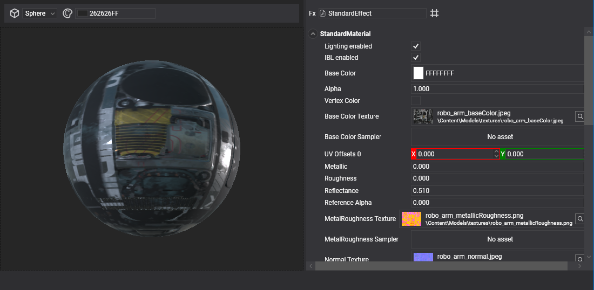

# Use assets



We can use an asset in our project in these ways:

* Reference it in an entity **Component**.
* Reference it from another asset.
* Load it from code.

## Reference an asset from components

Many components can use assets. For example, `MeshComponent` uses **Model** assets, and `Sprite` uses **Texture** assets.

When a component uses an asset, it will show an **Asset Selection Control** in its section in the **Entity Details** panel.


When a **Scene** is loaded in Evergine, all assets referenced by components will be loaded automatically.

To add an asset to that component, we need to click on it and an **Asset Picking Dialog** will appear, allowing us to select a desired asset. 


* The user can also fill the **Asset filter** textbox to filter all the assets, making it easier in big projects.
* Clicking the **lens icon**  will select the asset in the **Asset Details** panel. This is useful to locate and edit a specific asset used in your scene.
* Clicking on an asset in the list will select it and set it as the property value of the component.
* To clear the asset reference, simply select the **No Asset**  option from the list (it's the first one).

> [!NOTE]
> The dialog will only show assets of the same type as defined by the component property or field.

## Reference an asset by other assets

In the same way as components, assets can reference other assets. For example, a **Material** can reference a **Texture**, and a **Texture** can reference a **SamplerState** asset.

You can reference those assets in the same way you add them to components (see above).

## Reference assets by code

An asset can be loaded and accessed at runtime in two ways, depending on the asset scope:

* **AssetsService**: For loading global assets used in more than one **Scene**.
* **AssetsSceneManager**: For loading assets in a **Scene**.

### AssetsService loading

**AssetsService** is a _Service_ that manages all the assets in the application. When loading an asset using this service, we are also responsible for unloading it when it's no longer needed.

```csharp
var assetsService = Application.Current.Container.Resolve<AssetsService>();

Texture textureAsset;    

// Asset loading.

// Load asset by ID (using EvergineContent).
textureAsset = assetsService.Load<Texture>(EvergineContent.Textures.SampleTexture_png);

// Load asset by path.
textureAsset = assetsService.Load<Texture>("SampleTexture.wetx");

// Load asset by stream (we need to provide an asset name anyway).
textureAsset = assetsService.Load<Texture>("SampleTexture.wetx", stream);

// Asset unloading.

// Unload asset by ID.
assetsService.Unload(EvergineContent.Textures.SampleTexture_png);

// Unload asset by path.
assetsService.Unload("SampleTexture.wetx");
```

### AssetsSceneManager loading

**AssetsSceneManager** is a _SceneManager_ that controls all the assets in a specific **Scene**. All the assets loaded through this _SceneManager_ will be unloaded when the **Scene** is disposed (when navigating to other scenes, for example).

Its methods are very similar to those of **AssetsService**.

```csharp
var assetSceneManager = this.Managers.AssetSceneManager;

Texture textureAsset;    

// Asset loading.

// Load asset by ID (using EvergineContent).
textureAsset = assetSceneManager.Load<Texture>(EvergineContent.Textures.SampleTexture_png);

// Load asset by path.
textureAsset = assetSceneManager.Load<Texture>("SampleTexture.wetx");

// Load asset by stream (we need to provide an asset name anyway).
textureAsset = assetSceneManager.Load<Texture>("SampleTexture.wetx", stream);

// Asset unloading.

// Unload asset by ID.
assetSceneManager.Unload(EvergineContent.Textures.SampleTexture_png);

// Unload asset by path.
assetSceneManager.Unload("SampleTexture.wetx");
```

### Force new instance when loading

By default, when an asset is loaded either in the **AssetsService** or the **AssetsSceneManager**, only one instance of the asset is generated. This saves _GPU memory_ and time. 

However, on certain occasions, we want to load a *different instance* of an already loaded asset. For example, we may want to load and use a **Material** and change it without affecting the other instances.

In this case, we can use the **forceNewInstance** parameter in the Load method.

```csharp
// Forces a new instance to load.
Texture textureAsset = assetSceneManager.Load<Texture>(EvergineContent.Textures.SampleTexture_png, true); 
Texture textureAsset = assetsService.Load<Texture>(EvergineContent.Textures.SampleTexture_png, true);
```