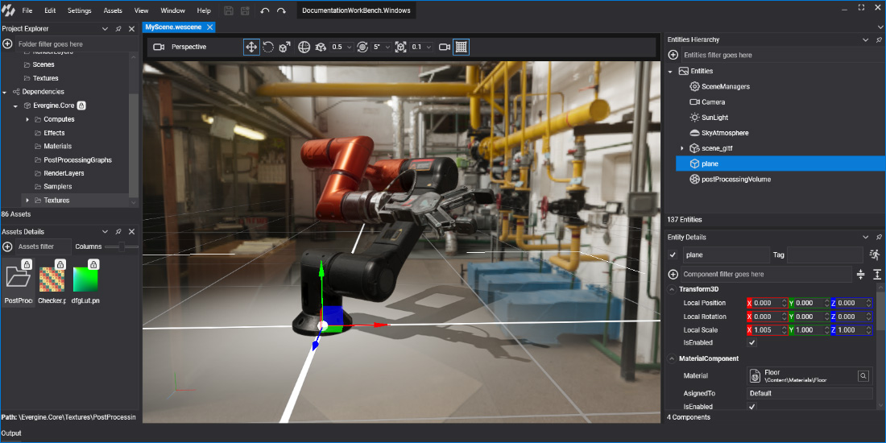

# Evergine Studio

---

**Evergine Studio** is the essential tool for creating experiences in Evergine. This documentation section covers the main topics on how to use this powerful tool. Click on the following links to learn more about it.

## In this section

* [Interface](interface.md)
* [Assets](assets/index.md)
* [Project Settings](settings.md)
* [Profile with RenderDoc](renderdoc.md)
