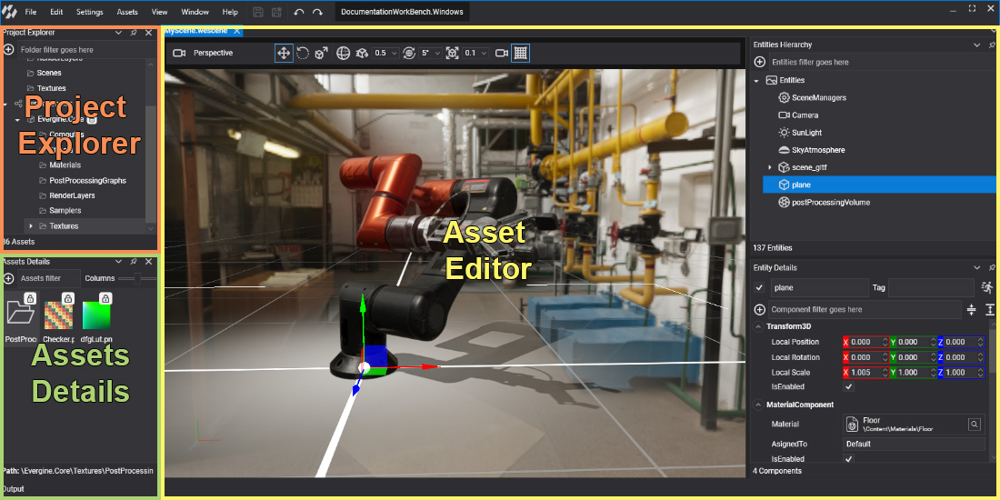
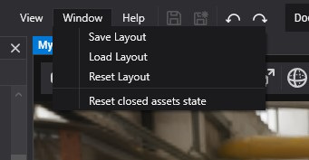

# Interface

<!-- CAPTURE: Images/interface_annotated.png; main window at 1440x900 with a scene open, numbered callouts on menu bar, toolbar, project/version boxes, Project Explorer, Assets Details, document tabs, scene toolbar, viewport, Scene Hierarchy, Entity Details / Scene Managers tabs and Output -->

Evergine Studio is organized in dockable panels around a central document area. The panels on the left browse the project, the document area hosts one editor per open asset, and the Output panel at the bottom shows the log. You can move, dock, float and auto-hide every panel to build the layout you prefer, and Evergine Studio remembers it for each project.

## Main window

| Area | Description |
| --- | --- |
| **Menu bar** | The **File**, **Edit**, **Settings**, **Assets**, **Window** and **Help** menus, described [below](#main-menu). |
| **Toolbar** | **Save** (Ctrl+S), **Save All** (Ctrl+Shift+S), **Undo** (Ctrl+Z) and **Redo** (Ctrl+Y), next to the menu bar. |
| **Project and version** | The name of the open project (hover it to see its path) and the Evergine Studio version with the graphics backend it uses. |
| **Project Explorer** | The folder tree of the project `Content` folder, plus a **Dependencies** node with the content of the installed add-ons. Type in the filter box to find a folder. |
| **Assets Details** | The assets of the folder selected in the Project Explorer. Use the  button to import or create assets, **Assets filter** to search by name, and **Columns** to change the thumbnail size. The bar at the bottom shows the path of the selected asset. |
| **Document area** | One tab per open asset, each with its [asset editor](#asset-editors). Right-click a tab to **Close** it, **Close Others** or **Close All**. |
| **Output** | The log of Evergine Studio and of your project code. Hover the panel to show its toolbar: **Level** (Verbose, Debug, Info, Warning or Error), **Clear**, **Pause** and **Auto Scroll**. |

When the project files change outside Evergine Studio, for example after you build in Visual Studio, a banner at the top of the window reads _The project files has been modified. Reload the project to stay updated._ Click it to reload the project. If something fails, a similar banner asks you to check the log and reload.

## Scene Editor panels

Double-click a scene to open it in the **Scene Editor**. Besides the 3D viewport and its toolbar, the Scene Editor adds three panels that are docked on the right by default:

| Panel | Description |
| --- | --- |
| **Scene Hierarchy** | The entity tree of the scene. Use the  button to add entities (primitives, cameras, lights, particles, text and more), the filter box to search, and the context menu to create or open prefabs. |
| **Entity Details** | The name, tag, enabled state and components of the selected entity. Use the  button to add components, the filter to find one, and the buttons next to it to collapse or expand all of them. |
| **Scene Managers** | The scene managers registered in the scene and their properties. It shares a tabbed pane with **Entity Details**, which comes to the front when you select an entity. |

The viewport toolbar selects the camera, the manipulation mode (**Move**, **Rotate**, **Scale**), the **Global** or **Local** space, the selection mode, the snapping units for moving, rotating and scaling, the camera options and the **Grid**. When RenderDoc is enabled it also shows **Capture next frame with RenderDoc** (see [Profile with RenderDoc](renderdoc.md)). The Scene Editor is described in detail in [Scene Editor](../basics/scenes/scene_editor.md).

## Main menu

### File

| Item | Description |
| --- | --- |
| **Reload Project** | Reloads the project, its assemblies and its assets. |
| **Manage dependencies** | Opens the **Add-Ons** tab of [Project Settings](settings.md). |
| **Save** / **Save All** | Saves the active editor, or every open editor. |
| **Open C# editor** | Opens the Visual Studio solution of a profile. With several profiles, pick one from the submenu. |
| **Open project folder** | Opens the project folder in _File Explorer_. |
| **Build & Run** | Builds and starts one of the Windows desktop profiles. F5 runs the default Windows profile. **Manage profile** opens Project Settings. |

### Edit

**Undo** (Ctrl+Z), **Redo** (Ctrl+Y), **Cut** (Ctrl+X), **Copy** (Ctrl+C), **Paste** (Ctrl+V), **Duplicate** (Ctrl+D) and **Delete** (Del). They act on the entities of the active scene or on the selected assets, depending on which panel has the focus.

### Settings

| Item | Description |
| --- | --- |
| **Enable RenderDoc** / **Disable RenderDoc** | Loads RenderDoc into the editor so you can capture frames. See [Profile with RenderDoc](renderdoc.md). |
| **Project Settings** | Profiles, add-ons, import parameters and application services of the project. See [Project Settings](settings.md). |
| **Preferences** | Options of Evergine Studio itself, stored for your user. See [Preferences](#preferences). |

### Assets

The same import and create items as the  button of the **Assets Details** panel, plus **Generative assets**. See [Create Assets](assets/create.md) and [Generate AI-Driven Assets](assets/generate.md).

### Window

| Item | Description |
| --- | --- |
| **Save Layout** | Saves the current position and size of the panels. |
| **Load Layout** | Restores the last saved layout. |
| **Reset Layout** | Goes back to the default layout and deletes the saved one. |
| **Reset closed assets state** | Forgets the viewer state (camera, toggles) that editors keep for assets you closed, so they open with their defaults. |

The layout is saved per project, and Evergine Studio also saves it when you close the main window, so the next session starts where you left it.

### Help

**WebPage** opens the Evergine website, **Open Log Folder** opens the folder with the Evergine Studio log files, **Software Licenses** lists third-party licenses, and **About** shows the version.

## Layouts and panels

Drag a panel by its title to dock it on another side, stack it as a tab with other panels, or leave it floating. The buttons and the context menu of the panel title let you **Auto Hide** it (it collapses to the window border and slides out on hover), **Maximize** or **Restore** it, or **Close** it. Use **Window > Reset Layout** if you lose track of a panel.

Evergine Studio uses a dark theme and an English user interface. There are no theme or language options in this version.

## Preferences

**Settings > Preferences** opens the options of Evergine Studio. They are saved for your user and apply to every project.

| Option | Default | Description |
| --- | --- | --- |
| Number of decimal places to show in numeric inputs | 3 | Precision of floating-point fields in the property panels. |
| Amount of increment in numeric up and down buttons | 0.005 | Step of the arrows, the mouse wheel and dragging for floating-point fields. |
| Amount of large increment in numeric up and down buttons | 0.02 | Step used while holding the modifier key. |
| Amount of increment in integer up and down buttons | 1 | Step for integer fields. |
| Amount of large increment in integer up and down buttons | 2 | Large step for integer fields. |
| Key to press to change values with mouse wheel | Shift | Modifier that makes the wheel change the value under the cursor. |
| Key to press to change values on mouse dragging | Shift | Modifier that makes dragging change the value. |
| Editor backend (Experimental) | DirectX12 | Graphics backend of the editor viewports: DirectX11, DirectX12 or Vulkan. Restart Evergine Studio after changing it. |
| Reload project automatically when changes in source files are detected | Enabled | Reloads the project when your C# code is rebuilt, instead of showing the reload banner. |
| Only show folders in the assets hierarchy view | Enabled | Hides files in the Project Explorer tree. |
| Use new viewer rendering control (experimental) | Enabled | Rendering control used by the viewports. |

## Asset editors

Double-click an asset in the **Assets Details** panel to open its editor. Every asset type below has one:

| Editor | Asset | Opens |
| --- | --- | --- |
| [Scene Editor](../basics/scenes/scene_editor.md) | [Scene](../basics/scenes/index.md) | `.wescene` |
| Prefab Editor | [Prefab](../basics/component_arch/prefabs/index.md) | `.weprefab` |
| [Effect Editor](../graphics/effects/effect_editor.md) | [Effect](../graphics/effects/index.md) | `.wefx` |
| [Material Editor](../graphics/materials/material_editor.md) | [Material](../graphics/materials/index.md) | `.wemt` |
| [Texture Editor](../graphics/textures/texture_editor.md) | [Texture](../graphics/textures/index.md) | Image files |
| [Model Editor](../graphics/models/model_editor.md) | [Model](../graphics/models/index.md) | Model files |
| [Audio Editor](../audio/audio_editor.md) | [Sound](../audio/index.md) | Audio files |
| [Font Editor](../graphics/fonts/font_editor.md) | [Font](../graphics/fonts/index.md) | `.ttf`, `.otf` |
| [Sampler Editor](../graphics/samplers.md) | [Sampler](../graphics/samplers.md) | `.wesp` |
| [Render Layer Editor](../graphics/renderlayers/renderlayer_editor.md) | [Render Layer](../graphics/renderlayers/index.md) | `.werl` |
| [Particle System Editor](../graphics/particles/particles_editor.md) | [Particle System](../graphics/particles/index.md) | `.weps` |
| [Post-Processing Graph Editor](../graphics/postprocessing_graph/postprocessing_graph_editor.md) | [Post-Processing Graph](../graphics/postprocessing_graph/index.md) | `.wepp` |

The Prefab Editor works like the Scene Editor, on the entities of a single prefab. Files imported as **File** assets, and assets marked to export as raw, have no editor.

<!-- CAPTURE: Images/asset_editors.png; 3x4 grid of thumbnails, one per asset editor listed above, each open on a sample asset of the docs project -->
