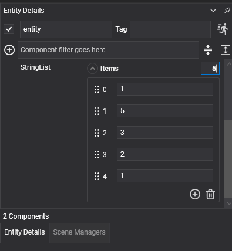

# IList Support in Components

> ⚠️ **Note:**  
> The user interface used for editing component properties (including `IList` support) is powered by an internal panels framework. This system is currently **pending documentation**.

## Overview

Evergine now supports the use of `IList<T>` properties within your custom `Component` classes. This allows developers to expose and manage collections of data directly from the Evergine Studio editor.



Users can:
- **Add**, **edit**, **remove**, or **reorder** elements in any `IList<T>` property.
- Respond to these collection operations using a new attribute: `CollectionChangeCallback`.

This functionality streamlines the development of dynamic and interactive components that work with list-like data structures in the editor.

---

## CollectionChangeCallback Attribute

The `[CollectionChangeCallback]` attribute allows you to register methods that will be automatically invoked by the editor when changes are made to a specific list property.

### Attribute Syntax

```csharp
[CollectionChangeCallback(PropertyName = "MyList", Type = OperationType.Addition)]
void OnAdd(IEnumerable<CollectionChangeCallback.CollectionItem> items) { ... }
```

### Parameters

| Parameter      | Description                                                          |
|----------------|----------------------------------------------------------------------|
| `PropertyName` | The name of the property (list) that this callback monitors.         |
| `Type`         | The type of operation that triggers the callback. See below.         |

### Operation Types

```csharp
enum OperationType
{
    Addition,
    Update,
    Deletion,
    Reordering
}
```

Each callback method must match the expected signature for the operation:

| Operation Type | Expected Callback Signature                                                  |
|----------------|-------------------------------------------------------------------------------|
| Addition       | `void OnAdded(IEnumerable<CollectionItem> items)`                            |
| Update         | `void OnUpdated(CollectionItem item)`                                        |
| Deletion       | `void OnDeleted(IEnumerable<CollectionItem> items)`                          |
| Reordering     | `void OnReordered(CollectionItem oldItem, CollectionItem newItem)`           |

---

## CollectionItem Structure

Each `CollectionItem` provides context about the changed element:

```csharp
public class CollectionItem
{
    public object Item { get; }
    public int Index { get; }
}
```

- `Item`: The value of the element affected.
- `Index`: The index within the list.

---

## Example: Handling a List of Strings

Here’s an example component using `List<string>` and handling all collection changes via callbacks:

```csharp
public class ListStringComponent : Component
{
    public List<string> StringList;

    [CollectionChangeCallback(PropertyName = nameof(StringList), Type = OperationType.Addition)]
    internal void AddedItems(IEnumerable<CollectionItem> items)
    {
        foreach (var item in items)
        {
            Debug.WriteLine($"Added: {item.Item} at index {item.Index}");
        }
    }

    [CollectionChangeCallback(PropertyName = nameof(StringList), Type = OperationType.Update)]
    internal void UpdatedItem(CollectionItem item)
    {
        Debug.WriteLine($"Updated: {item.Item} at index {item.Index}");
    }

    [CollectionChangeCallback(PropertyName = nameof(StringList), Type = OperationType.Deletion)]
    internal void DeletedItems(IEnumerable<CollectionItem> items)
    {
        foreach (var item in items)
        {
            Debug.WriteLine($"Deleted: {item.Item} at index {item.Index}");
        }
    }

    [CollectionChangeCallback(PropertyName = nameof(StringList), Type = OperationType.Reordering)]
    internal void ReorderedItems(CollectionItem item1, CollectionItem item2)
    {
        Debug.WriteLine($"Reordered: {item1.Item} from {item1.Index} to {item2.Index}");
    }
}
```

This setup allows your component to dynamically react to list operations triggered from the Evergine Studio editor — for example, updating visuals, syncing with other systems, or triggering logic based on user input.