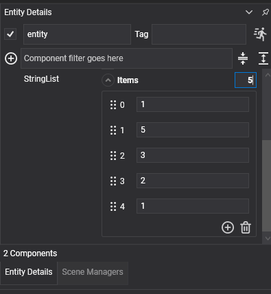

# Lists in Property Panels



When a component exposes a list property, the **Entity Details** panel of Evergine Studio shows it as an editable list. You can add, edit, remove and reorder elements without writing custom editor code. If your component has to react to those edits, for example to rebuild a cache or validate the new values, mark a method with the `CollectionChangeCallback` attribute and Evergine Studio calls it after each operation.

## Editing a list

Any public property whose type implements `System.Collections.IList`, such as `List<T>`, is rendered as a list. The panel shows:

* The number of items, in a box you can edit to grow or shrink the list.
* One row per item, with a drag handle to reorder it and the editor that matches the item type (text box, numeric input, color picker, asset selector, and so on).
* An **add** button that appends a new item, and a **delete** button that removes the selected items.

New items are created with the parameterless constructor of the item type (an empty string for `string`, and opaque white for `Color`). Use a `NewItemInstance` callback, described below, when you need a different starting value.

> [!NOTE]
> The item type must be concrete. A list declared as `List<object>` is not supported, because the editor cannot infer what to create.

## CollectionChangeCallback attribute

`CollectionChangeCallback` lives in `Evergine.Common.Attributes`. Apply it to an instance method of the component (it can be public or private) and indicate which list property it observes and which operation triggers it.

```csharp
[CollectionChangeCallback(nameof(Names), CollectionChangeCallback.OperationType.Addition)]
private void OnNamesAdded(CollectionChangeCallback.CollectionItem[] items)
{
}
```

| Parameter | Description |
| --- | --- |
| `PropertyName` | Name of the list property that the callback observes. Use `nameof` so the link survives a rename. |
| `Type` | The `OperationType` that triggers the callback. |

Both values can also be set as named properties: `[CollectionChangeCallback(PropertyName = nameof(Names), Type = OperationType.Update)]`.

> [!IMPORTANT]
> The attribute is editor-only. Evergine Studio invokes these methods when the list is edited in the property panel. Changes made to the list from your own code at runtime do not call them.

### Operation types and signatures

Each operation expects a specific method signature. Evergine Studio uses the first method it finds for each property and operation.

| OperationType | Expected signature | When it is called |
| --- | --- | --- |
| `Addition` | `void M(CollectionItem[] items)` | After one or more items are added. |
| `Update` | `void M(CollectionItem item)` | After the value of an item changes. |
| `Deletion` | `void M(CollectionItem[] items)` | After one or more items are removed. `Index` is the position each item had. |
| `Reordering` | `void M(CollectionItem item, int fromIndex)` | After an item is dragged to a new position. `item.Index` is the new position. |
| `NewItemInstance` | `T M()` | Before an item is added, to create the instance that is added. |

### CollectionItem

`CollectionChangeCallback.CollectionItem` describes the affected element.

| Property | Type | Description |
| --- | --- | --- |
| `Item` | `object` | The element that was added, updated, removed or moved. Cast it to the item type of the list. |
| `Index` | `int` | The position of the element in the list. |

## Example

The following component keeps a list of names, gives new entries a readable default instead of an empty string, and logs every change. The `using static` directive imports the nested types of the attribute, so you can write `OperationType` and `CollectionItem` without the class prefix; the regular `using` is still needed for the attribute itself.

```csharp
using System.Collections.Generic;
using System.Diagnostics;
using Evergine.Common.Attributes;
using Evergine.Framework;
using static Evergine.Common.Attributes.CollectionChangeCallback;

namespace MyProject.Components
{
    public class NameListComponent : Component
    {
        // Initialize the list so the editor always has an instance to add items to.
        public List<string> Names { get; set; } = new List<string>();

        [CollectionChangeCallback(nameof(Names), OperationType.NewItemInstance)]
        private string CreateName()
        {
            // Without this callback, new rows would start as an empty string.
            return $"Name {this.Names.Count}";
        }

        [CollectionChangeCallback(nameof(Names), OperationType.Addition)]
        private void OnNamesAdded(CollectionItem[] items)
        {
            foreach (var item in items)
            {
                Debug.WriteLine($"Added '{item.Item}' at {item.Index}");
            }
        }

        [CollectionChangeCallback(nameof(Names), OperationType.Update)]
        private void OnNameUpdated(CollectionItem item)
        {
            Debug.WriteLine($"Updated '{item.Item}' at {item.Index}");
        }

        [CollectionChangeCallback(nameof(Names), OperationType.Deletion)]
        private void OnNamesDeleted(CollectionItem[] items)
        {
            foreach (var item in items)
            {
                Debug.WriteLine($"Removed '{item.Item}' from {item.Index}");
            }
        }

        [CollectionChangeCallback(nameof(Names), OperationType.Reordering)]
        private void OnNameReordered(CollectionItem item, int fromIndex)
        {
            Debug.WriteLine($"Moved '{item.Item}' from {fromIndex} to {item.Index}");
        }
    }
}
```

Add the component to an entity, select the entity in the **Scene Hierarchy** panel and edit the list in **Entity Details** to trigger each callback.
