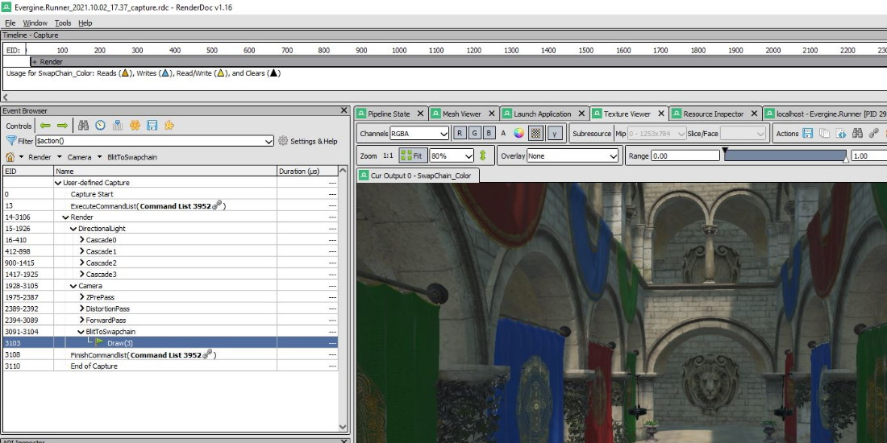
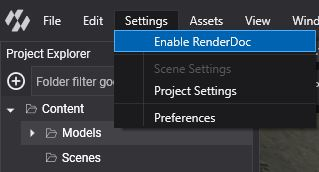
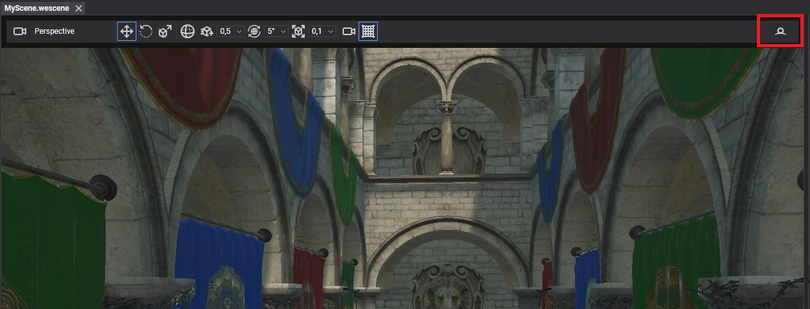
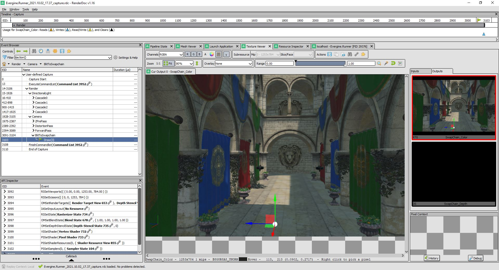
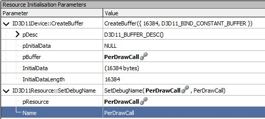
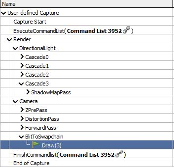

# Profile with RenderDoc




[RenderDoc](https://renderdoc.org/) is a free frame debugger for Direct3D 11, Direct3D 12, Vulkan and OpenGL. Evergine Studio integrates it, so you can capture a frame of any scene viewport and inspect every draw call, resource and shader that produced it. Use it to find out why an object does not render, why a material looks wrong, or which pass takes the most GPU time.

Evergine Studio renders with **DirectX 12** by default (see the **Editor backend** option in [Preferences](interface.md#preferences)), and RenderDoc captures it directly.

## Enable RenderDoc

1. Install RenderDoc from [renderdoc.org](https://renderdoc.org/). Evergine Studio looks for it in `Program Files\RenderDoc`, or through the file association RenderDoc registers. The menu item stays disabled while RenderDoc is not installed.
2. Select **Settings > Enable RenderDoc**.
3. Confirm the dialog. Evergine Studio saves your changes and reloads the project, so that RenderDoc is loaded before the graphics device is created.



Select **Settings > Disable RenderDoc** to turn it off again. It also reloads the project.

## Capture a frame

With RenderDoc enabled, the toolbar of the Scene Editor viewport shows **Capture next frame with RenderDoc** on its right side.



Click it to capture the next frame of that viewport. When the capture finishes, Evergine Studio starts the RenderDoc user interface with the capture open, ready to inspect.



> [!TIP]
> To capture your running application instead of the editor, start the launcher from RenderDoc with **Launch Application** and press F12 or Print Screen to capture a frame.

## Name graphics objects

Every object of the Evergine [low-level API](../graphics/low_level_api/index.md), such as buffers, textures, pipelines and command buffers, has a `Name` property. RenderDoc shows those names instead of generic identifiers, which makes a capture much easier to read. Give the name when you create the resource, or set it afterwards:

```csharp
// 64 bytes: one 4x4 float matrix.
var description = new BufferDescription(64, BufferFlags.ConstantBuffer, ResourceUsage.Default);

// The last argument of the factory methods is the debug name.
var constantBuffer = graphicsContext.Factory.CreateBuffer(ref description, "Outline_ConstantBuffer");

// The name can also be changed later, for example when a pooled buffer is reused.
constantBuffer.Name = "Outline_ConstantBuffer_Selected";
```



## Debug markers and regions

Debug markers group the commands of a command buffer into named regions of the RenderDoc **Event Browser**, or mark a single point of interest. Evergine already adds regions for its own passes (`Render`, `DirectionalLight`, `Camera`, `ForwardPass` and so on), and you can add yours around custom rendering code.

| Method | Description |
| --- | --- |
| `BeginDebugMarker(string label)` | Opens a named region. Regions can be nested. |
| `EndDebugMarker()` | Closes the last region opened. |
| `InsertDebugMarker(string label)` | Adds a single named event at the current position. |

```csharp
commandBuffer.Begin();

commandBuffer.BeginDebugMarker("Outline");
{
    // Everything recorded until EndDebugMarker appears under "Outline" in RenderDoc.
    commandBuffer.BeginRenderPass(ref renderPassDescription);
    commandBuffer.InsertDebugMarker("Outline: after clear");
    // ...draws...
    commandBuffer.EndRenderPass();
}
commandBuffer.EndDebugMarker();

commandBuffer.End();
```



> [!NOTE]
> Unlike names, markers are commands: record them while the command buffer is between `Begin()` and `End()`. They have no effect when no graphics debugger is attached, so you can leave them in release code.

## Include shader debug information

By default, Evergine strips the debug information from compiled shaders to keep them small. RenderDoc then shows constants and resources without names, and cannot show the HLSL source. To keep the debug information in one effect, add `[Mode Debug]` to its pass:

```hlsl
[Begin_Pass:Default]

    [Mode Debug]
    [Profile 11_0]
    [Entrypoints VS=VS PS=PS]

    // ...
[End_Pass]
```

To keep it for every effect compiled at runtime, enable `EnableShaderDebugInfo` on the graphics context in the launcher, before the application is initialized:

```csharp
GraphicsContext graphicsContext = new global::Evergine.DirectX12.DX12GraphicsContext();
graphicsContext.CreateDevice();

// Compile runtime shaders with debug information, for graphics debugging only.
graphicsContext.EnableShaderDebugInfo = true;
```

Remove `[Mode Debug]` and `EnableShaderDebugInfo` when you finish debugging, because debug shaders are larger and slower.

## Other graphics debuggers

On Windows you can also capture and debug frames of a DirectX build of your application with [PIX on Windows](https://devblogs.microsoft.com/pix/introduction/), [NVIDIA Nsight Graphics](https://developer.nvidia.com/nsight-graphics) or the [Visual Studio Graphics Diagnostics](https://learn.microsoft.com/visualstudio/debugger/graphics/visual-studio-graphics-diagnostics). The object names and debug markers described above show up in those tools too.
