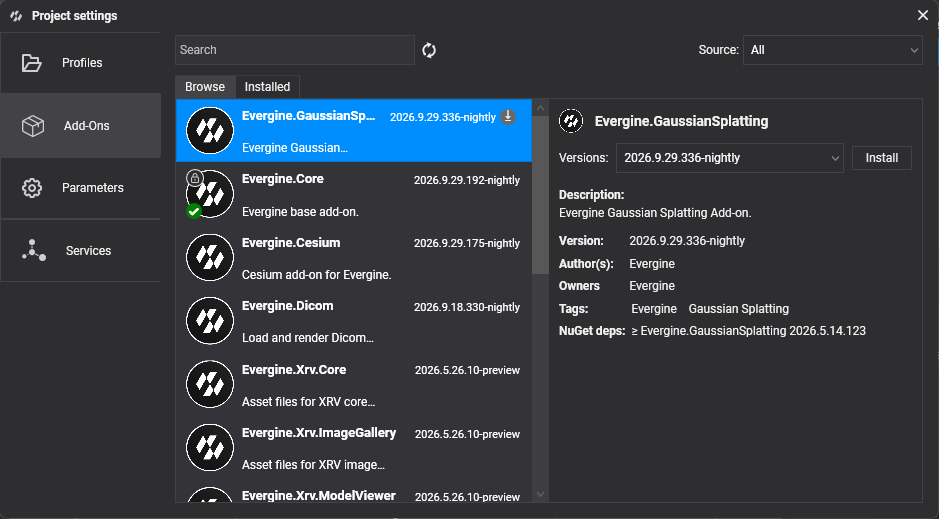

# Project Settings

**Project Settings** groups the options that affect the whole application rather than a single scene: the platforms it targets, the add-ons it uses, how source files are imported, and the application services it registers. Open it from **Settings > Project Settings**. The changes are saved in the project files (`.weproj` and `.weservices`), so they are shared with everyone who works on the project.

The dialog has four tabs:

| Tab | What you configure |
| --- | --- |
| [Profiles](settings/project_profiles.md) | The launcher projects of the application, one per platform or variant, and the texture compression and shader settings of each one. |
| Add-Ons | The add-ons installed in the project. See below. |
| Parameters | Import options that apply to every asset of the project. See below. |
| [Services](settings/project_services.md) | The application services that Evergine registers automatically at startup, and their property values. |

## Add-Ons

The **Add-Ons** tab lists the [add-ons](../addons/index.md) of the project and lets you install new ones, update them or remove them.

* **Browse** searches the available add-ons. Filter them by **Source** and by text with **Search**, and click **Refresh** to query the sources again.
* **Installed** lists the add-ons already in the project.
* Select an add-on to see its authors, description, tags, NuGet dependencies and versions. From there you can **Install** it, **Update to this version**, or **Uninstall** it.

Before applying an update, Evergine Studio shows the add-ons and NuGet packages that will change. If the update moves the project to a new engine version, it asks you to restart Evergine Studio.

> [!NOTE]
> Core add-ons such as **Evergine.Core** cannot be removed or updated from this tab. They are updated together with the engine when you upgrade the project from the Evergine Launcher.

**File > Manage dependencies** opens this tab directly.

## Parameters

The **Parameters** tab holds import options that apply to every asset of the project.

| Parameter | Default | Description |
| --- | --- | --- |
| **FBX Import > Skinning Max Weights** | 4 | Maximum number of bone weights per vertex kept when an `.fbx`, `.obj`, `.dae` or `.3ds` model is converted. Higher values keep more detail in skinned meshes but make them heavier to render. |
| **FBX Import > Sparsed Morph Targets** | Disabled | Reserved for sparse morph target data. The importer does not use it yet, so morph targets are always stored dense. |

## In this section

* [Manage Profiles](settings/project_profiles.md)
* [Manage Services](settings/project_services.md)
