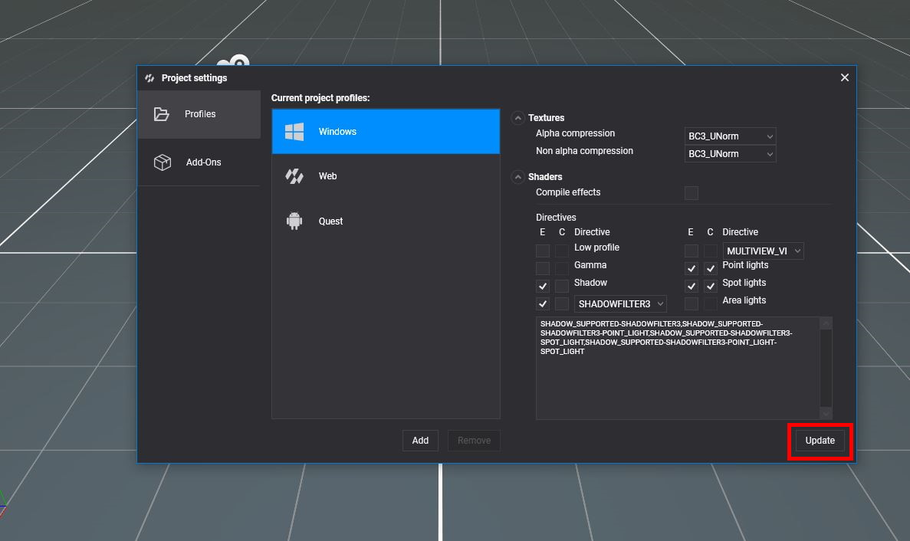
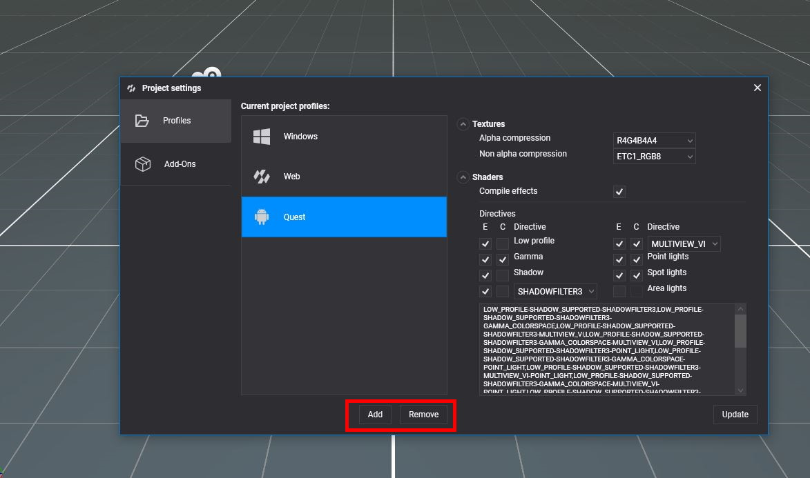
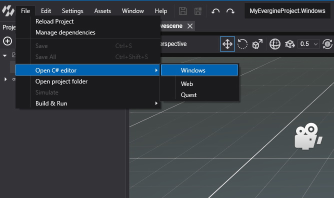

# Manage Profiles

Evergine is cross-platform, and each platform your application runs on has its own **launcher project**: a small C# project with the `Main` method, the window or view, and the graphics backend of that platform. Each launcher is a **profile** of the project. Profiles also decide how assets are exported for that platform, such as the texture compression and whether shaders are compiled ahead of time.

You choose the first profiles when you create the project in the Evergine Launcher. Add, remove and configure them later from **Settings > Project Settings > Profiles**.

## Add a profile

<!-- CAPTURE: images/profile_add-dialog.png; Add project profile dialog from develop, with the template list filtered by "Windows" and the Name box filled -->

1. Click **Add** under the list of profiles.

   

2. In the **Add project profile** dialog, find the template you need. Type in **Search** or pick a platform in the drop-down to filter the list.
3. Select the template. Evergine Studio proposes a profile name, which you can change. The name must be unique in the project.
4. Click **Add**.

Evergine Studio creates the launcher project and its Visual Studio solution in the project folder, named after the project and the profile, for example `MyProject.Windows.Vulkan` and `MyProject.Windows.Vulkan.sln`. You can add several profiles for the same platform, such as a DirectX 12 and a Vulkan build for Windows.

### Available templates

These are the launcher templates of this version, with the default settings each profile starts with:

| Template | Default profile name | Platform | Graphics backend | Compile effects | Texture compression (alpha / non-alpha) |
| --- | --- | --- | --- | --- | --- |
| Windows (DirectX12) | `Windows` | Windows | DirectX 12 | No | `BC3_UNorm` / `BC3_UNorm` |
| Windows (DirectX11) | `Windows.DirectX11` | Windows | DirectX 11 | No | `BC3_UNorm` / `BC3_UNorm` |
| Windows (Vulkan) | `Windows.Vulkan` | Windows | Vulkan | No | `R8G8B8A8_UNorm` / `R8G8B8A8_UNorm` |
| Windows (OpenGL) | `Windows.OpenGL` | Windows | OpenGL | No | `R8G8B8A8_UNorm` / `R8G8B8A8_UNorm` |
| Windows OpenXR (DirectX11) | `Windows.OpenXR` | Windows | DirectX 11 | No | `BC3_UNorm` / `BC3_UNorm` |
| WinUI (DirectX11) | `WinUI` | Windows | DirectX 11 | No | `BC3_UNorm` / `BC3_UNorm` |
| Avalonia | `Avalonia` | Windows | DirectX 11 | No | `BC3_UNorm` / `BC3_UNorm` |
| Web (WebGL2.0) | `Web` | Web | WebGL 2.0 | Yes | `R8G8B8A8_UNorm` / `R8G8B8A8_UNorm` |
| React SPA (WebGL2.0) | `WebReact` | Web | WebGL 2.0 | Yes | `R8G8B8A8_UNorm` / `R8G8B8A8_UNorm` |
| Web (Experimental WebGPU) | `WebGPU` | Web | WebGPU | Yes | `R8G8B8A8_UNorm` / `R8G8B8A8_UNorm` |
| WebXR (Experimental AR) | `WebXR` | Web | WebGL 2.0 | Yes | `R8G8B8A8_UNorm` / `R8G8B8A8_UNorm` |
| Android | `Android` | Android | Vulkan | Yes | `R4G4B4A4` / `ETC1_RGB8` |
| Android Meta Quest (OpenXR) | `Quest` | Android | Vulkan | Yes | `R4G4B4A4` / `ETC1_RGB8` |
| Android Pico (OpenXR) | `Pico` | Android | Vulkan | Yes | `R4G4B4A4` / `ETC1_RGB8` |
| iOS .NET 10 | `iOS` | iOS | Metal | Yes | `BC3_UNorm` / `BC3_UNorm` |
| MAUI | `Windows`, `Android`, `iOS` | Windows, Android, iOS | DirectX 11, Vulkan, Metal | No, Yes, Yes | Per platform, as in the rows above |

The MAUI template creates one solution with three profiles, which Evergine Studio shows as a single group.

> [!NOTE]
> A project always needs a Windows desktop profile, because Evergine Studio itself runs on Windows. The first profile of the project, usually **Windows**, cannot be removed.

## Edit a profile

Select a profile in **Current project profiles** to see its settings. After changing them, click **Update** to save them to the project. Profile settings take effect the next time you build that launcher.

### Textures

| Setting | Description |
| --- | --- |
| **Alpha compression** | `PixelFormat` used for textures with an alpha channel. |
| **Non alpha compression** | `PixelFormat` used for opaque textures. |

Pick formats that the GPUs of the platform support. Block-compressed formats such as `BC3_UNorm` suit desktop GPUs, `ETC1_RGB8` suits Android, and `R8G8B8A8_UNorm` works everywhere at a higher memory cost. Each texture can still override these values in its own [profile properties](../assets/edit.md#profile-properties).

### Shaders

| Setting | Description |
| --- | --- |
| **Compile effects** | Compiles every effect when the assets are exported and ships the compiled bytecode. Web, Android and iOS profiles enable it by default. Windows profiles compile effects at runtime instead. |
| **Directives** | The effect directives, and their combinations, to precompile. |

The directive grid lists the directives that Evergine effects use, with two check boxes each:

* **E** (enable) includes the directive.
* **C** (combine) generates the variants with and without it. An enabled directive without **C** is present in every variant.

| Directive | Effect directive | Meaning |
| --- | --- | --- |
| Low profile | `LOW_PROFILE` | Cheaper shading path for mobile and web GPUs. |
| Gamma | `GAMMA_COLORSPACE` | Output in gamma space instead of linear. |
| Shadow | `SHADOW_SUPPORTED` | Shadow support. |
| Shadow filter | `SHADOWFILTER3`, `SHADOWFILTER5` or `SHADOWFILTER7` | Size of the shadow filter kernel. |
| Multiview | `MULTIVIEW_RTI` or `MULTIVIEW_VI` | Stereo rendering in a single pass, for XR devices. |
| Point lights | `POINT_LIGHT` | Support for point lights. |
| Spot lights | `SPOT_LIGHT` | Support for spot lights. |
| Area lights | `AREA_LIGHT` | Support for area lights. |

The read-only box under the grid shows the resulting combinations, separated by commas, which is the value stored in the profile. For example, enabling **Shadow** and **Shadow filter** and combining **Point lights** gives `SHADOW_SUPPORTED-SHADOWFILTER3,SHADOW_SUPPORTED-SHADOWFILTER3-POINT_LIGHT`.

> [!TIP]
> Every combined directive doubles the number of variants to compile, which increases the export time and the package size. Combine only the directives your scenes need.

### Reset a profile

**Reset Profile** restores the texture compression, **Compile effects** and directives to the defaults of the template the profile was created from. Click **Update** afterwards to save them.

## Remove a profile

Select the profile and click **Remove**. The profile is removed from the project.

## Open a platform project

Every profile gets an entry in **File > Open C# editor**. Pick one to open the Visual Studio solution of that launcher. With a single profile, the menu item opens its solution directly.

