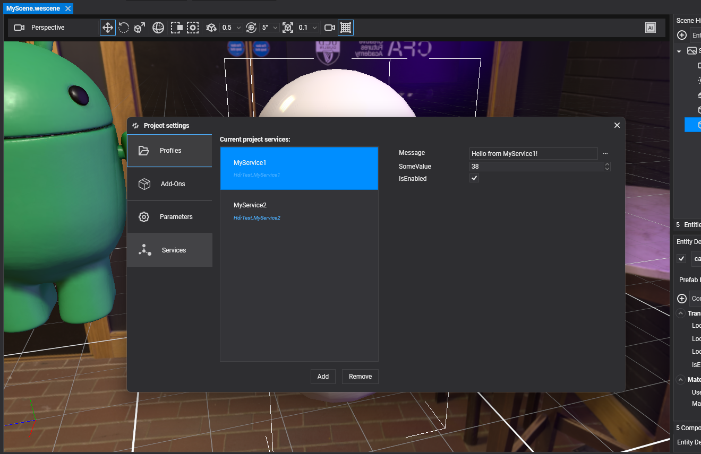
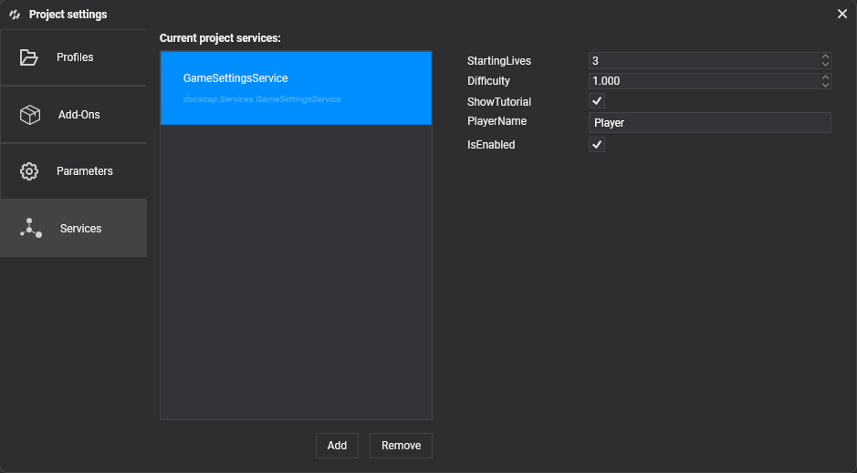
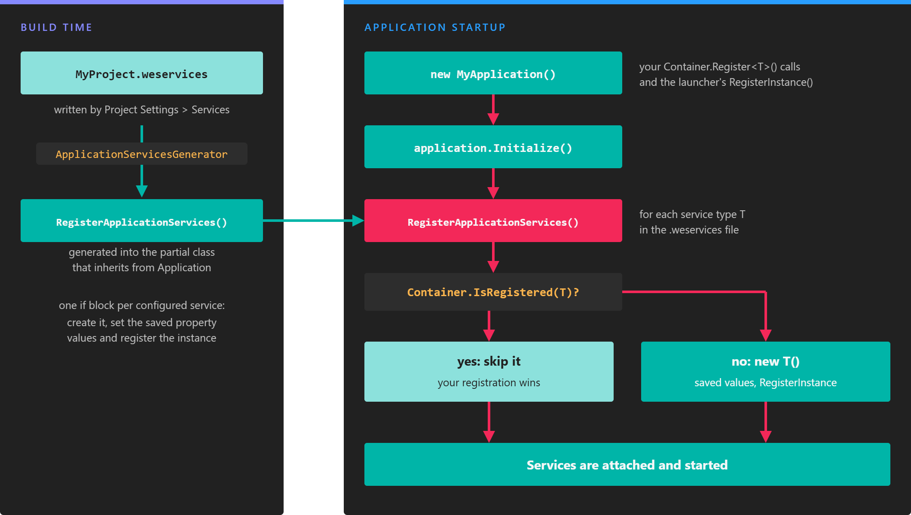

# Manage Services



An application **service** is a class that inherits from `Service` and lives as long as the application: settings, a score keeper, a connection to a backend. You usually register services in code, in the constructor of your `Application` class. The **Services** tab of **Project Settings** lets you do the same from Evergine Studio: pick the service types, edit their properties with the usual property editors, and let Evergine create and register them when the application starts.

## Add and remove services

* Click **Add** to open the **Add Application Service** dialog. It lists every non-abstract class that inherits from `Service` in the project and its references. Type in **Search service types...** to filter them, and select one to add it.
* Select one or more services and click **Remove** to delete them from the list. Evergine Studio asks for confirmation.

Each service type can appear only once in the list.

> [!NOTE]
> If the dialog shows _No application Service types are available_, build the project first. Evergine Studio finds services in the compiled assemblies of the project.

## Configure a service

Select a service in **Current project services** to show its properties on the right. Public properties with a getter and a setter are shown with the same editors as component properties, and the same attributes control how they look. Every change is saved immediately.

This service exposes four settings. The attributes limit the numeric values and add tooltips in Evergine Studio.

```csharp
using Evergine.Common.Attributes;
using Evergine.Framework.Services;

namespace MyProject.Services
{
    public class GameSettingsService : Service
    {
        [RenderPropertyAsInput(MinLimit = 1, MaxLimit = 9, Tooltip = "Lives at the start of a game")]
        public int StartingLives { get; set; } = 3;

        [RenderPropertyAsFInput(MinLimit = 0.5f, MaxLimit = 3f, Tooltip = "Multiplies enemy speed and damage")]
        public float Difficulty { get; set; } = 1f;

        public bool ShowTutorial { get; set; } = true;

        public string PlayerName { get; set; } = "Player";
    }
}
```



Components and other services get the configured instance like any other service, for example with `[BindService]`:

```csharp
using Evergine.Framework;
using MyProject.Services;

namespace MyProject.Components
{
    public class LivesCounter : Component
    {
        [BindService]
        private GameSettingsService settings = null;

        private int lives;

        protected override void Start()
        {
            base.Start();

            // The value edited in Project Settings, or the one registered from code.
            this.lives = this.settings.StartingLives;
        }
    }
}
```

## How services are registered

The list is stored next to the project file, in `<ProjectName>.weservices`: a YAML file with one entry per service, tagged with its type, and the property values you set. Keep it under version control with the rest of the project.

```yaml
- !MyProject.Services.GameSettingsService,MyProject
  IsEnabled: true
  StartingLives: 5
  Difficulty: 1.5
  ShowTutorial: false
  PlayerName: Ada
```

When you build, a source generator of the `Evergine.CodeScenes` package reads the file and adds a `RegisterApplicationServices` override to your application class. For the file above, the generated code is equivalent to:

```csharp
public partial class MyApplication
{
    protected override void RegisterApplicationServices()
    {
        if (!this.Container.IsRegistered(typeof(global::MyProject.Services.GameSettingsService)))
        {
            var svc0 = new global::MyProject.Services.GameSettingsService();
            svc0.IsEnabled = true;
            svc0.StartingLives = 5;
            svc0.Difficulty = 1.5F;
            svc0.ShowTutorial = false;
            svc0.PlayerName = "Ada";
            this.Container.RegisterInstance<global::MyProject.Services.GameSettingsService>(svc0);
        }
    }
}
```

`Application.Initialize()` calls `RegisterApplicationServices()` before it initializes the services, so the configured services go through the normal service lifecycle.

> [!IMPORTANT]
> Your application class must be `partial`, as it is in the project templates, so the generator can extend it. If it is not, the build reports error `WASP008`.

## Registration from code takes precedence



*The generated code only registers a service that is not registered yet, so a registration made in code always wins.*

The generated code checks `Container.IsRegistered` first. If you register the same service type yourself before `Initialize()` runs, typically in the constructor of your application class, Evergine keeps your registration and ignores the one from Project Settings:

```csharp
public MyApplication()
{
    // ...default registrations of the template...

    // Overrides the GameSettingsService configured in Project Settings.
    this.Container.RegisterInstance(new GameSettingsService
    {
        StartingLives = 1,
        Difficulty = 3f,
    });
}
```

Use this when a service needs constructor arguments, values that are only known at runtime, or a different setup per launcher.

> [!NOTE]
> The check uses the concrete service type. A registration made after `base.Initialize()` returns is too late to replace the configured service.

## Troubleshooting

The generator reports problems as build diagnostics:

| Code | Meaning |
| --- | --- |
| `WASP002` | An entry of the `.weservices` file has no valid type tag. |
| `WASP003` | The service type cannot be found in the compilation, or it does not inherit from `Service`. Add the missing reference or remove the entry. |
| `WASP004` | The same service type is configured twice. Only the first entry is used. |
| `WASP005` | The code for the properties of a service could not be generated. |
| `WASP007` | The `.weservices` file is not valid YAML. |
| `WASP008` | No `partial` class that inherits from `Application` was found. |
