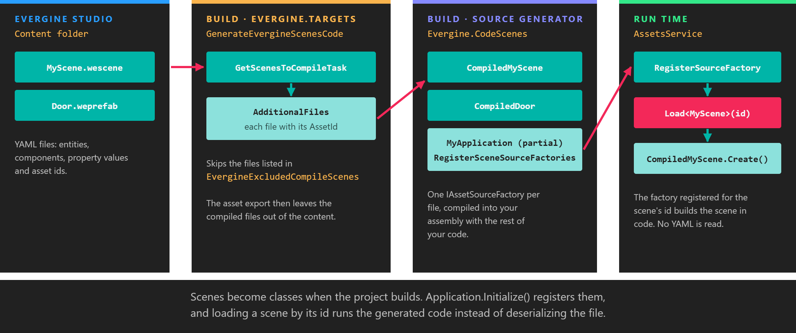

# CodeScenes

---



Evergine Studio saves scenes and prefabs as YAML files, `.wescene` and `.weprefab`. **CodeScenes** is a C# source generator that converts those files into code while your project builds. At run time, loading a scene then runs compiled C# that creates its entities and components, instead of reading and deserializing the scene file. Loading is faster, and a scene that references a type or property your code no longer has fails the build instead of failing when the scene is loaded.

## Enable it

New projects have CodeScenes enabled. It needs two things in the project that contains your scenes, and both are in the templates:

```xml
<PropertyGroup>
  <!-- Asks Evergine.Targets to pass the scene files to the generator. -->
  <GenerateEvergineScenesCode>True</GenerateEvergineScenesCode>
</PropertyGroup>

<ItemGroup>
  <!-- The source generator itself. Use the same version as the other Evergine packages. -->
  <PackageReference Include="Evergine.CodeScenes" Version="EVERGINE_VERSION" />
</ItemGroup>
```

The generator also needs your `Application` class to be `partial`, because it adds a method to it:

```csharp
public partial class MyApplication : Application
{
    // ...
}
```

Set `GenerateEvergineScenesCode` to `False` to go back to loading the scene files at run time.

## What it generates

For every scene and prefab in the `Content` folder, the build passes the file to the generator with its asset id, and the generator emits one class named `Compiled` followed by the file name: `CompiledMyScene` for `MyScene.wescene`. The class implements `IAssetSourceFactory`, and its `Create()` method builds the same `SceneModel` the YAML would have produced, one entity per method:

```csharp
// CompiledMyScene.g.cs (abridged)
public partial class CompiledMyScene : global::Evergine.Framework.Assets.Importers.IAssetSourceFactory
{
    public CompiledMyScene(global::Evergine.Framework.Services.AssetsService assetsService)
    {
        this.assetsService = assetsService;
        // The id and exported path of MyScene.wescene, so AssetsService can find this factory.
        this.AssetId = Guid.Parse("...");
        this.AssetPath = "...";
    }

    public global::Evergine.Framework.Assets.AssetSources.Entities.SceneModel CreateScene()
    {
        var ins0 = new Evergine.Framework.Assets.AssetSources.Entities.SceneModel();
        var ins1 = Create_ins1(ins0);
        ins0.Items.Add(ins1);
        // ... one call per root entity ...

        return ins0;
    }

    private Evergine.Framework.Assets.AssetSources.Entities.EntityItemModel Create_ins1(Evergine.Framework.Assets.AssetSources.Entities.ReferenceContainerModel ins0)
    {
        var ins1 = new Evergine.Framework.Assets.AssetSources.Entities.EntityItemModel();
        ins1.Name = "Cube";
        var ins2 = new Evergine.Framework.Graphics.Transform3D();
        ins2.LocalPosition = new Vector3(0.0F, 0.5F, 0.0F);
        ins1.Components.Add(ins2);
        // Asset references become loads by id.
        var ins3 = new Evergine.Framework.Graphics.MaterialComponent();
        if (TryLoadAsset<Evergine.Framework.Graphics.Material>(ins0, new Guid(new byte[]{ /* ... */ }), out var ins4)) { ins3.Material = ins4; }
        ins1.Components.Add(ins3);
        // ...

        return ins1;
    }
}
```

It also completes your `Application` class with an override that registers every generated factory with `AssetsService`:

```csharp
// RegisterScenes_MyApplication.g.cs
public partial class MyApplication
{
    protected override void RegisterSceneSourceFactories()
    {
        var assetsService = this.Container.Resolve<global::Evergine.Framework.Services.AssetsService>();
        assetsService.RegisterSourceFactory(new MyProject.CompiledMyScene(assetsService));
    }
}
```

`Application.Initialize()` calls `RegisterSceneSourceFactories()`. From then on, when you load a scene by its id, for example with `assetsService.Load<MyScene>(EvergineContent.Scenes.MyScene_wescene)`, `AssetsService` finds the registered factory and uses it. Nothing changes in the code that loads scenes.

Because the scenes now live in code, the asset export leaves the compiled scene and prefab files out of the exported content.

> [!NOTE]
> The generated files are regular C# and appear in Visual Studio under **Dependencies** > **Analyzers** > **Evergine.CodeScenes**. They are regenerated on every build, so do not edit them; change the scene in Evergine Studio instead.

## Exclude a scene

To keep loading one scene from its file, for example a very large scene that would produce a very large class, add it to `EvergineExcludedCompileScenes` with the path of the `.wescene` file:

```xml
<ItemGroup>
  <EvergineExcludedCompileScenes Include="$(MSBuildProjectDirectory)\..\Content\Scenes\HugeScene.wescene" />
</ItemGroup>
```

An excluded scene is exported and loaded from its file as usual.

## Build errors

Problems found while generating are reported as build diagnostics with the `WESC` prefix:

| Code | Meaning |
| --- | --- |
| **WESC000** | A node of a scene file could not be processed, for example a property whose value does not match its type. The error points at the line of the scene file. |
| **WESC001** | The generator itself failed. The message contains the exception. |
| **WESC002** | A whole scene or prefab file could not be converted. Fix it, or exclude it as shown above. |
| **WESC003** | No `partial` class deriving from `Evergine.Framework.Application` was found to add `RegisterSceneSourceFactories` to. |

> [!TIP]
> The same package contains a second generator for the services you configure in Evergine Studio's [Project Services](../evergine_studio/settings/project_services.md). It reads the project's `.weservices` file and adds a `RegisterApplicationServices()` override to your `Application`, which registers each service unless your own code already registered one of the same type. It does not depend on `GenerateEvergineScenesCode`.
