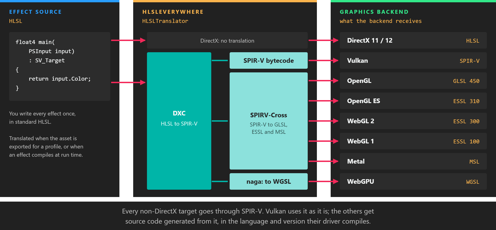

# HLSLEverywhere

---



Evergine effects are written once, in HLSL, and run on DirectX, Vulkan, OpenGL, OpenGL ES, WebGL, Metal and WebGPU. **HLSLEverywhere** is the library that makes that possible: it translates HLSL source into the shading language, or the bytecode, that each of those backends expects. You rarely call it yourself, because Evergine does it for you when an effect is exported or compiled, but it is a public library you can use in your own tools.

## What it translates to

| Graphics backend | Target | `ShadingLanguage` |
| --- | --- | --- |
| DirectX 11, DirectX 12 | HLSL, unchanged. The DirectX compiler consumes it directly. | |
| Vulkan | SPIR-V bytecode | `SpirV` |
| OpenGL | GLSL 4.50 | `Glsl` |
| OpenGL ES | ESSL 3.10 | `Essl` |
| WebGL 2 | ESSL 3.00 | `Essl` |
| WebGL 1 | ESSL 1.00 | `Essl` |
| Metal | Metal Shading Language | `Msl_macOS` |
| WebGPU | WGSL | `Wgsl` |

Under the hood, HLSLEverywhere wraps [ShaderConductor](https://github.com/microsoft/ShaderConductor). The DirectX Shader Compiler (DXC) compiles the HLSL to SPIR-V, and SPIRV-Cross turns that SPIR-V into GLSL, ESSL or MSL. For WebGPU, the SPIR-V is converted to WGSL by a separate native library built on [naga](https://github.com/gfx-rs/wgpu/tree/trunk/naga). The package ships these native libraries for Windows (x64 and ARM64), Linux (x64 and ARM64) and macOS (ARM64), which are the machines that build and export Evergine projects.

## How Evergine uses it

HLSLEverywhere runs in two places:

* **When assets are exported.** The effect exporter translates each effect for the graphics backend of the profile being built, so the exported asset already contains GLSL, ESSL, MSL, SPIR-V or WGSL.
* **When an effect is compiled while the application runs**, for example while you edit an effect in Evergine Studio. The engine's shader compiler translates the source for the active backend before handing it to the graphics context.

The platform templates already reference the `Evergine.HLSLEverywhere` package, so a new project needs no setup. Your effects need nothing special: write standard HLSL, and review the [effects documentation](../graphics/effects/index.md) for the Evergine-specific metadata blocks.

> [!NOTE]
> HLSLEverywhere compiles with DXC, and HLSL 2021 is its default language version. Code that relied on older HLSL behaviour may need small changes; see the [2025.3.18 upgrade notes](../get_started/migrations/upgrade_project_2025.3.18.md).

## Use it from your own code

The `HLSLTranslator` class, in the `Evergine.HLSLEverywhere` namespace, is static:

| Method | Returns |
| --- | --- |
| `HLSLTo(hlslSource, stage, profile, entryPoint, language, version = 450)` | The translated source as a string. `version` is the GLSL or ESSL version number, such as `450`, `310`, `300` or `100`; Evergine leaves the default for the other languages. |
| `HLSLToBinarySPIRV(hlslSource, stage, profile, entryPoint, enableDebugInfo = false)` | SPIR-V bytecode, padded to a multiple of 4 bytes. |
| `HLSLToWGSL(hlslSource, stage, profile, entryPoint)` | WGSL source. `HLSLTo` with `ShadingLanguage.Wgsl` calls it. |
| `DisassemblySPIRV(bytecode)` | A readable listing of SPIR-V bytecode. |

`stage` is a value of `ShaderStages` and `profile` a `GraphicsProfile`, both from `Evergine.Common.Graphics`. A translation error throws an `Exception` whose message contains the compiler output.

This console snippet prints the GLSL and WGSL versions of a small pixel shader:

```csharp
using Evergine.Common.Graphics;
using Evergine.HLSLEverywhere;
using System;

public static class TranslateShader
{
    private const string PixelShader = @"
struct PSInput
{
    float4 Position : SV_Position;
    float4 Color : COLOR;
};

float4 main(PSInput input) : SV_Target
{
    return input.Color;
}";

    public static void Main()
    {
        string glsl = HLSLTranslator.HLSLTo(PixelShader, ShaderStages.Pixel, GraphicsProfile.Level_12_0, "main", ShadingLanguage.Glsl, 450);
        Console.WriteLine(glsl);

        string wgsl = HLSLTranslator.HLSLTo(PixelShader, ShaderStages.Pixel, GraphicsProfile.Level_12_0, "main", ShadingLanguage.Wgsl);
        Console.WriteLine(wgsl);
    }
}
```

> [!IMPORTANT]
> The translator follows Evergine's conventions, not a neutral default. Matrices are packed row-major, and for SPIR-V and Metal the register numbers of textures, samplers and read-write buffers are shifted so they do not collide in a single binding space. Keep that in mind if you feed the output to a renderer other than Evergine's.
