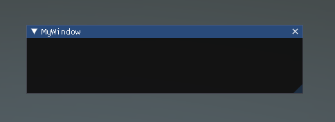
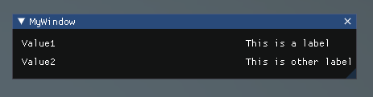
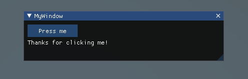
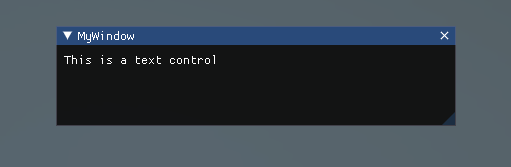
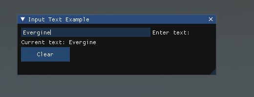
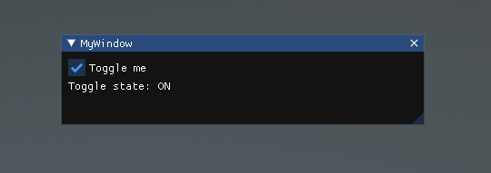
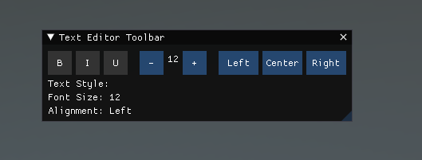
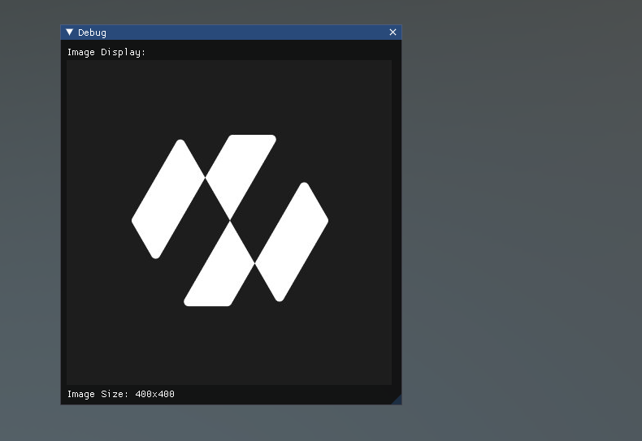
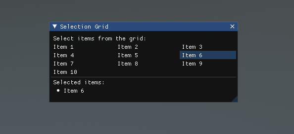
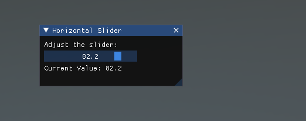

# Features

---

This page is a tour of the Dear ImGui widgets you will use most, each with a complete `Behavior` you can drop on an entity. Every example follows the same three rules:

* The UI is declared in `Update()`, every frame.
* Anything a widget edits is a **field** of the behavior, so its value survives to the next frame.
* Every `igBegin` is paired with an `igEnd`, whatever `igBegin` returned.

All the examples need these namespaces, and a class declared `unsafe` because widgets take pointers:

```csharp
using Evergine.Bindings.Imgui;
using Evergine.Framework;
using Evergine.Mathematics;
using Evergine.UI;
using System;
```

For widgets that are not covered here, open the built-in demo window with `igShowDemoWindow` (see [Getting Started](setup.md#the-built-in-demo-window)) and look for the function name in `ImguiNative`.

## Window

A window is the container every other widget goes into. `igBegin` opens it and `igEnd` closes it, and the widgets declared between the two calls are laid out top to bottom inside it. The title doubles as the window's identity: ImGui keeps the position, size and collapsed state of each title from one frame to the next, and lets the user move and resize it.

The `igSetNextWindow*` functions configure the window that the next `igBegin` opens. The `ImGuiCond` argument says when the value applies: `FirstUseEver` only the first time the window is created, `Appearing` every time it becomes visible, and `Always` on every frame, which also stops the user from changing it.

```csharp
public unsafe class MyUI : Behavior
{
    private bool open = true;

    protected override void Update(TimeSpan gameTime)
    {
        if (!this.open)
        {
            return;
        }

        // Anchor the window by its right edge (pivot 1, 0.5) at x = 420.
        ImguiNative.igSetNextWindowPos(new Vector2(420, 120), ImGuiCond.Appearing, new Vector2(1, 0.5f));
        ImguiNative.igSetNextWindowSize(new Vector2(400, 100), ImGuiCond.Appearing);

        // Passing a pointer to 'open' adds a close button that sets it to false.
        if (ImguiNative.igBegin("MyWindow", this.open.Pointer(), ImGuiWindowFlags.None))
        {
            // Widgets go here.
        }

        ImguiNative.igEnd();
    }
}
```



`ImGuiWindowFlags` changes the window's behaviour: `NoTitleBar`, `NoResize`, `NoMove`, `NoCollapse`, `AlwaysAutoResize` and `NoBackground` are the most common, and can be combined with `|`.

## Label text

`igLabelText` draws a value next to a label, aligned in two columns like the rest of the form widgets. It is read-only, which makes it the right choice for showing values the user should see but not edit.

```csharp
public unsafe class MyUI : Behavior
{
    private bool open = true;

    protected override void Update(TimeSpan gameTime)
    {
        if (ImguiNative.igBegin("MyWindow", this.open.Pointer(), ImGuiWindowFlags.None))
        {
            // The first argument is the label on the right, the second the value on the left.
            ImguiNative.igLabelText("This is a label", "Value1");
            ImguiNative.igLabelText("This is another label", "Value2");
        }

        ImguiNative.igEnd();
    }
}
```



## Button

`igButton` draws a button and returns `true` on the one frame in which the user releases the mouse over it. React to the click inside the `if`, and keep any consequence of the click in a field. A size of `Vector2.Zero` fits the button to its label.

```csharp
public unsafe class MyUI : Behavior
{
    private bool open = true;
    private int clickCount;

    protected override void Update(TimeSpan gameTime)
    {
        if (ImguiNative.igBegin("MyWindow", this.open.Pointer(), ImGuiWindowFlags.None))
        {
            if (ImguiNative.igButton("Press me", new Vector2(100, 25)))
            {
                this.clickCount++;
            }

            // Drawn on every frame after the first click, not only on the frame of the click.
            if (this.clickCount > 0)
            {
                ImguiNative.igText("Thanks for clicking me!");
            }
        }

        ImguiNative.igEnd();
    }
}
```



## Text

`igText` draws a line of static text. It is not editable; for that, see [Input text](#input-text). Related functions cover the usual variations: `igTextColored` takes a colour, `igTextWrapped` wraps at the window edge, `igBulletText` adds a bullet, and `igSeparatorText` draws a heading with a line.

```csharp
public unsafe class MyUI : Behavior
{
    private bool open = true;

    protected override void Update(TimeSpan gameTime)
    {
        if (ImguiNative.igBegin("MyWindow", this.open.Pointer(), ImGuiWindowFlags.None))
        {
            ImguiNative.igText("This is a text control");
        }

        ImguiNative.igEnd();
    }
}
```



> [!TIP]
> The text functions interpret their argument as a printf-style format. Escape percent signs as `%%`, or pass text you do not control to `igTextUnformatted(text, null)`.

## Input text

`igInputText` is an editable single-line text field. Dear ImGui edits a byte buffer in place, so you own a buffer of the maximum length you accept and convert it to a `string` when the widget reports a change. Allocate the buffer once, in a field: a buffer created inside `Update()` would lose the user's typing on the next frame.

```csharp
using System.Text;

public unsafe class MyUI : Behavior
{
    private bool open = true;

    // UTF-8 bytes edited in place by ImGui. The text ends at the first zero byte.
    private byte[] buffer = new byte[256];
    private string text = string.Empty;

    protected override void Update(TimeSpan gameTime)
    {
        ImguiNative.igSetNextWindowSize(new Vector2(400, 110), ImGuiCond.FirstUseEver);

        if (ImguiNative.igBegin("Input Text Example", this.open.Pointer(), ImGuiWindowFlags.None))
        {
            fixed (byte* bufferPointer = this.buffer)
            {
                if (ImguiNative.igInputText("Enter text:", bufferPointer, (uint)this.buffer.Length, ImGuiInputTextFlags.None, null, null))
                {
                    int length = Array.IndexOf(this.buffer, (byte)0);
                    this.text = Encoding.UTF8.GetString(this.buffer, 0, length < 0 ? this.buffer.Length : length);
                }
            }

            ImguiNative.igTextUnformatted($"Current text: {this.text}", null);

            if (ImguiNative.igButton("Clear", new Vector2(100, 30)))
            {
                Array.Clear(this.buffer, 0, this.buffer.Length);
                this.text = string.Empty;
            }
        }

        ImguiNative.igEnd();
    }
}
```



`ImGuiInputTextFlags` adds behaviour such as `CharsDecimal` (digits only), `Password` (hidden characters) and `EnterReturnsTrue` (report the change only when the user presses Enter).

## Checkbox

`igCheckbox` toggles a `bool`. It takes a pointer to the field, flips it when clicked, and returns `true` on the frame the value changed, so you can react to the change without comparing with the previous value. The `Pointer()` extension method from `Evergine.UI` converts a `bool` field into the `byte*` that the C API expects.

```csharp
public unsafe class MyUI : Behavior
{
    private bool open = true;
    private bool isToggled;

    protected override void Update(TimeSpan gameTime)
    {
        if (ImguiNative.igBegin("MyWindow", this.open.Pointer(), ImGuiWindowFlags.None))
        {
            if (ImguiNative.igCheckbox("Toggle me", this.isToggled.Pointer()))
            {
                Console.WriteLine($"Toggle state changed to: {this.isToggled}");
            }

            ImguiNative.igText($"Toggle state: {(this.isToggled ? "ON" : "OFF")}");
        }

        ImguiNative.igEnd();
    }
}
```



## Buttons in a row

Widgets are placed one below the other unless you call `igSameLine` between them, which puts the next widget on the same line after an optional gap. Combined with `igIsItemHovered` and `igSetTooltip`, which act on the widget declared just before them, this is how you build a toolbar. `igPushStyleColor_Vec4` changes a style colour for the widgets that follow until the matching `igPopStyleColor`, which here marks the active toggles.

```csharp
public unsafe class MyUI : Behavior
{
    private bool open = true;

    private bool isBold;
    private bool isItalic;
    private bool isUnderline;
    private int fontSize = 12;
    private string alignment = "Left";

    protected override void Update(TimeSpan gameTime)
    {
        ImguiNative.igSetNextWindowSize(new Vector2(390, 110), ImGuiCond.FirstUseEver);

        if (ImguiNative.igBegin("Text Editor Toolbar", this.open.Pointer(), ImGuiWindowFlags.None))
        {
            if (this.ToggleButton("B", this.isBold, "Toggle Bold")) this.isBold = !this.isBold;
            ImguiNative.igSameLine(0, 5);
            if (this.ToggleButton("I", this.isItalic, "Toggle Italic")) this.isItalic = !this.isItalic;
            ImguiNative.igSameLine(0, 5);
            if (this.ToggleButton("U", this.isUnderline, "Toggle Underline")) this.isUnderline = !this.isUnderline;
            ImguiNative.igSameLine(0, 15);

            if (ImguiNative.igButton("-", new Vector2(30, 30)) && this.fontSize > 8) this.fontSize--;
            ImguiNative.igSameLine(0, 5);
            ImguiNative.igText($"{this.fontSize}");
            ImguiNative.igSameLine(0, 5);
            if (ImguiNative.igButton("+", new Vector2(30, 30)) && this.fontSize < 72) this.fontSize++;
            ImguiNative.igSameLine(0, 15);

            foreach (var option in new[] { "Left", "Center", "Right" })
            {
                if (ImguiNative.igButton(option, new Vector2(50, 30))) this.alignment = option;
                ImguiNative.igSameLine(0, 5);
            }

            // Ends the row started by the last igSameLine.
            ImguiNative.igNewLine();

            ImguiNative.igText($"Text Style: {(this.isBold ? "Bold " : "")}{(this.isItalic ? "Italic " : "")}{(this.isUnderline ? "Underline" : "")}");
            ImguiNative.igText($"Font Size: {this.fontSize}");
            ImguiNative.igText($"Alignment: {this.alignment}");
        }

        ImguiNative.igEnd();
    }

    private bool ToggleButton(string label, bool isActive, string tooltip)
    {
        var color = isActive ? new Vector4(0.2f, 0.7f, 0.2f, 1.0f) : new Vector4(0.2f, 0.2f, 0.2f, 1.0f);
        ImguiNative.igPushStyleColor_Vec4(ImGuiCol.Button, color);
        bool clicked = ImguiNative.igButton(label, new Vector2(30, 30));
        ImguiNative.igPopStyleColor(1);

        if (ImguiNative.igIsItemHovered(ImGuiHoveredFlags.None))
        {
            ImguiNative.igSetTooltip(tooltip);
        }

        return clicked;
    }
}
```



## Image

`igImage` draws an Evergine texture. ImGui does not know about Evergine textures, so you first ask `ImGuiManager` for a binding with `CreateImGuiBinding`, which returns the `ImTextureRef` that identifies the texture in the draw data. Create the binding once and keep it in a field; release it with `RemoveImGuiBinding` when the component goes away.

This behavior exposes a `Texture` property, so you can assign any texture asset of the project from Evergine Studio:

```csharp
using Evergine.Common.Graphics;

public unsafe class ImageViewer : Behavior
{
    [BindSceneManager]
    private ImGuiManager imGuiManager = null;

    private bool open = true;
    private ImTextureRef imageRef;

    // Assign a texture asset to this property in Evergine Studio.
    public Texture Texture { get; set; }

    protected override void Start()
    {
        base.Start();

        if (this.Texture != null)
        {
            this.imageRef = this.imGuiManager.CreateImGuiBinding(this.Texture);
        }
    }

    protected override void OnDetach()
    {
        base.OnDetach();

        if (this.Texture != null)
        {
            this.imGuiManager.RemoveImGuiBinding(this.Texture);
        }
    }

    protected override void Update(TimeSpan gameTime)
    {
        ImguiNative.igSetNextWindowSize(new Vector2(420, 480), ImGuiCond.FirstUseEver);

        if (ImguiNative.igBegin("Debug", this.open.Pointer(), ImGuiWindowFlags.None))
        {
            ImguiNative.igText("Image Display:");

            if (this.Texture != null)
            {
                var size = new Vector2(400, 400);

                // uv0 and uv1 select the part of the texture to draw: here, all of it.
                ImguiNative.igImage(this.imageRef, size, Vector2.Zero, Vector2.One);
                ImguiNative.igText($"Image Size: {this.Texture.Description.Width}x{this.Texture.Description.Height}");
            }
            else
            {
                ImguiNative.igTextColored(new Vector4(1, 0, 0, 1), "No texture assigned");
            }
        }

        ImguiNative.igEnd();
    }
}
```



`igImage` draws the texture as it is. To draw it over a background colour or multiply it by a tint, use `igImageWithBg`, which takes both colours after the texture coordinates:

```csharp
// Dark grey background, texture tinted at half opacity.
ImguiNative.igImageWithBg(this.imageRef, size, Vector2.Zero, Vector2.One, new Vector4(0.1f, 0.1f, 0.1f, 1), new Vector4(1, 1, 1, 0.5f));
```

To load an image that is not a project asset, `ImGUIHelpers.LoadTextureFromFile(path)` decodes a PNG or JPEG file into a new `Texture`, and `ImGUIHelpers.DownloadTextureFromUrl(url)` does the same for a file on the web. Both are asynchronous and return the texture you then pass to `CreateImGuiBinding`.

## Selectable grid

`igSelectable_Bool` draws a line of text that highlights when selected, and returns `true` when the user clicks it. You decide what a click means: here, each item toggles, so several can be selected at once. `igPushID_Int` gives each item a unique identity even when two labels are equal, which ImGui needs to track which one is being clicked.

```csharp
public unsafe class MyUI : Behavior
{
    private const int Columns = 3;

    private bool open = true;
    private string[] items = { "Item 1", "Item 2", "Item 3", "Item 4", "Item 5", "Item 6", "Item 7", "Item 8", "Item 9", "Item 10" };
    private bool[] selected = new bool[10];

    protected override void Update(TimeSpan gameTime)
    {
        ImguiNative.igSetNextWindowSize(new Vector2(380, 160), ImGuiCond.FirstUseEver);

        if (ImguiNative.igBegin("Selection Grid", this.open.Pointer(), ImGuiWindowFlags.None))
        {
            ImguiNative.igText("Select items from the grid:");

            // Split the available width between the columns, minus the spacing between them.
            float spacing = ImguiNative.igGetStyle()->ItemSpacing.X;
            float itemWidth = (ImguiNative.igGetContentRegionAvail().X - (Columns - 1) * spacing) / Columns;

            for (int i = 0; i < this.items.Length; i++)
            {
                if (i % Columns != 0)
                {
                    ImguiNative.igSameLine(0, -1);
                }

                ImguiNative.igPushID_Int(i);
                if (ImguiNative.igSelectable_Bool(this.items[i], this.selected[i], ImGuiSelectableFlags.None, new Vector2(itemWidth, 0)))
                {
                    this.selected[i] = !this.selected[i];
                }

                ImguiNative.igPopID();
            }

            ImguiNative.igSeparator();
            ImguiNative.igText("Selected items:");

            for (int i = 0; i < this.items.Length; i++)
            {
                if (this.selected[i])
                {
                    ImguiNative.igBulletText(this.items[i]);
                }
            }
        }

        ImguiNative.igEnd();
    }
}
```



## Slider

`igSliderFloat` edits a number by dragging a handle between a minimum and a maximum. It writes the new value through the pointer and returns `true` on every frame the value changes. The format string controls how the value is printed on the slider; a label that starts with `##` is hidden but still gives the widget its identity. `igSliderInt`, `igSliderFloat2` to `igSliderFloat4`, and the `igDragFloat` family, which edit without limits, work the same way.

```csharp
public unsafe class MyUI : Behavior
{
    private bool open = true;
    private float sliderValue = 50f;

    protected override void Update(TimeSpan gameTime)
    {
        ImguiNative.igSetNextWindowSize(new Vector2(400, 110), ImGuiCond.FirstUseEver);

        if (ImguiNative.igBegin("Horizontal Slider", this.open.Pointer(), ImGuiWindowFlags.None))
        {
            ImguiNative.igText("Adjust the slider:");

            // Pin the field while ImGui writes to it.
            fixed (float* value = &this.sliderValue)
            {
                if (ImguiNative.igSliderFloat("##slider", value, 0f, 100f, "%.1f", ImGuiSliderFlags.None))
                {
                    Console.WriteLine($"Slider value changed to: {this.sliderValue}");
                }
            }

            ImguiNative.igText($"Current Value: {this.sliderValue:F1}");
        }

        ImguiNative.igEnd();
    }
}
```


