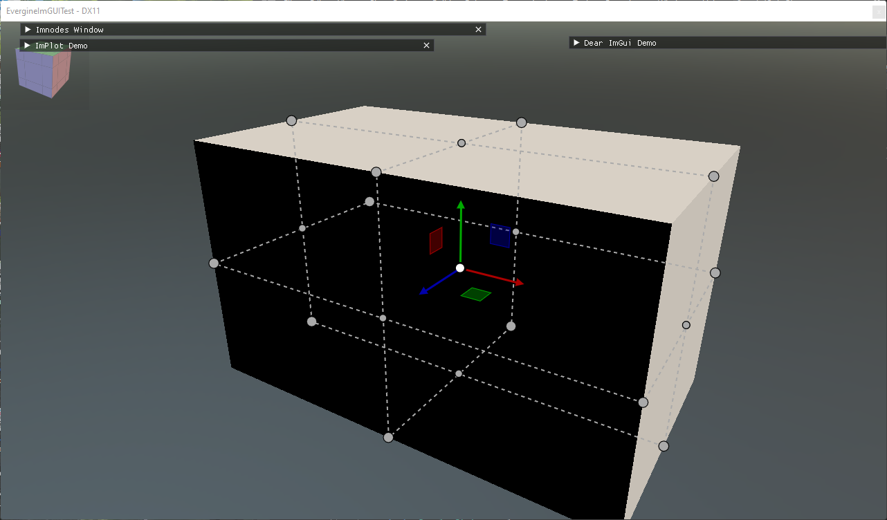
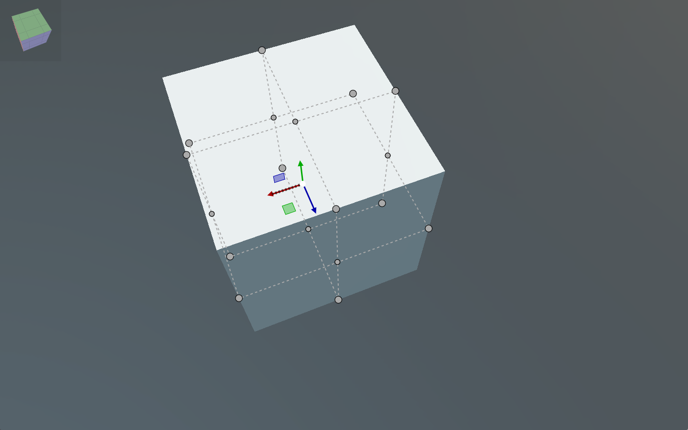
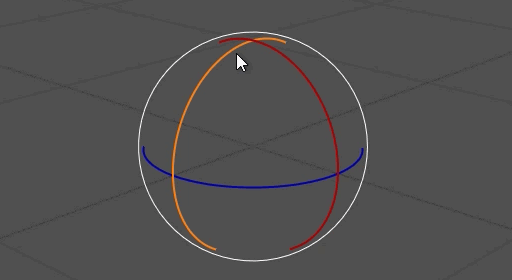
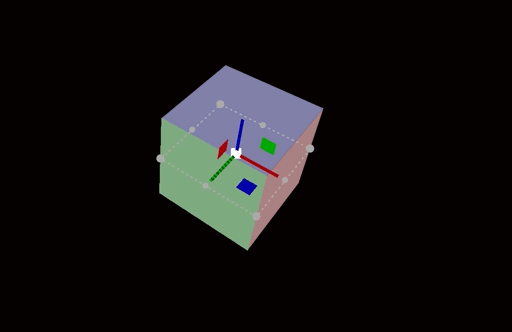
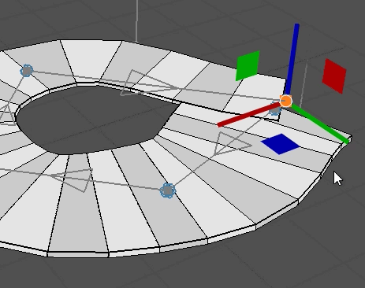
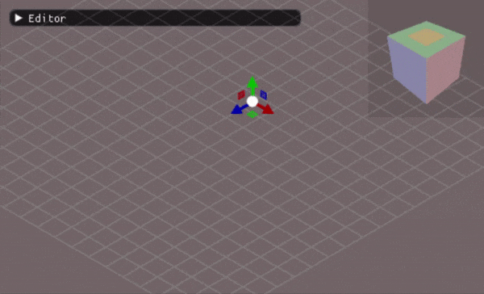

# ImGuizmo

---



[ImGuizmo](https://github.com/CedricGuillemet/ImGuizmo) draws 3D manipulation gizmos with Dear ImGui: the arrows, rings and handles that editors use to move, rotate and scale an object, and a view cube that orients the camera. It works directly on 4x4 matrices. You give it the camera's view and projection and the object's world matrix, the user drags a handle, and ImGuizmo writes the new world matrix back. Use it to add in-scene editing to a tool without writing the picking and drag math yourself.

The C# bindings cover the core ImGuizmo module: `Manipulate`, `ViewManipulate`, the grid and cube helpers, and the state queries. The other widgets of the ImGuizmo project, such as the sequencer and the graph editor, are not part of the binding.

## Enable ImGuizmo

`ImGuiManager` connects ImGuizmo to its ImGui context and starts an ImGuizmo frame every frame only when `ImGuizmoEnabled` is set:

```csharp
this.Managers.AddManager(new ImGuiManager()
{
    ImGuizmoEnabled = true,
});
```

The functions are in `ImguizmoNative`, and the `OPERATION` and `MODE` enums in the same `Evergine.Bindings.Imguizmo` namespace.

## Manipulate an entity

`ImGuizmo_Manipulate` draws the gizmo for one matrix and applies the user's drag to it. It returns `true` on the frames in which the matrix changed. The matrices are passed as `float*`, which the `Pointer()` extension method from `Evergine.UI` provides for a `Matrix4x4` field.

This component, adapted from the `Manipulation` component of the [ImGui-Demo](https://github.com/EvergineTeam/ImGui-Demo) project, puts a gizmo on the entity it is attached to and adds a small window to choose the operation:

```csharp
using Evergine.Bindings.Imgui;
using Evergine.Bindings.Imguizmo;
using Evergine.Framework;
using Evergine.Framework.Graphics;
using Evergine.Mathematics;
using Evergine.UI;
using System;

public unsafe class Manipulation : Behavior
{
    [BindComponent]
    private Transform3D transform = null;

    // ImGuizmo reads and writes these through pointers, so they are fields.
    private Matrix4x4 view;
    private Matrix4x4 projection;
    private Matrix4x4 world;

    // Local bounds of the object (min xyz, max xyz), used by OPERATION.BOUNDS.
    private float[] bounds = { -0.5f, -0.5f, -0.5f, 0.5f, 0.5f, 0.5f };

    private OPERATION operation = OPERATION.TRANSLATE;
    private MODE mode = MODE.WORLD;

    protected override void Update(TimeSpan gameTime)
    {
        // A small window to choose what the gizmo does.
        ImguiNative.igSetNextWindowPos(new Vector2(10, 10), ImGuiCond.FirstUseEver, Vector2.Zero);

        if (ImguiNative.igBegin("Gizmo", null, ImGuiWindowFlags.AlwaysAutoResize))
        {
            if (ImguiNative.igRadioButton_Bool("Translate", this.operation == OPERATION.TRANSLATE)) this.operation = OPERATION.TRANSLATE;
            ImguiNative.igSameLine(0, -1);
            if (ImguiNative.igRadioButton_Bool("Rotate", this.operation == OPERATION.ROTATE)) this.operation = OPERATION.ROTATE;
            ImguiNative.igSameLine(0, -1);
            if (ImguiNative.igRadioButton_Bool("Scale", this.operation == OPERATION.SCALE)) this.operation = OPERATION.SCALE;
            ImguiNative.igSameLine(0, -1);
            if (ImguiNative.igRadioButton_Bool("Bounds", this.operation == (OPERATION.TRANSLATE | OPERATION.BOUNDS))) this.operation = OPERATION.TRANSLATE | OPERATION.BOUNDS;

            if (ImguiNative.igRadioButton_Bool("World", this.mode == MODE.WORLD)) this.mode = MODE.WORLD;
            ImguiNative.igSameLine(0, -1);
            if (ImguiNative.igRadioButton_Bool("Local", this.mode == MODE.LOCAL)) this.mode = MODE.LOCAL;
        }

        ImguiNative.igEnd();

        // The gizmo can be drawn anywhere on screen: use the whole display.
        var io = ImguiNative.igGetIO_Nil();
        ImguizmoNative.ImGuizmo_SetRect(0, 0, io->DisplaySize.X, io->DisplaySize.Y);

        var camera = this.Managers.RenderManager.ActiveCamera3D;
        this.view = camera.View;
        this.projection = camera.Projection;
        this.world = this.transform.WorldTransform;

        fixed (float* boundsPointer = this.bounds)
        {
            float* localBounds = (this.operation & OPERATION.BOUNDS) != 0 ? boundsPointer : null;

            if (ImguizmoNative.ImGuizmo_Manipulate(this.view.Pointer(), this.projection.Pointer(), this.operation, this.mode, this.world.Pointer(), null, null, localBounds, null))
            {
                this.transform.WorldTransform = this.world;
            }
        }
    }
}
```





`OPERATION` is a set of flags, so you can combine handles: `TRANSLATE_X | TRANSLATE_Z` limits the move to the ground plane, and `UNIVERSAL` shows translation, rotation and scale together. `MODE.LOCAL` aligns the handles with the object's axes instead of the world's; scaling always happens in local space.

Adding `OPERATION.BOUNDS` shows handles on the faces and corners of the box given by `localBounds`, which resize the object like a selection box in a 2D editor.





### Snapping

The `snap` argument, left as `null` above, is a pointer to three floats: the step for each axis when translating, the angle in degrees when rotating (only the first value is used), or the scale step. Pass it only while you want snapping, for example while Ctrl is held. Add a field for the steps:

```csharp
// A field, like the matrices: 0.5 units, or 15 degrees when rotating.
private float[] snap = { 0.5f, 0.5f, 0.5f };
```

Then replace the `ImGuizmo_Manipulate` call in `Update()`:

```csharp
fixed (float* snapPointer = this.snap)
{
    float* activeSnap = io->KeyCtrl != 0 ? snapPointer : null;
    ImguizmoNative.ImGuizmo_Manipulate(this.view.Pointer(), this.projection.Pointer(), this.operation, this.mode, this.world.Pointer(), null, activeSnap, null, null);
}
```


## Orient the camera with a view cube

`ImGuizmo_ViewManipulate_Float` draws a cube that shows the camera's orientation. Clicking a face turns the view to look along that axis, and dragging the cube orbits the camera around a point at the given distance. It edits a view matrix, so convert the result back into the camera's transform by inverting it:

```csharp
using Evergine.Bindings.Imgui;
using Evergine.Bindings.Imguizmo;
using Evergine.Framework;
using Evergine.Mathematics;
using Evergine.UI;
using System;

public unsafe class ViewCube : Behavior
{
    private Matrix4x4 view;

    protected override void Update(TimeSpan gameTime)
    {
        var camera = this.Managers.RenderManager.ActiveCamera3D;
        this.view = camera.View;

        // Distance of the orbit pivot, position and size of the cube, and background colour (ABGR).
        ImguizmoNative.ImGuizmo_ViewManipulate_Float(this.view.Pointer(), 2, Vector2.Zero, new Vector2(128, 128), 0x10101010);

        // The inverse of the view matrix is the camera's world transform.
        Matrix4x4.Invert(ref this.view, out Matrix4x4 cameraWorld);
        camera.Transform.LocalPosition = cameraWorld.Translation;
        camera.Transform.LocalRotation = cameraWorld.Rotation;
    }
}
```



> [!NOTE]
> The view cube assigns the camera's position every frame. Disable any camera controller on the same camera, or it will fight the cube for the transform.

## Helpers and queries

| Function | Description |
| --- | --- |
| `ImGuizmo_DrawGrid(view, projection, matrix, gridSize)` | Draws a grid on the plane defined by `matrix`, for example `Matrix4x4.Identity` for the ground. |
| `ImGuizmo_DrawCubes(view, projection, matrices, count)` | Draws unit cubes with the given world matrices, useful to preview placements. |
| `ImGuizmo_IsOver_Nil()` | `true` while the mouse is over a gizmo handle. |
| `ImGuizmo_IsUsing()` | `true` while the user is dragging a handle. Check it to stop other input, such as camera orbit, from reacting to the same drag. |
| `ImGuizmo_Enable(bool)` | Shows the gizmo without accepting input when `false`. |
| `ImGuizmo_SetOrthographic(bool)` | Tells ImGuizmo that the projection is orthographic, which changes how handles are sized. |
| `ImGuizmo_SetID(int)` or `ImGuizmo_PushID_Int(int)` / `ImGuizmo_PopID()` | Gives each gizmo its own identity when you draw several in one frame. |
| `ImGuizmo_DecomposeMatrixToComponents` and `ImGuizmo_RecomposeMatrixFromComponents` | Convert between a matrix and translation, rotation (degrees) and scale arrays, for numeric editing next to the gizmo. |
