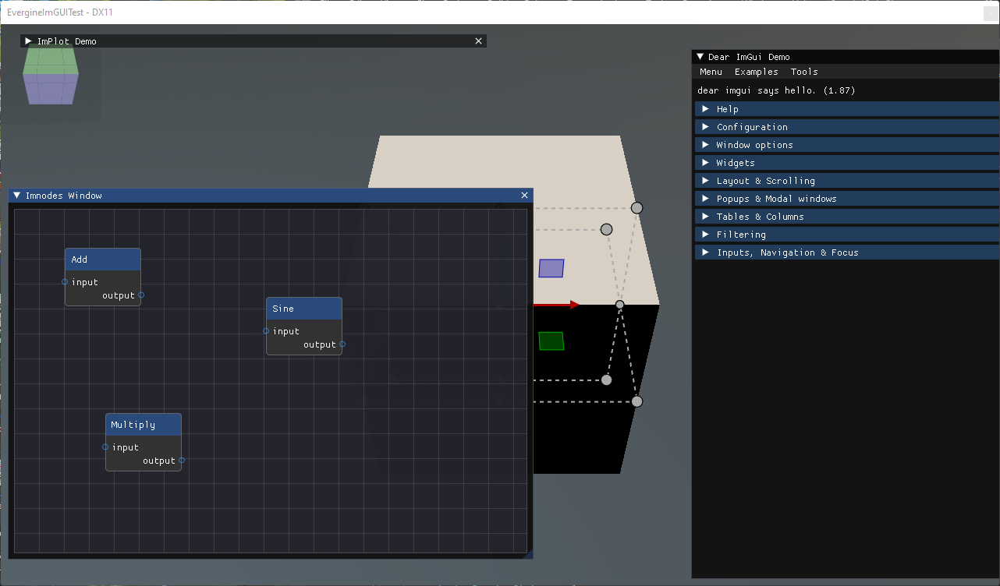
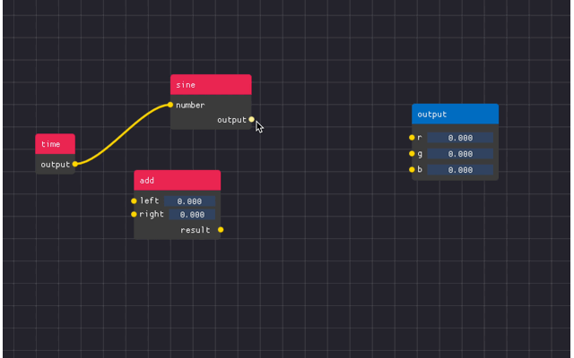

# ImNodes

---



[ImNodes](https://github.com/Nelarius/imnodes) adds a node editor to Dear ImGui: a pannable canvas with nodes, pins and the links between them. Use it for tools where the user wires things together, such as a material graph, a dialogue tree or a state machine. Like the rest of ImGui it is immediate mode. ImNodes draws the graph you declare each frame and reports what the user did; the graph itself, which nodes exist and what is connected to what, is data you keep.



## Enable ImNodes

ImNodes needs its own context, which `ImGuiManager` only creates when `ImNodesEnabled` is set:

```csharp
this.Managers.AddManager(new ImGuiManager()
{
    ImNodesEnabled = true,
});
```

The functions are in `ImnodesNative`, and the enums such as `ImNodesPinShape` and `ImNodesMiniMapLocation` in the same `Evergine.Bindings.Imnodes` namespace.

## Building blocks

An editor is declared inside an ImGui window, between `imnodes_BeginNodeEditor` and `imnodes_EndNodeEditor`:

| Call pair | Declares |
| --- | --- |
| `imnodes_BeginNode(id)` / `imnodes_EndNode()` | A node. Any ImGui widget can go inside it. |
| `imnodes_BeginNodeTitleBar()` / `imnodes_EndNodeTitleBar()` | The coloured title bar at the top of a node. |
| `imnodes_BeginInputAttribute(id, shape)` / `imnodes_EndInputAttribute()` | A row with a pin on the left, where links arrive. |
| `imnodes_BeginOutputAttribute(id, shape)` / `imnodes_EndOutputAttribute()` | A row with a pin on the right, where links start. |
| `imnodes_BeginStaticAttribute(id)` / `imnodes_EndStaticAttribute()` | A row without a pin, for settings of the node. |
| `imnodes_Link(id, startAttribute, endAttribute)` | A link between two pins, declared after the nodes. |

Every node, attribute and link needs an integer id that stays the same from frame to frame, because ImNodes stores their positions and selection by id.

## A graph the user can wire

The editor below declares three nodes with one input and one output each. The user drags from an output pin to an input pin to create a link, and ImNodes reports it after `imnodes_EndNodeEditor`; the behavior then adds it to its own list so it is declared again on the next frame. Detaching a link reports its id, and the behavior removes it.

```csharp
using Evergine.Bindings.Imgui;
using Evergine.Bindings.Imnodes;
using Evergine.Framework;
using Evergine.Mathematics;
using Evergine.UI;
using System;
using System.Collections.Generic;

public unsafe class NodeGraph : Behavior
{
    private bool open = true;
    private bool positioned;

    private string[] nodes = { "Node1", "Node2", "Node3" };

    // The graph is ours: ImNodes only draws the links we declare.
    private List<(int Id, int Start, int End)> links = new List<(int Id, int Start, int End)>();
    private int nextLinkId = 1000;

    // Node i has id i * 10, its input pin i * 10 + 1 and its output pin i * 10 + 2.
    private static int NodeId(int i) => i * 10;

    protected override void Update(TimeSpan gameTime)
    {
        if (!this.open)
        {
            return;
        }

        ImguiNative.igSetNextWindowSize(new Vector2(500, 500), ImGuiCond.Appearing);

        if (ImguiNative.igBegin("ImNodes Demo", this.open.Pointer(), ImGuiWindowFlags.None))
        {
            ImnodesNative.imnodes_BeginNodeEditor();

            for (int i = 0; i < this.nodes.Length; i++)
            {
                ImnodesNative.imnodes_BeginNode(NodeId(i));

                ImnodesNative.imnodes_BeginNodeTitleBar();
                ImguiNative.igText(this.nodes[i]);
                ImnodesNative.imnodes_EndNodeTitleBar();

                ImnodesNative.imnodes_BeginInputAttribute(NodeId(i) + 1, ImNodesPinShape.CircleFilled);
                ImguiNative.igText("input");
                ImnodesNative.imnodes_EndInputAttribute();

                ImnodesNative.imnodes_BeginOutputAttribute(NodeId(i) + 2, ImNodesPinShape.CircleFilled);
                ImguiNative.igIndent(40);
                ImguiNative.igText("output");
                ImnodesNative.imnodes_EndOutputAttribute();

                ImnodesNative.imnodes_EndNode();

                // Without this, every node starts at the origin on top of the others.
                if (!this.positioned)
                {
                    ImnodesNative.imnodes_SetNodeGridSpacePos(NodeId(i), new Vector2(20 + (i * 160), 40 + (i * 60)));
                }
            }

            this.positioned = true;

            foreach (var link in this.links)
            {
                ImnodesNative.imnodes_Link(link.Id, link.Start, link.End);
            }

            ImnodesNative.imnodes_MiniMap(0.25f, ImNodesMiniMapLocation.BottomRight, IntPtr.Zero, IntPtr.Zero);
            ImnodesNative.imnodes_EndNodeEditor();

            // Interaction queries are only valid after imnodes_EndNodeEditor.
            int start, end;
            if (ImnodesNative.imnodes_IsLinkCreated_BoolPtr(&start, &end, null))
            {
                this.links.Add((this.nextLinkId++, start, end));
            }

            int destroyedLink;
            if (ImnodesNative.imnodes_IsLinkDestroyed(&destroyedLink))
            {
                this.links.RemoveAll(link => link.Id == destroyedLink);
            }
        }

        ImguiNative.igEnd();
    }
}
```

<!-- CAPTURE: imnodes_graph.png; the NodeGraph window from this page (or the ImNodes Demo window of ImGui-Demo next-release) with the three nodes spread out, two links between them and the minimap in the bottom-right corner -->

> [!TIP]
> To let the user remove a link by dragging it off a pin, push `ImNodesAttributeFlags.EnableLinkDetachWithDragClick` with `imnodes_PushAttributeFlag` before `imnodes_BeginNodeEditor`, and pop it with `imnodes_PopAttributeFlag` after `imnodes_EndNodeEditor`. That is when `imnodes_IsLinkDestroyed` reports it.

## Useful queries

| Function | Returns |
| --- | --- |
| `imnodes_IsNodeHovered(int*)`, `imnodes_IsLinkHovered(int*)`, `imnodes_IsPinHovered(int*)` | Whether something is under the mouse, and its id. |
| `imnodes_NumSelectedNodes()` and `imnodes_GetSelectedNodes(int*)` | The nodes the user has selected. The same pair exists for links. |
| `imnodes_IsLinkDropped(int*, bool)` | A link dragged from a pin and released over empty space, a common trigger for a "create node" menu. |
| `imnodes_SaveCurrentEditorStateToIniString(uint*)` and `imnodes_LoadCurrentEditorStateFromIniString(string, uint)` | The positions of the nodes and the panning of the canvas, to restore the layout later. |
