# ImPlot

---

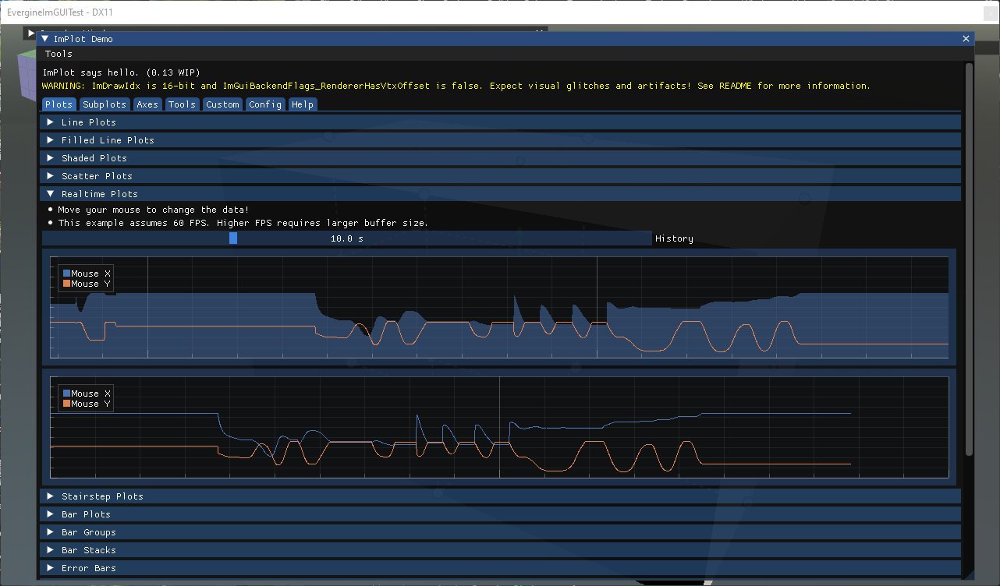

[ImPlot](https://github.com/epezent/implot) is an immediate-mode plotting library for Dear ImGui. It draws interactive 2D charts inside an ImGui window, with zoom, pan, legends and tooltips built in, and is fast enough to redraw thousands of points every frame. Use it to watch values change while the application runs: frame times, sensor data, physics quantities, or any array you already have in memory.

## Enable ImPlot

ImPlot needs its own context, which `ImGuiManager` only creates when `ImPlotEnabled` is set:

```csharp
this.Managers.AddManager(new ImGuiManager()
{
    ImPlotEnabled = true,
});
```

The functions are in `ImplotNative`, in the `Evergine.Bindings.Implot` namespace. Their names carry the type of the data as a suffix: `ImPlot_PlotLine_FloatPtrInt` plots an array of `float` values against their index, and `ImPlot_PlotLine_FloatPtrFloatPtr` plots `x` and `y` arrays.

## Plot a value over time

A chart is declared like a window. `ImPlot_BeginPlot` opens it inside the current ImGui window and returns `false` when it is not visible; everything between it and `ImPlot_EndPlot` configures the axes and adds series.

This behavior keeps the last 200 frame times in a ring buffer, plots them as a line, and shows how they are distributed in a histogram below:

```csharp
using Evergine.Bindings.Imgui;
using Evergine.Bindings.Implot;
using Evergine.Framework;
using Evergine.Mathematics;
using Evergine.UI;
using System;

public unsafe class FrameTimePlot : Behavior
{
    private const int Count = 200;

    private bool open = true;

    // Samples live in fields: the plot reads them again on every frame.
    private float[] frameTimes = new float[Count];
    private int offset;

    // ImPlotSpec describes how a series is drawn. A zeroed struct would draw
    // transparent lines and read every point from index 0, so start from the same
    // defaults as the C++ ImPlotSpec constructor.
    private ImPlotSpec spec = new ImPlotSpec
    {
        LineColor = new Vector4(0, 0, 0, -1),       // IMPLOT_AUTO_COL: next colour of the colormap
        LineWeight = 1,
        FillColor = new Vector4(0, 0, 0, -1),
        FillAlpha = 1,
        Marker = ImPlotMarker.None,
        MarkerSize = 4,
        MarkerLineColor = new Vector4(0, 0, 0, -1),
        MarkerFillColor = new Vector4(0, 0, 0, -1),
        Size = 4,
        Offset = 0,
        Stride = -1,                                // IMPLOT_AUTO: sizeof(float)
        Flags = ImPlotItemFlags.None,
    };

    protected override void Update(TimeSpan gameTime)
    {
        this.frameTimes[this.offset] = (float)gameTime.TotalMilliseconds;
        this.offset = (this.offset + 1) % Count;

        if (!this.open)
        {
            return;
        }

        ImguiNative.igSetNextWindowSize(new Vector2(500, 520), ImGuiCond.FirstUseEver);

        if (ImguiNative.igBegin("Frame time", this.open.Pointer(), ImGuiWindowFlags.None))
        {
            fixed (float* values = this.frameTimes)
            {
                if (ImplotNative.ImPlot_BeginPlot("Frame time (ms)", new Vector2(-1, 220), ImPlotFlags.None))
                {
                    ImplotNative.ImPlot_SetupAxes("frame", "ms", ImPlotAxisFlags.None, ImPlotAxisFlags.AutoFit);
                    ImplotNative.ImPlot_SetupAxisLimits(ImAxis.X1, 0, Count, ImPlotCond.Always);

                    // ImPlot reads element (Offset + i) % count, so starting at the
                    // oldest sample puts the newest one on the right.
                    var lineSpec = this.spec;
                    lineSpec.Offset = this.offset;
                    ImplotNative.ImPlot_PlotLine_FloatPtrInt("Update", values, Count, 1, 0, lineSpec);
                    ImplotNative.ImPlot_EndPlot();
                }

                if (ImplotNative.ImPlot_BeginPlot("Distribution", new Vector2(-1, 220), ImPlotFlags.NoLegend))
                {
                    ImplotNative.ImPlot_SetupAxes("ms", "frames", ImPlotAxisFlags.AutoFit, ImPlotAxisFlags.AutoFit);

                    // The order of the samples does not matter here. An empty range
                    // lets ImPlot use the minimum and maximum of the data.
                    ImplotNative.ImPlot_PlotHistogram_FloatPtr("Update", values, Count, 20, 1.0, new ImPlotRange(), this.spec);
                    ImplotNative.ImPlot_EndPlot();
                }
            }
        }

        ImguiNative.igEnd();
    }
}
```

`ImPlot_EndPlot` is only called when `ImPlot_BeginPlot` returned `true`, which is the opposite of `igBegin` and `igEnd`. A size of `-1` fills the available width.

> [!IMPORTANT]
> Every plot function takes an `ImPlotSpec` by value. Build it from the defaults shown above and change only what you need, such as `LineColor`, `LineWeight` or `Marker`. `default(ImPlotSpec)` has a `Stride` of 0 and a fully transparent line colour, so the series reads the same element over and over and draws nothing visible.

## Series types

Each kind of chart is one function call inside `ImPlot_BeginPlot` and `ImPlot_EndPlot`, and several series of different kinds can share one plot. The images below come from the ImPlot demo window, which you can open with `ImplotNative.ImPlot_ShowDemoWindow(open.Pointer())` to see every type with its source.

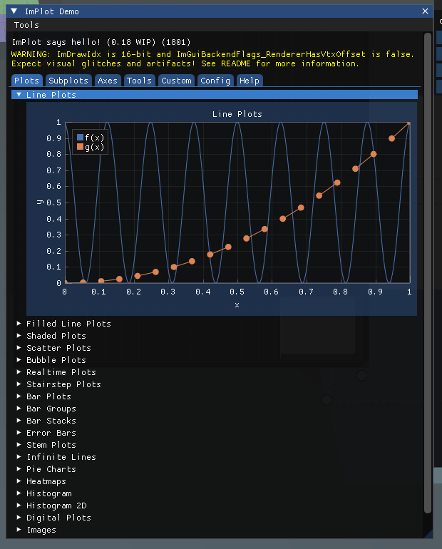

### Line plots

`ImPlot_PlotLine_*` joins consecutive points with straight segments. It is the default choice for a value sampled at regular intervals, and the basis of a realtime plot: keep a ring buffer, as in the example above, and scroll the x axis.

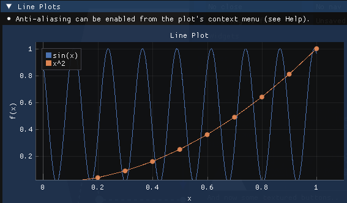

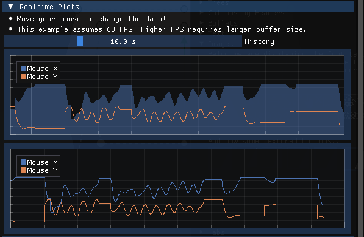

### Shaded and filled plots

`ImPlot_PlotShaded_*` fills the area between a series and a reference value, or between two series. Filling down to zero turns a line into an area chart; filling between an upper and a lower bound shows a range or a confidence band.

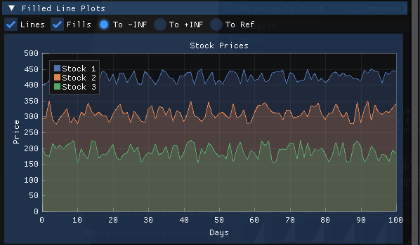

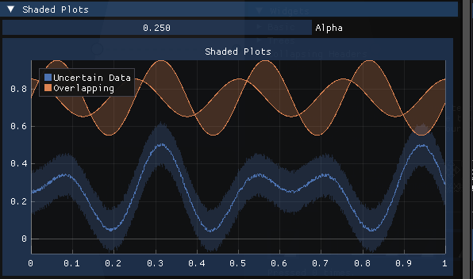

### Scatter plots

`ImPlot_PlotScatter_*` draws one marker per point and no lines. Use it when the order of the points carries no meaning, for example to show how two measurements relate to each other.

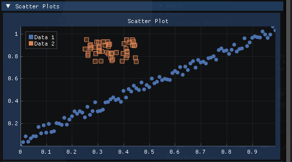

### Stairstep plots

`ImPlot_PlotStairs_*` holds each value until the next point, which draws signals that change in discrete steps, such as a state or a quantized value, without the false slopes a line plot would suggest.

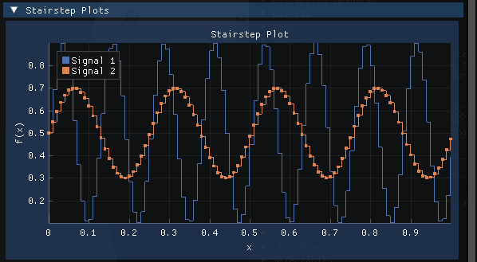

### Bar plots

`ImPlot_PlotBars_*` draws one bar per value, vertical by default. `ImPlot_PlotBarGroups_FloatPtr` draws several series side by side for each category, and stacks them on top of each other when its spec's `Flags` include `ImPlotBarGroupsFlags.Stacked`.

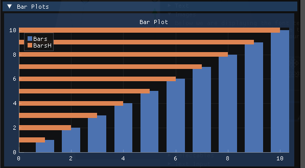

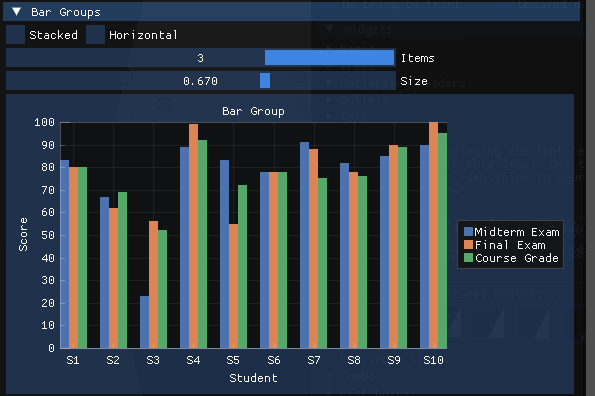

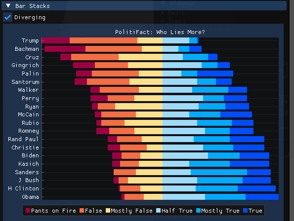

### Error bars

`ImPlot_PlotErrorBars_*` draws a whisker above and below each point. Plot it together with a line or bar series to show the uncertainty of each value.

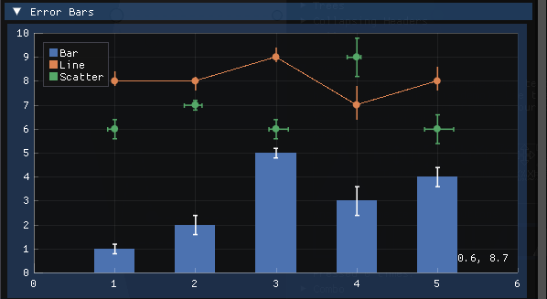

### Stem plots

`ImPlot_PlotStems_*` draws a vertical line from a reference value up to each point, with a marker at the end. It suits sparse or discrete samples, where a line between points would be misleading.

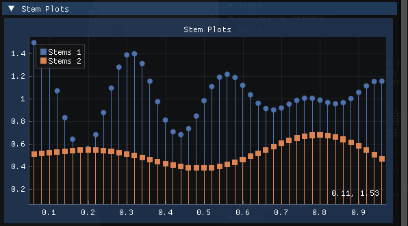

### Infinite lines

`ImPlot_PlotInfLines_FloatPtr` draws lines that span the whole plot at the given positions. Use it to mark thresholds or events that should stay visible whatever the zoom.

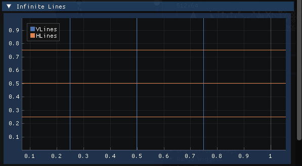

### Pie charts

`ImPlot_PlotPieChart_*` divides a circle into slices proportional to the values, labelled with a format string. It reads best with a handful of slices and an equal-axes plot (`ImPlotFlags.Equal`).

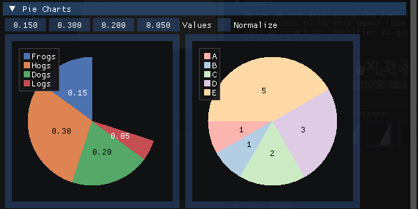

### Heatmaps

`ImPlot_PlotHeatmap_FloatPtr` colours each cell of a 2D array according to its value, using the current colormap. It shows a grid of values, such as a density map or a matrix, at a glance.

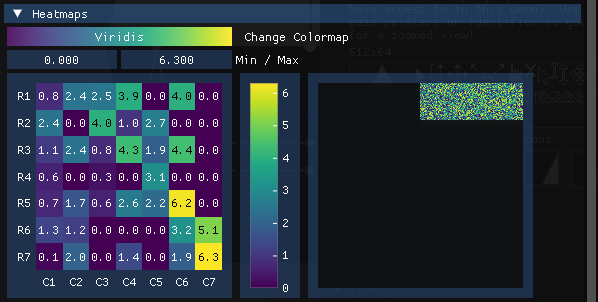

### Histograms

`ImPlot_PlotHistogram_FloatPtr` sorts values into bins and draws the count of each bin as a bar, which shows how the values are distributed. `ImPlot_PlotHistogram2D_FloatPtr` does the same for pairs of values and draws the counts as a heatmap.

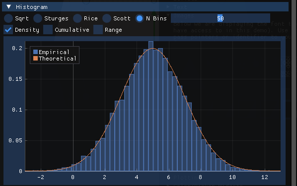

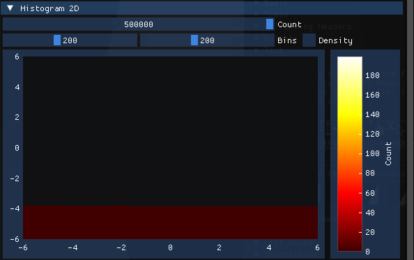

### Digital plots

`ImPlot_PlotDigital_FloatPtr` draws on/off or small integer signals as stacked lanes that do not scale with the y axis, like the traces of a logic analyser, so you can watch several of them next to an ordinary series.

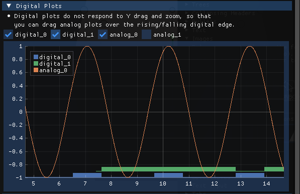
