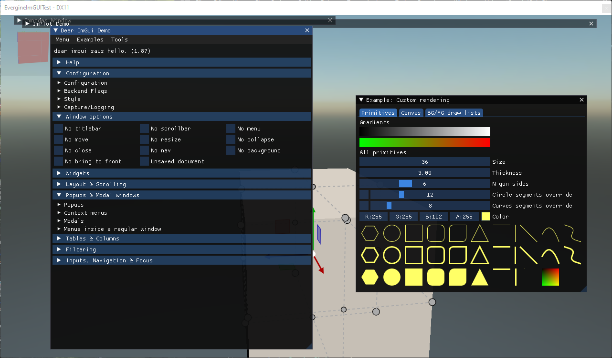
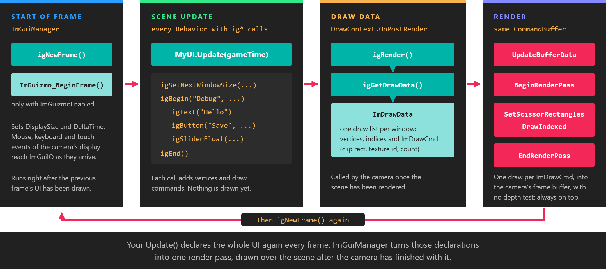

# ImGui

---

The `Evergine.ImGui` extension integrates [Dear ImGui](https://github.com/ocornut/imgui), the immediate-mode GUI library, into the Evergine render loop. Use it for the interface that you, not your end users, look at: debug panels, property editors, profilers and small in-app tools. You write the whole UI as plain function calls in a `Behavior`, and the extension draws it on top of the camera's image.

The same package also exposes three libraries built on top of Dear ImGui: [ImPlot](implot.md) for charts, [ImNodes](imnodes.md) for node editors, and [ImGuizmo](imguizmo.md) for 3D manipulation gizmos.

## Immediate mode in one paragraph

A retained-mode UI keeps a tree of widget objects that you create once and update. Dear ImGui keeps nothing of yours. Every frame, your code calls `igBegin`, then one function per widget, then `igEnd`, and those calls *are* the UI. A button exists for as long as you keep calling `igButton`, and it tells you it was clicked by returning `true` from that call. The values a widget edits live in your own fields, so the UI can never drift out of sync with your data.

## How a frame is drawn

`ImGuiManager` is a scene manager. It owns the Dear ImGui context, feeds it the mouse, keyboard and touch input of the camera's display, and renders the result.

*Your `Update()` only declares widgets. Nothing reaches the GPU until the camera has finished drawing the scene, when `ImGuiManager` converts the draw data into a single render pass over the same frame buffer.*

This has two practical consequences:

* **Call `ig*` functions from `Update()`**, or from anything that runs during the scene update. Calls made from another thread, or after the camera has rendered, land in the wrong frame.
* **The UI is always on top.** It is drawn after the scene, into the frame buffer of the rendering camera, with no depth test.

## Namespaces

| Namespace | Contains |
| --- | --- |
| `Evergine.UI` | `ImGuiManager`, `CustomFont` and `ImGUIHelpers` (the `Pointer()` extension methods and texture loading helpers). |
| `Evergine.Bindings.Imgui` | `ImguiNative` with every `ig*` function, plus the Dear ImGui enums and structs. |
| `Evergine.Bindings.Implot` | `ImplotNative` and the ImPlot types. |
| `Evergine.Bindings.Imnodes` | `ImnodesNative` and the ImNodes types. |
| `Evergine.Bindings.Imguizmo` | `ImguizmoNative` and the ImGuizmo types. |

The bindings are generated from the [cimgui](https://github.com/cimgui/cimgui) C API, so function names follow the C conventions: an `ig` prefix, and a suffix such as `_Vec4`, `_Int` or `_Nil` where C++ overloads had to be split into separate functions.

## In this section

* [Getting Started](setup.md)
* [Features](features.md)
* [ImPlot](implot.md)
* [ImNodes](imnodes.md)
* [ImGuizmo](imguizmo.md)
