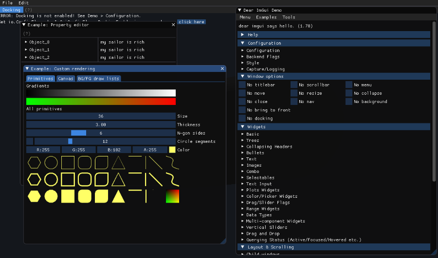
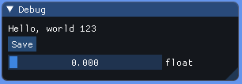
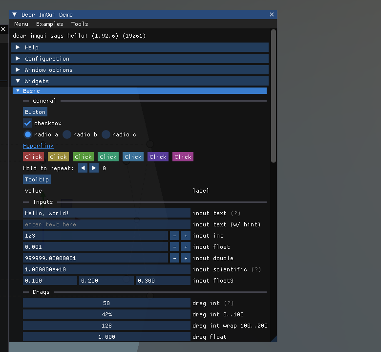
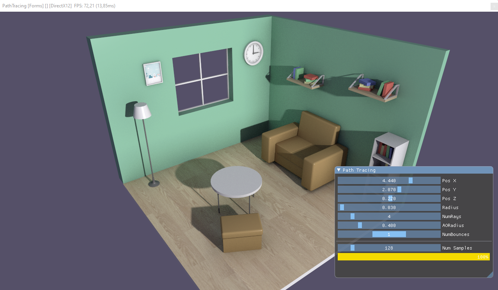

# Getting Started

---



This page takes you from an empty project to your first ImGui window: install the package, register `ImGuiManager` in the scene, and write a `Behavior` that declares the UI every frame. It also covers the options of `ImGuiManager`, custom fonts, and how the UI shares input with the rest of your scene.

## Install the package

Add the `Evergine.ImGui` NuGet package to your application project (the one that contains your scenes and components):

```xml
<!-- Use the same version as the other Evergine packages in your project. -->
<PackageReference Include="Evergine.ImGui" Version="EVERGINE_VERSION" />
```

`Evergine.ImGui` brings in `Evergine.Bindings.Imgui`, which contains the C# bindings for Dear ImGui, ImPlot, ImNodes and ImGuizmo, and the native `cimgui` library they call.

> [!IMPORTANT]
> The bindings package ships native binaries for Windows (x64 and ARM64), Linux (x64 and ARM64), macOS (x64 and ARM64) and WebAssembly. There are no Android or iOS binaries, so ImGui is not available in mobile builds.

## Allow unsafe code

The bindings are a thin layer over the C API. Widgets that edit a value take a pointer to it, so the code that calls them must be compiled with unsafe code enabled. Add this property to the project file:

```xml
<PropertyGroup>
  <AllowUnsafeBlocks>True</AllowUnsafeBlocks>
</PropertyGroup>
```

In Visual Studio you can set the same option from the project properties, under **Build** > **Allow unsafe code**.

## Register ImGuiManager

`ImGuiManager` is a scene manager. Add it in `RegisterManagers` of every scene that shows ImGui, and enable the extra libraries you need:

```csharp
using Evergine.Framework;
using Evergine.UI;

public class MyScene : Scene
{
    public override void RegisterManagers()
    {
        base.RegisterManagers();
        this.Managers.AddManager(new global::Evergine.Framework.Physics.PhysicsManager());

        // ImPlot, ImNodes and ImGuizmo each need their own context, which is only
        // created when the flag is set before the manager is attached.
        this.Managers.AddManager(new ImGuiManager()
        {
            ImPlotEnabled = true,
            ImNodesEnabled = true,
            ImGuizmoEnabled = true,
        });
    }

    protected override void CreateScene()
    {
    }
}
```

### ImGuiManager properties

| Property | Default | Description |
| --- | --- | --- |
| **ImGuizmoEnabled** | false | Connects ImGuizmo to the ImGui context and calls `ImGuizmo_BeginFrame()` at the start of every frame. Required before calling any `ImguizmoNative` function. |
| **ImPlotEnabled** | false | Creates the ImPlot context. Required before calling any `ImplotNative` function. |
| **ImNodesEnabled** | false | Creates the ImNodes context. Required before calling any `ImnodesNative` function. |
| **CustomFonts** | null | Array of `CustomFont` loaded into the font atlas instead of the built-in font. See [Custom fonts](#custom-fonts). |
| **MergeCustomFonts** | true | For custom fonts that declare a `GlyphRange`, merges their glyphs into the previous font instead of adding a separate font. This is how an icon font is combined with a text font. |
| **RequiresExplicitRenderingCamera** | false | When false, the manager uses the render manager's `ActiveCamera3D`. When true, it does nothing until you assign `RenderingCamera`. |
| **RenderingCamera** | active 3D camera | The camera whose display receives the UI and whose mouse, keyboard and touch input feed ImGui. Changing it at run time moves the UI to the new camera's display. |

`ImGuiManager` also has three methods:

| Method | Description |
| --- | --- |
| `CreateImGuiBinding(Texture)` | Returns the `ImTextureRef` that `igImage` and other image widgets need to draw an Evergine texture. Calling it again with the same texture returns the same reference. See [Image](features.md#image). |
| `RemoveImGuiBinding(Texture)` | Releases the binding. Call it when you stop drawing the texture or dispose it. |
| `TrySetCurrentContext()` | Makes this manager's ImGui context current. Only needed when more than one scene with an `ImGuiManager` is alive at the same time. |

> [!NOTE]
> The flags and fonts are read when the manager is attached to the scene. Set them in the object initializer, as above, rather than later from a component.

## Write your first window

Create a `Behavior` and declare the window in `Update()`. Everything the UI edits lives in fields, because the method runs every frame and local variables would be reset each time.

```csharp
using Evergine.Bindings.Imgui;
using Evergine.Framework;
using Evergine.Mathematics;
using Evergine.UI;
using System;

public unsafe class MyUI : Behavior
{
    // State that must survive from one frame to the next.
    private bool open = true;
    private float value;
    private int saveCount;

    protected override void Update(TimeSpan gameTime)
    {
        // The close button of the window sets 'open' to false. Stop declaring the
        // window from then on, or it would reappear on the next frame.
        if (!this.open)
        {
            return;
        }

        // SetNextWindow* calls apply to the next igBegin, so they must come first.
        ImguiNative.igSetNextWindowSize(new Vector2(300, 100), ImGuiCond.FirstUseEver);

        if (ImguiNative.igBegin("Debug", this.open.Pointer(), ImGuiWindowFlags.None))
        {
            ImguiNative.igText("Hello, world 123");

            if (ImguiNative.igButton("Save", Vector2.Zero))
            {
                this.saveCount++;
            }

            fixed (float* valuePointer = &this.value)
            {
                ImguiNative.igSliderFloat("float", valuePointer, 0.0f, 1.0f, "%.3f", ImGuiSliderFlags.None);
            }
        }

        // igEnd is always required, even when igBegin returns false because the
        // window is collapsed or hidden.
        ImguiNative.igEnd();
    }
}
```

Then add the behavior to an entity. In Evergine Studio, create an empty entity and add the `MyUI` component to it. In code, add it from `CreateScene`:

```csharp
protected override void CreateScene()
{
    var ui = new Entity("UI")
        .AddComponent(new MyUI());

    this.Managers.EntityManager.Add(ui);
}
```

Run the project and the window appears over the scene. It can be moved, resized and collapsed with the mouse, and ImGui remembers its position between frames by its title, `"Debug"`.



*The window declared by `MyUI`. Dragging the slider changes the `value` field, and the next frame draws the slider from that field.*

> [!TIP]
> `igText` and the other text widgets treat their argument as a printf-style format string. Write `%%` for a literal percent sign, or use `igTextUnformatted(text, null)` for text you do not control, such as file names or user input.

## The built-in demo window

Dear ImGui includes a demo window that exercises almost every widget and flag. It is the fastest way to find out what a control looks like and which function draws it:

```csharp
using Evergine.Bindings.Imgui;
using Evergine.Framework;
using Evergine.UI;
using System;

public unsafe class DemoWindow : Behavior
{
    private bool open = true;

    protected override void Update(TimeSpan gameTime)
    {
        if (this.open)
        {
            ImguiNative.igShowDemoWindow(this.open.Pointer());
        }
    }
}
```



The [ImGui-Demo](https://github.com/EvergineTeam/ImGui-Demo) repository contains a complete Evergine project that shows the demo windows of Dear ImGui, ImPlot and ImNodes, and an ImGuizmo gizmo attached to an entity.

## A property editor for an entity

Widgets that edit a `Vector3` take a pointer to an Evergine `Vector3` directly, so editing a component is a matter of copying the value out, passing its address, and writing it back when the widget reports a change:

```csharp
using Evergine.Bindings.Imgui;
using Evergine.Framework;
using Evergine.Framework.Graphics;
using Evergine.Mathematics;
using Evergine.UI;
using System;

public unsafe class TransformInspector : Behavior
{
    [BindComponent]
    private Transform3D transform = null;

    private bool open = true;

    protected override void Update(TimeSpan gameTime)
    {
        if (!this.open)
        {
            return;
        }

        ImguiNative.igSetNextWindowPos(new Vector2(10, 10), ImGuiCond.FirstUseEver, Vector2.Zero);
        ImguiNative.igSetNextWindowSize(new Vector2(320, 0), ImGuiCond.FirstUseEver);

        if (ImguiNative.igBegin(this.Owner.Name, this.open.Pointer(), ImGuiWindowFlags.AlwaysAutoResize))
        {
            // Transform3D exposes properties, not fields, so work on a local copy
            // and assign it back only when the widget reports a change.
            Vector3 position = this.transform.LocalPosition;
            if (ImguiNative.igDragFloat3("Position", &position, 0.01f, 0, 0, "%.2f", ImGuiSliderFlags.None))
            {
                this.transform.LocalPosition = position;
            }

            Vector3 rotation = this.transform.LocalRotation;
            if (ImguiNative.igDragFloat3("Rotation", &rotation, 0.01f, 0, 0, "%.2f", ImGuiSliderFlags.None))
            {
                this.transform.LocalRotation = rotation;
            }

            Vector3 scale = this.transform.LocalScale;
            if (ImguiNative.igDragFloat3("Scale", &scale, 0.01f, 0.01f, 100f, "%.2f", ImGuiSliderFlags.None))
            {
                this.transform.LocalScale = scale;
            }

            ImguiNative.igSeparator();
            ImguiNative.igText($"{ImguiNative.igGetIO_Nil()->Framerate:F0} FPS");
        }

        ImguiNative.igEnd();
    }
}
```

Add `TransformInspector` to any entity that has a `Transform3D` and the window edits that entity. The same pattern scales to full tools: the UI of the [path tracer demo](https://github.com/EvergineTeam/Raytracing) is a list of sliders bound to its render settings in exactly this way.



## Custom fonts

By default ImGui uses its built-in bitmap font. To use your own, place the `.ttf` files in the project's `Content` folder and list them in `CustomFonts`. Paths are relative to the root of the application's assets directory, which is the `Content` folder at run time.

```csharp
this.Managers.AddManager(new ImGuiManager()
{
    CustomFonts = new[]
    {
        // The first font becomes the default font of every window.
        new CustomFont("Fonts/Roboto-Regular.ttf", 16.0f),

        // An icon font merged into the previous one. The glyph range is a list of
        // [first, last] pairs terminated by 0, as Dear ImGui expects.
        new CustomFont("Fonts/icons.ttf", 16.0f, new ushort[] { 0xE000, 0xF8FF, 0 }),
    },
    MergeCustomFonts = true,
});
```

| `CustomFont` field | Default | Description |
| --- | --- | --- |
| **Path** | | Path of the font file, including its extension, relative to the assets directory root. A font that cannot be found is skipped with a warning. |
| **Size** | 14 | Font size in pixels. |
| **GlyphRange** | null | Zero-terminated pairs of the first and last character to load. Leave it null to load the font's default range. A range with fewer than three elements is ignored. |

## Draw on a specific camera

With more than one camera, the UI goes to the render manager's active 3D camera unless you choose another one. To wait for a camera that does not exist yet, for example one created later by your own code, set `RequiresExplicitRenderingCamera` and assign `RenderingCamera` when it is ready:

```csharp
using Evergine.Framework;
using Evergine.Framework.Graphics;
using Evergine.UI;

public class ImGuiCameraSelector : Component
{
    [BindComponent]
    private Camera3D camera = null;

    [BindSceneManager]
    private ImGuiManager imGuiManager = null;

    protected override void OnActivated()
    {
        base.OnActivated();

        // Requires the manager to be registered with RequiresExplicitRenderingCamera = true.
        this.imGuiManager.RenderingCamera = this.camera;
    }
}
```

## Sharing input with the scene

`ImGuiManager` listens to the same mouse, keyboard and touch dispatchers as the rest of your application, and it does not consume the events. A drag over an ImGui slider also reaches, for example, a camera controller that orbits on mouse drag. Dear ImGui tells you when it is using the input, so check it before reacting to your own:

```csharp
var io = ImguiNative.igGetIO_Nil();
if (io->WantCaptureMouse == 0)
{
    // The mouse is not over an ImGui window: handle it in the scene.
}
```

`WantCaptureKeyboard` does the same for the keyboard, and is set while a text field has focus.
