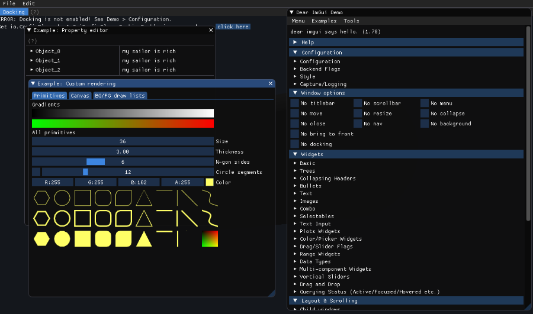

# Getting Started
---



## Install Evergine.ImGUI Extension

To start using this extension, add the Evergine.ImGui package to your project using the NuGet package manager from Visual Studio.

```xml
<PackageReference Include="Evergine.ImGui" Version="2022.9.28.1" />
```

Register the ImGuiManager in your scene:

```csharp
public class ImGuiSceneTest : Scene
{
    public override void RegisterManagers()
    {
        base.RegisterManagers();
        this.Managers.AddManager(new global::Evergine.Bullet.BulletPhysicManager3D());
        this.Managers.AddManager(new ImGuiManager()
        {
            ImGuizmoEnabled = true,
            ImPlotEnabled = true,
            ImNodesEnabled = true,
        });
    }
...
}
```

Add the namespace ImGuiNET:

```csharp
using ImGuiNET;
```

Now you can start calling the ImGui API from anywhere using the static reference:

```csharp
private bool imguiDemoOpen;
...
ImguiNative.igShowDemoWindow(this.imguiDemoOpen.Pointer());
```

## Usage

The UI is generated every frame, and all the controls between Begin and End will be drawn.

Here is a simple example:

```csharp
bool open = true;
ImguiNative.igBegin("Debug", open.Pointer(), ImGuiWindowFlags.None);

ImguiNative.igText("Hello, world 123");
if (ImguiNative.igButton("Save", Vector2.Zero))
{
    // MySaveFunction();
}
float f = 0.5f;
ImguiNative.igSliderFloat("float", &f, 0.0f, 1.0f, null, ImGuiSliderFlags.None);

ImguiNative.igEnd();
```

And this is the result:


<br><br>

Now let's see a more advanced example:

```csharp
bool open = false;
ImguiNative.igBegin("Path Tracing", open.Pointer(), ImGuiWindowFlags.None);

float x = this.worldInfo.LightPosition.X;
float y = this.worldInfo.LightPosition.Y;
float z = this.worldInfo.LightPosition.Z;

ImguiNative.igSliderFloat("Camera Pos X", &x, -10.0f, 10.0f, null, ImGuiSliderFlags.None);
ImguiNative.igSliderFloat("Camera Pos Y", &y, -10.0f, 10.0f, null, ImGuiSliderFlags.None);
ImguiNative.igSliderFloat("Camera Pos Z", &z, -10.0f, 10.0f, null, ImGuiSliderFlags.None);

this.worldInfo.LightPosition.X = x;
this.worldInfo.LightPosition.Y = y;
this.worldInfo.LightPosition.Z = z;
float lightRadius = this.worldInfo.LightRadius;
ImguiNative.igSliderFloat("Light Radius", &lightRadius, 0.0f, 0.2f, null, ImGuiSliderFlags.None);
this.worldInfo.LightRadius = lightRadius;

int numRays = this.worldInfo.NumRays;
ImguiNative.igSliderInt("AO Num Rays", &numRays, 0, 32, null, ImGuiSliderFlags.None);
this.worldInfo.NumRays = numRays;

float aoRadius = this.worldInfo.AORadius;
ImguiNative.igSliderFloat("AO Radius", &aoRadius, 0.0f, 2.0f, null, ImGuiSliderFlags.None);
this.worldInfo.AORadius = aoRadius;

int numBounces = this.worldInfo.NumBounces;
ImguiNative.igSliderInt("GI Num Bounces", &numBounces, 0, 3, null, ImGuiSliderFlags.None);
this.worldInfo.NumBounces = numBounces;

float reflectanceCoef = this.worldInfo.ReflectanceCoef;
ImguiNative.igSliderFloat("Reflectance Coef", &reflectanceCoef, 0, 1, null, ImGuiSliderFlags.None);
this.worldInfo.ReflectanceCoef = reflectanceCoef;

float roughness = this.worldInfo.Roughness;
ImguiNative.igSliderFloat("Roughness", &roughness, 0, 1, null, ImGuiSliderFlags.None);
this.worldInfo.Roughness = roughness;

ImguiNative.igSpacing();
ImguiNative.igSeparator();
ImguiNative.igSpacing();            

int numSamples = this.pathTracerNumSamples;
ImguiNative.igSliderInt("Num Samples", &numSamples, 0, 1024, null, ImGuiSliderFlags.None);
this.pathTracerNumSamples = numSamples;

ImguiNative.igProgressBar((float)this.pathTracerSampleIndex / (float)this.pathTracerNumSamples, Vector2.Zero, null);

ImguiNative.igEnd();
```

This is the result:


Take a look at this in our [path tracer demo](https://github.com/EvergineTeam/Raytracing).

Note: This project needs to create an ImGuiRenderer because it uses the **Evergine** low-level API, but this is unnecessary in a default project created from **Evergine Studio**.