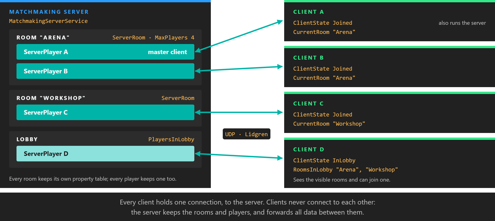
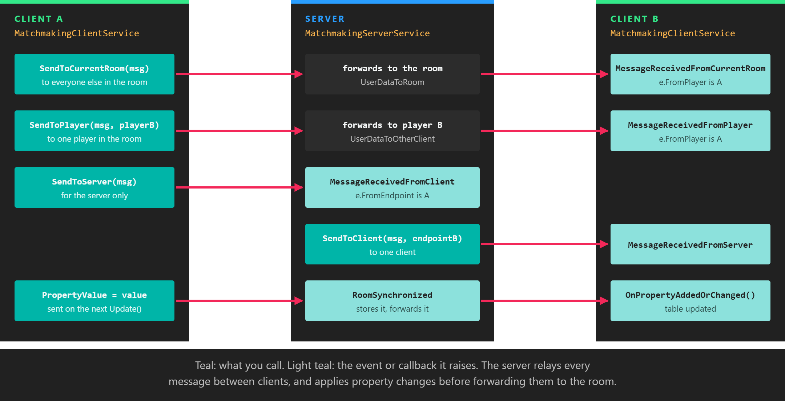

# Networking

---



The `Evergine.Networking` extension connects several Evergine applications over the network so they can share a session. One process runs a **matchmaking server**; the others, and usually the server's own process too, run a **matchmaking client** that connects to it, enters a **room**, and exchanges messages and synchronized properties with the other players in that room. It is designed for local networks: clients can find a server without knowing its address, and the processes can run on the same computer or on different devices.

## How it works

Two services do all the work, one on each side:

* `MatchmakingServerService`, in `Evergine.Networking.Server`, accepts connections, keeps the list of rooms and players, and forwards data between players.
* `MatchmakingClientService`, in `Evergine.Networking.Client`, connects to a server, creates or joins rooms, and sends and receives data.

A connected client starts in the **lobby**, where it sees the list of visible rooms. It then enters one room at a time. Rooms group players: messages sent to "the room" reach the other players in it, and each room has its own table of properties that every member sees.

All traffic goes through the server. Clients never connect to each other; when a client sends a message to another player, the server receives it and forwards it. The picture at the top of the page shows a server with two rooms and one client still in the lobby.

The transport is [Evergine.Lidgren](https://github.com/EvergineTeam/lidgren-network-gen3), Evergine's fork of the Lidgren.Network library, which sends messages over UDP with optional reliability and ordering.

## Install the package

Add `Evergine.Networking` to the project that contains your scenes and components. It brings `Evergine.Lidgren` with it.

```xml
<!-- Use the same version as the other Evergine packages in your project. -->
<PackageReference Include="Evergine.Networking" Version="EVERGINE_VERSION" />
```

> [!NOTE]
> The extension needs UDP sockets, which browsers do not provide, so it does not work in WebAssembly builds. Check that your firewall lets the server's port through, and that the network allows broadcast traffic if you use server discovery.

## Register the services

Both services are Evergine [services](../basics/services.md). Register the ones each process needs in the container, in the constructor of your `Application`:

```csharp
using Evergine.Framework;
using Evergine.Networking.Client;
using Evergine.Networking.Server;

public partial class MyApplication : Application
{
    public MyApplication()
    {
        // ... the default registrations of the template ...

        // Only the process that hosts the session needs the server.
        this.Container.RegisterInstance(new MatchmakingServerService());

        // Every process that takes part in the session, the host included, needs a client.
        this.Container.RegisterInstance(new MatchmakingClientService());
    }
}
```

Components then get them with `[BindService]`.

## Configure the server

Set the server's properties before calling `StartAsync`. Once the server has started, changing any of them throws an `InvalidOperationException`.

| Property | Default | Description |
| --- | --- | --- |
| **ApplicationIdentifier** | null | **Required.** Separates your application from any other that uses the extension on the same network. Clients must use the same value. |
| **ClientApplicationVersion** | null | Combined with the identifier, so clients of a different version neither discover nor connect to this server. |
| **ServerName** | null | Sent in every discovery response, so clients can show a list of servers by name. |
| **PingInterval** | 4 seconds | `TimeSpan` between the pings used to measure latency and detect lost connections. |
| **ConnectionTimeout** | 25 seconds | `TimeSpan` without any message after which a connection is considered lost. Keep it several times longer than `PingInterval`, so a single lost ping does not drop the connection. |
| **NetworkFactory** | `NetworkFactory` | Creates the underlying network peer. Replace it only to plug in a different transport, for example in tests. |

```csharp
this.server.ApplicationIdentifier = "MyApp";
this.server.ClientApplicationVersion = "1.0.0";
this.server.ServerName = "Workshop PC";
this.server.PingInterval = TimeSpan.FromSeconds(4);
this.server.ConnectionTimeout = TimeSpan.FromSeconds(8);

await this.server.StartAsync(21000);
```

`ShutdownAsync()` stops the server, disconnects every client and clears its rooms and players. After it completes, the properties can be changed and the server started again.

> [!TIP]
> A breakpoint stops your process, but not the clock of the other peers, so a paused server or client is disconnected once `ConnectionTimeout` expires. While debugging, set it to something like `TimeSpan.FromHours(1)` on both sides.

### Server events

The server reports what its clients do through events. They are raised on the main thread, so handlers can touch entities and components directly.

| Event | Arguments | Raised when |
| --- | --- | --- |
| **PlayerConnected** | `ServerPlayer` | A client has connected. It is in the lobby. |
| **PlayerDisconnected** | `ServerPlayer` | A client has disconnected or timed out. It has already left its room. |
| **PlayerJoining** | `PlayerJoiningEventArgs` | A client asks to join an existing room. Call `e.Reject()` to refuse it; the client receives `EnterRoomResultCodes.Rejected`. Not raised for the player who creates the room. |
| **PlayerJoined** | `ServerPlayer` | A client has entered a room, including the one that created it. |
| **PlayerLeaving** / **PlayerLeft** | `ServerPlayer` | A client is about to leave, and has left, its room. |
| **PlayerSynchronized** | `ServerPlayer` | The server has received new values of a player's properties. |
| **RoomCreated** / **RoomDestroyed** | `ServerRoom` | A room has been created, or removed because its last player left. |
| **RoomSynchronized** | `ServerRoom` | The server has received new values of a room's properties. |
| **MessageReceivedFromClient** | `MessageReceivedEventArgs` | A client has sent a message to the server with `SendToServer`. |

`AllConnectedPlayers`, `PlayersInLobby` and `AllRooms` list the current state at any time, and `FindPlayer(endpoint)` returns the `ServerPlayer` behind a network endpoint.

## Connect a client

Configure the client with the same identifier and version as the server, and optionally a nickname, before it connects:

| Property | Default | Description |
| --- | --- | --- |
| **ApplicationIdentifier** | null | **Required.** Must match the server's. |
| **ClientApplicationVersion** | null | Must match the server's. |
| **PingInterval** | 4 seconds | As on the server. Use the same values on both sides. |
| **ConnectionTimeout** | 25 seconds | As on the server. |
| **LocalPlayer** | | The `LocalNetworkPlayer` of this client. Set `LocalPlayer.Nickname` before connecting to send it with the connection request. |

There are two ways to reach a server:

```csharp
// 1. Discovery: broadcast on the local network and wait for answers.
this.client.ServerDiscovered += this.OnServerDiscovered;
this.client.DiscoverServers(21000);

// 2. A known address.
bool connected = await this.client.ConnectAsync(new NetworkEndpoint("192.168.1.20", 21000));
```

`ServerDiscovered` passes a `HostDiscoveredEventArgs` with the server's `Host` endpoint and its `ServerName`; pass the endpoint to `ConnectAsync`. Every server that answers raises the event, so decide which one to use and ignore the rest. `Disconnect()` leaves the current room, closes the connection and returns the client to `Disconnected`.

### Client state

`ClientState` tells you where the client is, and `ClientStateChanged` reports every change. `IsConnectedAndReady` is `true` only in the two states in which room and message operations are allowed, `InLobby` and `Joined`.

| `ClientStates` | Meaning |
| --- | --- |
| **Disconnected** | Not connected to any server. |
| **InLobby** | Connected, and not in a room. `RoomsInLobby` lists the visible rooms. |
| **Joining** | A create or join request is on its way to the server. |
| **Joined** | In a room. `CurrentRoom` and `LocalPlayer.Id` are valid. |
| **Leaving** | A leave request is on its way; the client returns to `InLobby`. |

## Rooms

A room is created with a `RoomOptions`:

| Property | Default | Description |
| --- | --- | --- |
| **RoomName** | null | Unique name of the room on the server. Always set it. |
| **IsVisible** | true | Whether the room appears in `RoomsInLobby` of clients in the lobby. |
| **MaxPlayers** | 0 | Maximum number of players. `0` means no limit. |
| **PropertiesListedInLobby** | empty | A set of names stored with the room's lobby entry and sent to the clients in the lobby. The extension does not interpret them. |

Three methods enter a room, all of them only from the lobby. Each returns an `EnterRoomResultCodes` when the server answers:

| Method | Behaviour |
| --- | --- |
| `CreateRoomAsync(RoomOptions)` | Creates the room and enters it. Fails with `RoomAlreadyExists` if the name is taken. |
| `JoinRoomAsync(string name)` | Enters an existing room. Fails with `RoomNotExists`, `RoomIsFull` or `Rejected`. |
| `JoinOrCreateRoomAsync(RoomOptions)` | Enters the room, creating it with these options if it does not exist. The options are ignored when the room already exists. |

| `EnterRoomResultCodes` | Meaning |
| --- | --- |
| **Succeed** | The client is in the room. |
| **RoomNotExists** | No room has that name. |
| **RoomAlreadyExists** | A room with that name already exists. |
| **RoomIsFull** | The room has `MaxPlayers` players. |
| **Rejected** | A `PlayerJoining` handler on the server rejected the player. |
| **Aborted** | The client disconnected before the server answered. |

The first player in a room is its master client (`IsMasterClient` on the player, `MasterClientId` on the room). When that player leaves, the remaining player with the lowest id takes over, which gives you a simple way to choose one client to own shared decisions.

`LeaveRoom()` returns the client to the lobby. While in a room, `CurrentRoom` is a `LocalNetworkRoom` with the room's `Name`, `PlayerCount`, `MaxPlayers`, its `RemotePlayers` and its `CustomProperties`. Its `PlayerJoined` and `PlayerLeft` events report other players arriving and leaving, and the client's `CurrentRoomSynchronized` event fires whenever the server sends new room or player data. In the lobby, `RoomsInLobbySynchronized` fires when the list of rooms changes.

## Messages

Messages are the way to send events: a chat line, a "fire" command, a request that only the server should handle. You create an `OutgoingMessage`, write values into it, and send it with a delivery method. The receiver reads the values back **in the same order**.



*The server relays every message. A client names the destination, and the event that fires on the receiving side depends on how it was sent.*

| Send with | Reaches | Raised on the receiver |
| --- | --- | --- |
| `client.SendToCurrentRoom(message, delivery)` | Every other player in the sender's room. | `client.MessageReceivedFromCurrentRoom` |
| `client.SendToPlayer(message, remotePlayer, delivery)` | One player in the sender's room. | `client.MessageReceivedFromPlayer` |
| `client.SendToServer(message, delivery)` | The server. | `server.MessageReceivedFromClient` |
| `server.SendToClient(message, endpoint, delivery)` | One client, by the `Endpoint` of its `ServerPlayer`. | `client.MessageReceivedFromServer` |

The two room events pass a `MessageFromPlayerEventArgs`, whose `FromPlayer` is the `RemoteNetworkPlayer` who sent it. `SendToCurrentRoom` and `SendToPlayer` return `false` when the client is not in a room.

> [!IMPORTANT]
> Subscribe to `MessageReceivedFromPlayer` on every client of a session that uses `SendToPlayer`. The client raises that event without checking for handlers, so a message sent to a client that has none throws a `NullReferenceException`.

`OutgoingMessage.Write` has overloads for `bool`, `byte`, `short`, `int`, `long`, `float`, `string`, `byte[]`, `Vector2`, `Vector3`, `Vector4`, `Quaternion`, `Color`, `Matrix3x3`, `Matrix4x4`, `DateTime` and `TimeSpan`. `IncomingMessage` has the matching `ReadBoolean`, `ReadByte`, `ReadInt32`, `ReadString`, `ReadVector3` and so on.

| `DeliveryMethod` | Guarantees | Use for |
| --- | --- | --- |
| **Unreliable** | None: messages can be lost, duplicated or arrive out of order. | Data that is replaced by the next message anyway. |
| **UnreliableSequenced** | Late messages are dropped, so only newer data is delivered. | Continuous state such as positions. |
| **ReliableUnordered** | Every message arrives, in any order. | Independent events. |
| **ReliableSequenced** | Only the newest message arrives, and it is guaranteed to. | The latest value of something that changes rarely. |
| **ReliableOrdered** | Every message arrives, in the order it was sent. | Commands and chat. The safe default. |

## A complete session

This component turns a scene into a small LAN chat. With `IsHost` set, it starts a server and connects its own client to it; otherwise it discovers a server on the local network. Either way the client enters the room `Main`, and `Send` delivers a line of text to everyone else in the room.

```csharp
using Evergine.Framework;
using Evergine.Networking;
using Evergine.Networking.Client;
using Evergine.Networking.Connection;
using Evergine.Networking.Messages;
using Evergine.Networking.Server;
using System;
using System.Diagnostics;
using System.Linq;
using System.Threading.Tasks;

public class LanChat : Component
{
    private const int Port = 21000;

    [BindService]
    private MatchmakingServerService server = null;

    [BindService]
    private MatchmakingClientService client = null;

    private bool connecting;

    public bool IsHost { get; set; }

    public string Nickname { get; set; } = "Player";

    public void Send(string text)
    {
        if (this.client.ClientState != ClientStates.Joined)
        {
            return;
        }

        var message = this.client.CreateMessage();
        message.Write(text);
        this.client.SendToCurrentRoom(message, DeliveryMethod.ReliableOrdered);
    }

    protected override void OnActivated()
    {
        base.OnActivated();

        this.client.ApplicationIdentifier = "LanChat";
        this.client.ClientApplicationVersion = "1.0";
        this.client.LocalPlayer.Nickname = this.Nickname;

        this.client.ClientStateChanged += this.OnClientStateChanged;
        this.client.ServerDiscovered += this.OnServerDiscovered;
        this.client.MessageReceivedFromCurrentRoom += this.OnRoomMessage;
        this.client.MessageReceivedFromPlayer += this.OnRoomMessage;

        if (this.IsHost)
        {
            this.server.PlayerJoined += this.OnPlayerJoined;
        }

        _ = this.StartAsync();
    }

    protected override void OnDeactivated()
    {
        base.OnDeactivated();

        this.client.ClientStateChanged -= this.OnClientStateChanged;
        this.client.ServerDiscovered -= this.OnServerDiscovered;
        this.client.MessageReceivedFromCurrentRoom -= this.OnRoomMessage;
        this.client.MessageReceivedFromPlayer -= this.OnRoomMessage;
        this.client.Disconnect();

        if (this.IsHost)
        {
            this.server.PlayerJoined -= this.OnPlayerJoined;
            _ = this.server.ShutdownAsync();
        }
    }

    private async Task StartAsync()
    {
        if (this.IsHost)
        {
            this.server.ApplicationIdentifier = "LanChat";
            this.server.ClientApplicationVersion = "1.0";
            this.server.ServerName = Environment.MachineName;
            await this.server.StartAsync(Port);

            // The host plays too: connect its own client to the server it just started.
            await this.ConnectAndJoinAsync(new NetworkEndpoint("127.0.0.1", Port));
        }
        else
        {
            this.client.DiscoverServers(Port);
        }
    }

    private async void OnServerDiscovered(object sender, HostDiscoveredEventArgs e)
    {
        // Every server that answers raises this event: keep the first one.
        if (!this.connecting && this.client.ClientState == ClientStates.Disconnected)
        {
            Debug.WriteLine($"Found server '{e.ServerName}' at {e.Host}");
            await this.ConnectAndJoinAsync(e.Host);
        }
    }

    private async Task ConnectAndJoinAsync(NetworkEndpoint endpoint)
    {
        this.connecting = true;
        try
        {
            if (await this.client.ConnectAsync(endpoint))
            {
                var result = await this.client.JoinOrCreateRoomAsync(new RoomOptions
                {
                    RoomName = "Main",
                    MaxPlayers = 8,
                });

                if (result != EnterRoomResultCodes.Succeed)
                {
                    Debug.WriteLine($"Could not enter the room: {result}");
                }
            }
        }
        finally
        {
            this.connecting = false;
        }
    }

    private void OnClientStateChanged(object sender, ClientStates state)
    {
        Debug.WriteLine($"Client state: {state}");
    }

    private void OnRoomMessage(object sender, MessageFromPlayerEventArgs e)
    {
        // Read in the same order as Send wrote.
        string text = e.ReceivedMessage.ReadString();
        Debug.WriteLine($"{e.FromPlayer.Nickname}: {text}");
    }

    private void OnPlayerJoined(object sender, ServerPlayer player)
    {
        Debug.WriteLine($"{player.Nickname} joined room {player.Room.Name}. {this.server.AllConnectedPlayers.Count()} players connected.");
    }
}
```

Add `LanChat` to an entity in the scene of every instance, with `IsHost` set on exactly one of them. A service bound with `[BindService]` is required by default, so this component expects both services in the container of every instance, as registered above. An application that never hosts can drop the server and its field.

## Synchronized properties

Messages are fire and forget. For **state** that every player must see, and that a late joiner must receive too, use properties instead. Every room and every player has a `NetworkPropertiesTable`, a small key-value table that the extension keeps in sync: when a client changes a value, its `MatchmakingClientService` sends the change on the next update, the server stores it and forwards it to the rest of the room.

* **Room properties** belong to the room and any member can write them. Use them for shared world state, such as the position of an object.
* **Player properties** belong to one player and only that player's client can write them; the other players see a read-only copy. Use them for per-player state, such as an avatar colour.

Keys are bytes, so a table holds at most 256 properties. Values are the same types that messages support, plus `NetworkEndpoint` and your own [serializable types](#synchronize-a-custom-type). You can use the tables directly, through `client.CurrentRoom.CustomProperties` and `client.LocalPlayer.CustomProperties`, or with the components in `Evergine.Networking.Components`, which is what the rest of this section shows.

### Provider and sync components

A property component reads and writes one key of one table. It finds the table through a **provider** component on the same entity or on one of its ancestors:

| Provider | Table it provides |
| --- | --- |
| `NetworkRoomProvider` | The `CustomProperties` of the current room. |
| `NetworkPlayerProvider` | The `CustomProperties` of the player with id `PlayerId`. The default, `-1`, is the local player. |

The property components derive from `NetworkPropertySync<K, V>`, where `K` is an enum of your keys and `V` the value type. There is one for each supported type: `NetworkBooleanPropertySync`, `NetworkBytePropertySync`, `NetworkByteArrayPropertySync`, `NetworkIntegerPropertySync`, `NetworkLongIntegerPropertySync`, `NetworkFloatPropertySync`, `NetworkStringPropertySync`, `NetworkVector2PropertySync`, `NetworkVector3PropertySync`, `NetworkVector4PropertySync`, `NetworkQuaternionPropertySync`, `NetworkColorPropertySync`, `NetworkMatrix3x3PropertySync`, `NetworkMatrix4x4PropertySync`, `NetworkDateTimePropertySync`, `NetworkTimeSpanPropertySync`, `NetworkEndpointPropertySync` and `NetworkSerializablePropertySync`.

| Member | Description |
| --- | --- |
| **PropertyKey** | The key in the table, as a value of your enum. |
| **ProviderFilter** | Which provider to look for: `Any` (default), `Room` or `Player`. Cannot change once the provider is found. |
| **IsReady** | `true` once the table is available, that is, once the client is in a room. Check it before writing. |
| **PropertyValue** | Reads the current value, or writes a new one to the table. |
| **HasValue** | `true` when the table contains the key. |
| `OnPropertyReadyToSet()` | Called when the table becomes available and this client can write to it. |
| `OnPropertyAddedOrChanged()` | Called when the key appears or its value changes, whoever changed it. |
| `OnPropertyRemoved()` | Called when the key is removed from the table. |

### Synchronize a transform

This component shares an entity's transform through a room property. Only one client should move the object at a time, so `CanManipulate` decides who writes and everyone else applies what they receive.

```csharp
using Evergine.Framework;
using Evergine.Framework.Graphics;
using Evergine.Networking.Components;
using System;

// One enum for all room keys, so two components never use the same key by mistake.
public enum RoomProperties : byte
{
    MyObjectTransform = 0x00,
    MapInfo = 0x01,
}

public class SyncLocalTransform : NetworkMatrix4x4PropertySync<RoomProperties>
{
    [BindComponent]
    private Transform3D transform = null;

    public SyncLocalTransform()
    {
        this.ProviderFilter = NetworkPropertyProviderFilter.Room;
        this.PropertyKey = RoomProperties.MyObjectTransform;
    }

    // Decide in your own code which client owns the object, for example the one that grabbed it.
    public bool CanManipulate { get; set; }

    protected override void OnActivated()
    {
        base.OnActivated();
        this.transform.LocalTransformChanged += this.OnLocalTransformChanged;
    }

    protected override void OnDeactivated()
    {
        this.transform.LocalTransformChanged -= this.OnLocalTransformChanged;
        base.OnDeactivated();
    }

    protected override void OnPropertyReadyToSet()
    {
        base.OnPropertyReadyToSet();
        this.UpdatePropertyValue();
    }

    protected override void OnPropertyAddedOrChanged()
    {
        // The owner already has this transform. Applying it would only echo its own change.
        if (!this.CanManipulate)
        {
            this.transform.LocalTransform = this.PropertyValue;
        }
    }

    protected override void OnPropertyRemoved()
    {
    }

    private void OnLocalTransformChanged(object sender, EventArgs e) => this.UpdatePropertyValue();

    private void UpdatePropertyValue()
    {
        if (this.IsReady && this.CanManipulate)
        {
            this.PropertyValue = this.transform.LocalTransform;
        }
    }
}
```

Put the provider and the sync component on the entity, together with its usual components:

```csharp
var sharedObject = new Entity("SharedObject")
    .AddComponent(new Transform3D())
    .AddComponent(new NetworkRoomProvider())
    .AddComponent(new SyncLocalTransform());

this.Managers.EntityManager.Add(sharedObject);
```

> [!NOTE]
> The providers get `MatchmakingClientService` with `[BindService]`, so the client service must be registered before the scene that contains them is loaded.

### Synchronize a custom type

For a value that is not one of the built-in types, implement `INetworkSerializable` and use `NetworkSerializablePropertySync<K, V>`. The interface has two methods that write and read a Lidgren `NetBuffer`; read the fields in the same order you wrote them. Keep these objects small: the whole value is sent each time any part of it changes.

```csharp
using Evergine.Networking;
using Evergine.Networking.Components;
using Lidgren.Network;

public class MapInfo : INetworkSerializable
{
    public double Latitude { get; set; }

    public double Longitude { get; set; }

    public short ZoomLevel { get; set; }

    public void Write(NetBuffer buffer)
    {
        buffer.Write(this.Latitude);
        buffer.Write(this.Longitude);
        buffer.Write(this.ZoomLevel);
    }

    public void Read(NetBuffer buffer)
    {
        this.Latitude = buffer.ReadDouble();
        this.Longitude = buffer.ReadDouble();
        this.ZoomLevel = buffer.ReadInt16();
    }
}

public class SyncMapInfo : NetworkSerializablePropertySync<RoomProperties, MapInfo>
{
    public SyncMapInfo()
    {
        this.ProviderFilter = NetworkPropertyProviderFilter.Room;
        this.PropertyKey = RoomProperties.MapInfo;
    }

    protected override void OnPropertyAddedOrChanged()
    {
        MapInfo info = this.PropertyValue;

        // Move your map view to info.Latitude, info.Longitude and info.ZoomLevel.
    }

    protected override void OnPropertyRemoved()
    {
    }
}
```

To change the map for everyone, assign a new `MapInfo` to `PropertyValue` once `IsReady` is `true`.
