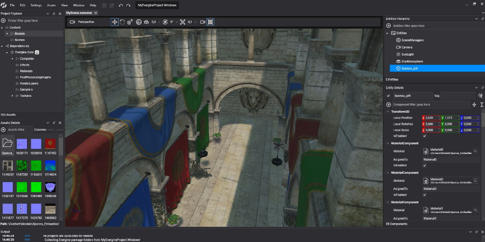

# Get Started

Evergine is a C# engine for building real-time 3D applications for Windows, Android, iOS, the web and XR devices. You work with two tools: **Evergine Studio**, where you compose scenes and manage assets, and **Visual Studio**, where you write the components and services that give those scenes behavior. This section takes you from an empty machine to a running project.

## Your first project

1. **Install Evergine.** Check the requirements (Windows, the .NET 10 SDK, Visual Studio 2026 and a DirectX 12 GPU) and run the installer. See [Install Evergine](install.md).
2. **Create a project.** In the Evergine Launcher, click **Add new project**, give it a name and a folder, and choose the platforms it targets. The **Windows (DirectX12)** platform is always included, because Evergine Studio needs it. See [Create an Evergine Project](../evergine_launcher/create_project.md).

3. **Edit the scene in Evergine Studio.** The Launcher opens the new project in Evergine Studio with a default scene that has a camera, a sun light and a sky atmosphere.
4. **Write code in Visual Studio.** Select **File > Open C# editor** to open the solution, add your own components, and build. See [Open Your Project in Visual Studio](open_in_vs.md).
5. **Keep Evergine up to date.** Install new versions from the Launcher and move your projects to them. See [Manage Evergine Versions](../evergine_launcher/manage_versions.md) and [Upgrade My Project to the Latest Evergine Release](migrations/index.md).

## In this section

* [Install Evergine](install.md)
* [Create an Evergine Project](../evergine_launcher/create_project.md)
* [Open Your Project in Visual Studio](open_in_vs.md)
* [Manage Evergine Versions](../evergine_launcher/manage_versions.md)
* [Samples, Learning and Support](../evergine_launcher/samples_learning_support.md)
* [Upgrade My Project to the Latest Evergine Release](migrations/index.md)
