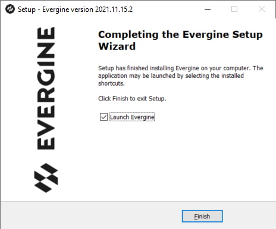
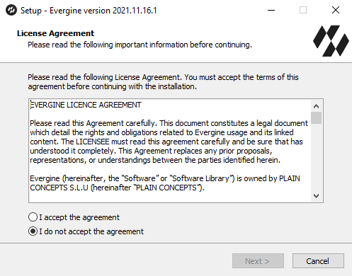
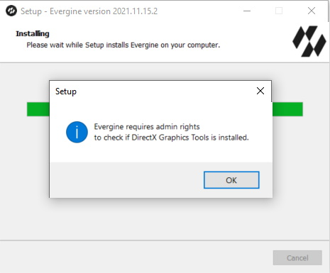
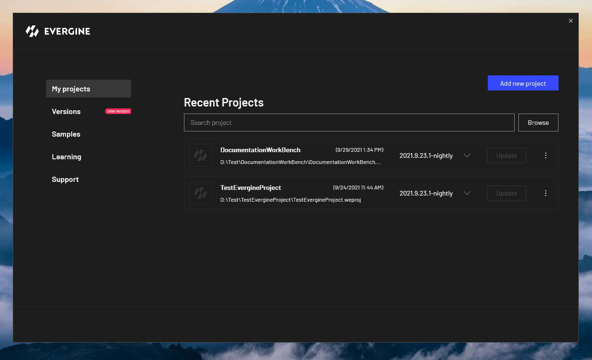

# Install Evergine

Evergine installs with a single setup program that adds the **Evergine Launcher** to your computer. From the Launcher you then download Evergine versions, create projects and open them in **Evergine Studio**. This page lists what your machine needs, walks through the installer, and explains how to fix the most common setup problems.

## Requirements

The installer checks the .NET SDK and Visual Studio before it copies any file, and stops with a message if one is missing. Install them first.

| Requirement | Minimum | Notes |
| --- | --- | --- |
| Operating system | Windows 10 or Windows 11, 64-bit | Evergine Studio and the Evergine Launcher are Windows applications. Your projects can still target Android, iOS, the web and other platforms. |
| .NET SDK | .NET 10 SDK, version 10.0.201 or later (x64) | Download it from [dotnet.microsoft.com](https://dotnet.microsoft.com/download/dotnet/10.0). |
| Visual Studio | Visual Studio 2026 (version 18.0 or later) with the **.NET desktop development** workload | Needed to build and debug your projects. Add the **ASP.NET and web development** workload for Web profiles, and **.NET Multi-platform App UI development** for Android, iOS and MAUI profiles. |
| GPU | Direct3D 12 with feature level 12_2 | Evergine Studio and new Windows projects render with DirectX 12. On a GPU without feature level 12_2, use the DirectX 11 or Vulkan backend (see [Troubleshooting](#troubleshooting)). |
| Permissions | A standard user account | Evergine installs for the current user. Administrator rights are only requested to add the Windows **Graphics Tools** optional feature. |

## Run the installer

1. Download the Evergine installer (**EvergineSetup.exe**) from the [Evergine download page](https://evergine.com/download/).

2. Run the installer. It shows the license agreement (EULA) that defines the licensing terms of the engine. Accept it to continue:

   

3. Choose the optional tasks: a desktop shortcut, and associating `.weproj` project files with Evergine so that double-clicking a project opens it.

4. The installer then checks the **DirectX Graphics Tools**, the optional Windows feature that provides the DirectX debug layer. Adding it needs administrator rights, so Windows asks for permission:

   

   > [!NOTE]
   > If you decline, Evergine still installs. You can add it later from the **Optional features** page of Windows Settings, where it is listed as **Graphics Tools**. Without it, the graphics validation layer is not available.

5. When the wizard finishes, keep **Launch Evergine** checked and click **Finish** to open the Evergine Launcher.

## Evergine Launcher

The **Evergine Launcher** is a standalone Windows app. From it you install and remove Evergine versions, create and open projects, update projects to a newer version, and find samples, learning materials and support.

## Troubleshooting

### The installer asks for Visual Studio

The message *requires VisualStudio >= 2026 with .NET desktop development workload installed* means the installer did not find Visual Studio 2026 with MSBuild. Install Visual Studio 2026 (any edition, including Community) with the **.NET desktop development** workload, then run the Evergine installer again. The installer opens the Visual Studio download page for you.

### The installer asks for .NET

The message *requires Microsoft .NET >= v10.0.201* means no .NET 10 SDK of that version or later is installed. Install the latest **.NET 10 SDK for x64**, not only the runtime, and run the Evergine installer again. To see which SDKs you have, run `dotnet --list-sdks` in a terminal.

### Evergine Studio or the application cannot create a DirectX 12 device

The error *Couldn't find GPU device that supports feature level 12.2* means the GPU or its driver does not support Direct3D feature level 12_2. First update the GPU driver. If the error remains:

- **Evergine Studio**: open **Settings > Preferences**, set **Editor backend** to **DirectX11** or **Vulkan**, and restart Evergine Studio.
- **Your application**: add the **Windows (DirectX11)** or **Windows (Vulkan)** platform to the project and run that profile. See [Manage profiles](../evergine_studio/settings/project_profiles.md).

### A project does not open from the file explorer

Double-clicking a `.weproj` file only opens Evergine when you chose the file association during installation. Run the installer again and select it, or open the project from the Evergine Launcher.

## Next steps

[Create a project with the Evergine Launcher](../evergine_launcher/create_project.md).
