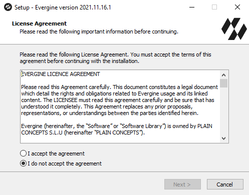
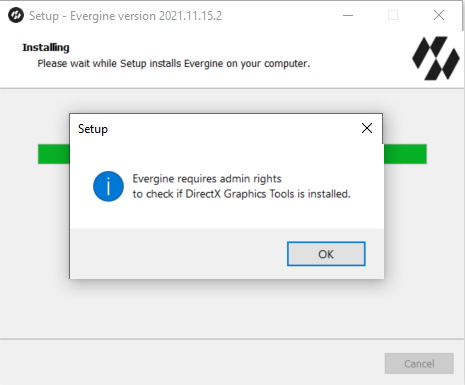

# Install Evergine

To get Evergine, please follow these steps: 

1. Download the Evergine installer (**EvergineSetup.exe**) from the [Evergine download page](https://evergine.com/download/).

2. After downloading the Evergine installer, start the installer and follow the installation wizard steps. To install Evergine, you will be asked to accept the *EULA* that defines the engine's licensing terms:

   

3. The installer will install some dependencies required to execute Evergine Studio, such as DirectX tools.

   

> [!NOTE]
> Please note that some dependencies require admin rights, which will be necessary during the installation process.

4. Once the installation process is completed, you will be ready to launch Evergine with the Evergine Launcher. 

   

## Evergine Launcher

After the installer closes, the Evergine Launcher opens.

The **Evergine Launcher** is a standalone Windows app that allows you to install Evergine versions, create and manage your Evergine projects, and find useful resources like samples, access to learning materials, and support for the Evergine section.

## Next Steps

The first thing you can do is [create a project with Evergine Launcher](../evergine_launcher/create_project.md).