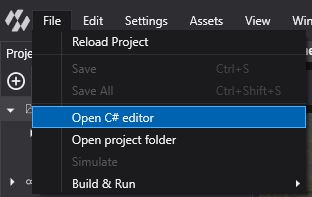
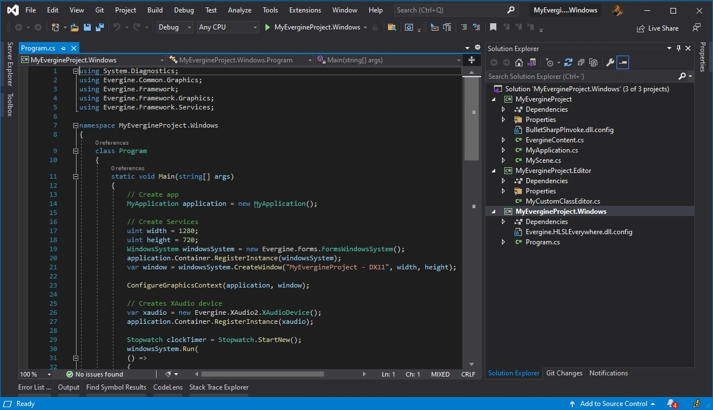

# Open Your Project in Visual Studio

Evergine Studio edits scenes and assets; the game code lives in a regular .NET solution that you build and debug in **Visual Studio 2026**. This page shows how to open that solution from Evergine Studio, what each generated project contains, and how the solutions relate to the profiles of your project.

## Open the solution

In Evergine Studio, select **File > Open C# editor**.

- If the project only has the required **Windows** profile, this opens `MyGame.Windows.sln` directly.
- If the project has more profiles, the menu shows one entry per profile, with **Windows** first. Pick the profile whose solution you want to open.

Evergine Studio opens the `.sln` file with the application Windows associates with solutions, normally Visual Studio. You can also open the solution yourself: **File > Open project folder** shows the project folder in the file explorer, and every `.sln` file sits at its root.

<!-- CAPTURE: images/visual_studio_2026_solution.png; Visual Studio 2026 with MyGame.Windows.sln open, Solution Explorer expanded to show MyGame (EvergineContent.cs, MyApplication.cs, MyScene.cs), MyGame.Editor (MyCustomClassEditor.cs) and MyGame.Windows (Program.cs) with Program.cs open on the DX12GraphicsContext line -->

## One solution per profile

Each profile of the project has its own solution file. All of them include the same shared project, so the code you write there runs on every platform. The Content folder with your assets is also shared.

*Each profile adds a launcher project and a solution. Game code goes in the shared project, which every solution references.*

The Windows solution of a new project contains three projects:

| Project | Target framework | Contents |
| --- | --- | --- |
| **MyGame** | `net10.0` | The code shared by every platform: `MyApplication.cs`, `MyScene.cs`, and your components, behaviors, services and scene managers. The build generates `EvergineContent.cs`, with the ids of every asset in `Content`. |
| **MyGame.Editor** | `net10.0` | Extensions for Evergine Studio, such as custom property editors (see `MyCustomClassEditor.cs`). It references `Evergine.Editor.Extension` and is only built into the Windows launcher when Evergine Studio builds the project, which defines `EVERGINE_EDITOR`. |
| **MyGame.Windows** | `net10.0-windows` | The Windows launcher. `Program.cs` creates the window, a `DX12GraphicsContext`, the swap chain and the XAudio2 audio device, then runs the application loop. |

The solutions of other profiles contain their own launcher project (for example `MyGame.Windows.Vulkan`, or `MyGame.Web` and `MyGame.Web.Server`) plus the shared project. Only the Windows solution includes the Editor project.

> [!NOTE]
> New projects render on **DirectX 12** by default. If you need DirectX 11, add the **Windows (DirectX11)** platform in **Settings > Project Settings**. It creates a `Windows.DirectX11` profile with its own `MyGame.Windows.DirectX11.sln`. See [Manage profiles](../evergine_studio/settings/project_profiles.md).

## Build and debug

`MyGame.Windows` is the first project of the Windows solution, so Visual Studio uses it as the startup project. Press **F5** to build it and start debugging; breakpoints in the shared project and in your components work as in any .NET application.

The Windows launcher accepts a few command-line options, which you can set in the debug profile of the project:

| Option | Effect |
| --- | --- |
| `-Width <pixels>`, `-Height <pixels>` | Window size. The default is 1280 x 720. |
| `-Vsync`, `-NoVsync` | Enable or disable vertical sync. It is enabled by default. |
| `-Windowed`, `-FullScreen` | Run in a window (the default) or full screen. |

## Next steps

- Read [Project Structure](../basics/project_structure.md) for the rest of the files in the project folder.
- Learn how to [manage Evergine versions](../evergine_launcher/manage_versions.md) and update a project.
