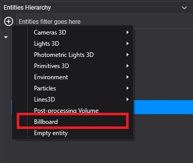
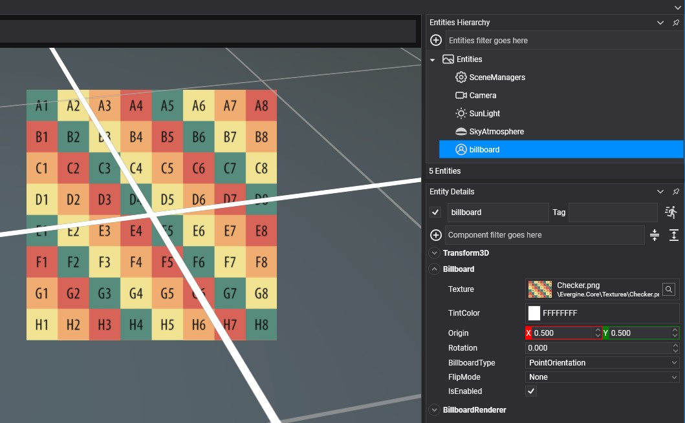
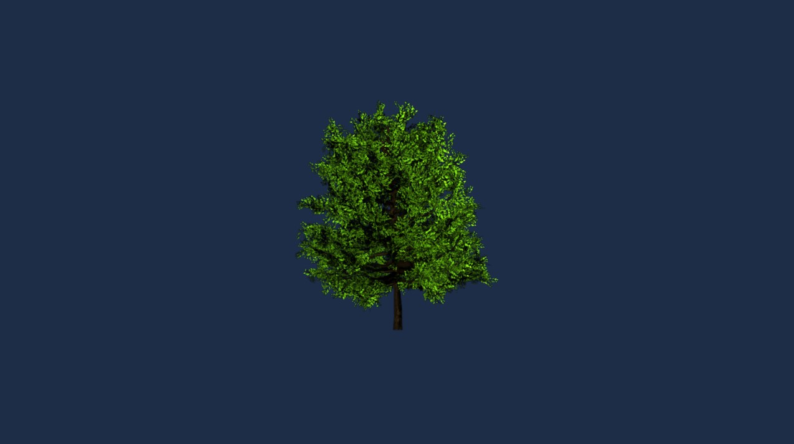

# Create a Billboard

---


A **billboard** allows simulating far objects like bushes or trees, reducing the amount of geometry needed to render your scene.

## Create a Billboard in Evergine Studio
You can create a billboard by clicking the  button from the [Entity Hierarchy](../../evergine_studio/interface.md) panel to deploy the create menu options and then selecting the option _"Billboard"_



A billboard entity will be added to your scene.



In the billboard component of your billboard entity, you will find the following properties:

| Property | Default | Description |
| --- | --- | --- |
| **Texture** | none | The billboard texture. |
| **Sampler** | none | The sampler used to read the texture. |
| **TintColor** | White | Color every pixel of the billboard is multiplied by. |
| **Origin** | (0.5, 0.5) | Pivot of the quad, normalized to its size, around which it scales, rotates and moves. (0, 0) is the top-left corner. |
| **Rotation** | 0 | Rotation of the quad around its facing axis. |
| **BillboardType** | `PointOrientation` | `PointOrientation` turns the quad fully towards the camera; `Axial_Orientation` only turns it around its up axis, which suits trees and poles. |
| **FlipMode** | `None` | Flip the texture horizontally or vertically. |

The `BillboardRenderer` draws the billboard. Its **Layer** is the render layer used, **Alpha** by default.

## Create a Billboard from code
The following code shows the list of components necessary to convert an entity into a billboard entity. 

```csharp
using Evergine.Common.Graphics;
using Evergine.Components.Graphics3D;
using Evergine.Framework;
using Evergine.Framework.Graphics;
using Evergine.Framework.Services;

public class MyScene : Scene
{
    protected override void CreateScene()
    {                       
        var assetsService = Application.Current.Container.Resolve<AssetsService>();

        // Content/Textures/BillboardTree.png
        Texture treeTexture = assetsService.Load<Texture>(EvergineContent.Textures.BillboardTree_png);

        // Load default sampler
        SamplerState linearClampSampler = assetsService.Load<SamplerState>(DefaultResourcesIDs.LinearClampSamplerID);

        // Load a Render Layer description...
        RenderLayerDescription layer = assetsService.Load<RenderLayerDescription>(DefaultResourcesIDs.AlphaRenderLayerID);

        var billboard = new Entity()
            .AddComponent(new Transform3D())
            .AddComponent(new Billboard()
            {
                Texture = treeTexture,
                Sampler = linearClampSampler,
                BillboardType = BillboardType.Axial_Orientation,
            })
            .AddComponent(new BillboardRenderer()
            {
                Layer = layer,
            });

        this.Managers.EntityManager.Add(billboard);
    }
}
```

The result:

