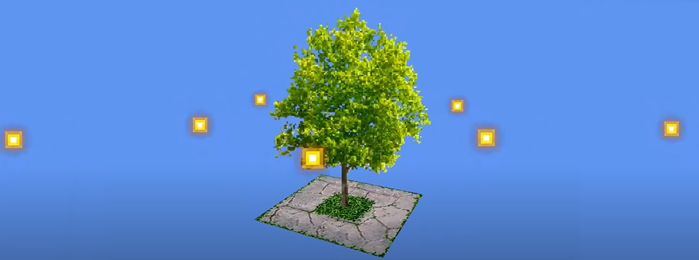

# Billboards

---

A **billboard** is a textured quad that keeps turning to face the camera. Billboards are cheap stand-ins for distant objects such as trees and bushes, and a simple way to show labels, markers and indicators in 3D.

## Types of Billboards

### Point Orientation
The billboard is oriented around its origin to always face the camera. With this type of billboarding, the object will always appear the same to the camera; however, it will be affected by perspective.

<video autoplay loop muted width="500">
  <source src="images/PointBillboard.mp4" type="video/mp4">
</video>

### Axial Orientation
The billboard is rotated about an axis to face towards the camera.

<video autoplay loop muted width="500">
  <source src="images/AxisBillboard.mp4" type="video/mp4">
</video>

## In This Section

The following sections show how to create and use billboards in your scene.

* [Create a Billboard](create_billboard.md)