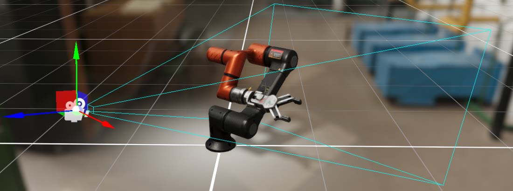
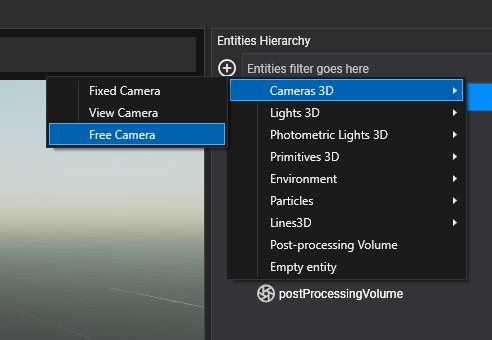
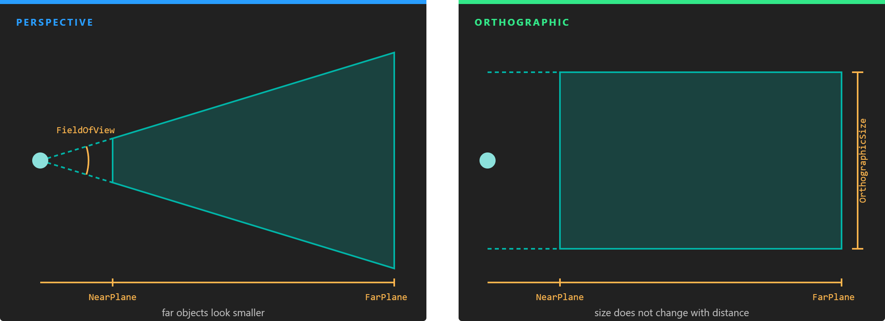
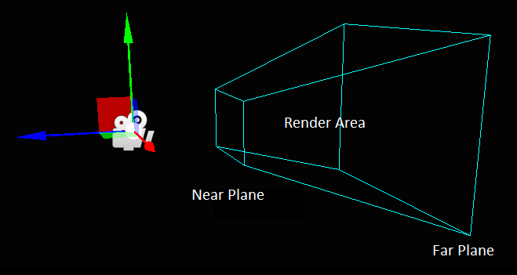
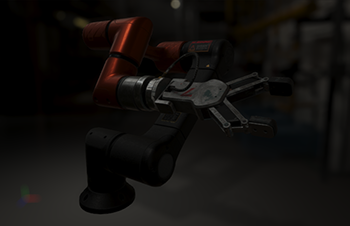
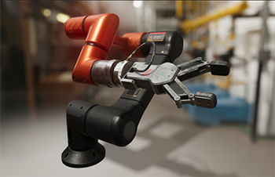
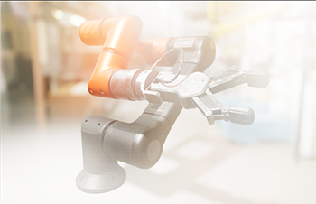

# Cameras

---



A **camera** captures the scene from a point of view and renders it to the screen or to a texture. A scene can have any number of cameras: they render in a set order, each to its own display, frame buffer or part of the screen, so split screens, picture-in-picture, mirrors and minimaps are all combinations of cameras.

The camera component is `Camera3D` (namespace `Evergine.Framework.Graphics`). Like any component, it lives on an entity, and the entity's `Transform3D` gives the camera its position and orientation: the camera looks along the transform's **forward** vector.

## Create a camera in Evergine Studio

In the **Entities Hierarchy** panel of the scene editor, click **Add Entity**, open **Cameras 3D** and choose:

* **Fixed Camera** or **View Camera**: an entity with a `Camera3D` and no controller. The camera stays where you put it until your code moves it.
* **Free Camera**: a `Camera3D` plus the `FreeCamera3D` component, which lets you fly the camera with mouse, keyboard, touch or gamepad while the application runs.



## Create a camera from code

```csharp
using Evergine.Common.Graphics;
using Evergine.Components.Cameras;
using Evergine.Framework;
using Evergine.Framework.Graphics;
using Evergine.Mathematics;

public class MyScene : Scene
{
    protected override void CreateScene()
    {
        Entity cameraEntity = new Entity("mainCamera")
            .AddComponent(new Transform3D() { Position = new Vector3(0, 2, 6) })
            .AddComponent(new Camera3D()
            {
                BackgroundColor = Color.CornflowerBlue,

                // Field of view is set in radians in code, and shown in degrees in Evergine Studio.
                FieldOfView = MathHelper.ToRadians(60),
                NearPlane = 0.1f,
                FarPlane = 500f,
            })
            .AddComponent(new FreeCamera3D());

        this.Managers.EntityManager.Add(cameraEntity);
    }
}
```

## Projection

A camera projects the scene either with **perspective**, where distant objects look smaller, or **orthographically**, where size does not change with distance. Perspective is what you want for most 3D views; orthographic suits technical views, isometric games and 2D.



*A perspective frustum widens with distance according to the field of view. An orthographic one is a box whose height is the orthographic size.*

| Property | Default | Description |
| --- | --- | --- |
| **ProjectionType** | `Perspective` | `Perspective` or `Orthographic`. Shown as **Projection**. |
| **FieldOfView** | π/4 (45°) | Perspective only. The view angle along `FieldOfViewAxis`, in radians in code and in degrees in Evergine Studio. |
| **FieldOfViewAxis** | `Vertical` | Perspective only. Whether `FieldOfView` is measured vertically or horizontally. With `Vertical`, a wider window shows more to the sides; with `Horizontal`, it shows less above and below. Shown as **View Axis**. |
| **OrthographicSize** | 5 | Orthographic only. The height of the view in world units (the width when the axis is `Horizontal`). |
| **NearPlane** | 0.1 | Closest distance the camera renders. Anything nearer is clipped. |
| **FarPlane** | 1000 | Farthest distance the camera renders, also called the draw distance. |
| **AspectRatio** | from the viewport | Width divided by height. Computed from the target and the viewport unless you set it. |

### Frustum

The volume the camera sees is its **frustum**: the region between the near and far planes inside the field of view. Objects whose bounds fall entirely outside it are culled and not drawn.



> [!TIP]
> Depth precision is spread between the near and far planes, and most of it is used close to the near plane. Keep `NearPlane` as large as the scene allows; raising it from 0.01 to 0.1 does far more for depth precision than lowering `FarPlane`.

## Clearing and background

Before rendering, the camera clears its target.

| Property | Default | Description |
| --- | --- | --- |
| **BackgroundColor** | `CornflowerBlue` | Color the target is cleared to. A skybox or sky atmosphere, when present, covers it. |
| **ClearFlags** | `All` | What is cleared: `Target` (color), `Depth`, `Stencil`, or a combination. `All` clears everything. Turn off `Target` to draw a camera on top of another one. |
| **UseCustomClearDepth** | false | Clear depth to `ClearDepth` instead of the far value of the depth buffer. |
| **ClearDepth** | far plane | Depth value to clear to when `UseCustomClearDepth` is on, from 0 to 1. Shown as **Custom Clear Depth**. |
| **ClearStencil** | 0 | Stencil value to clear to. |

## Render order and output

| Property | Default | Description |
| --- | --- | --- |
| **CameraOrder** | 0 | Cameras render from lowest to highest order. A camera drawn later lands on top of the earlier ones. |
| **HDREnabled** | true | Render into a 16-bit floating point intermediate buffer, so that bright values survive until tone mapping. Needed for physically based lighting and for most post-processing. |
| **Viewport** | (0, 0, 1, 1) | The part of the target the camera draws to, in normalized coordinates: X, Y, width and height from 0 to 1. `(0, 0, 0.5, 1)` is the left half. |
| **DisplayTag** | empty | Name of the display to render to. Each display is registered in the `GraphicsPresenter` with a tag; when empty, the camera renders to the first display. |
| **FrameBuffer** | null | A frame buffer to render to instead of a display. It overrides `DisplayTag`. See [Render to a texture](#render-to-a-texture). |
| **TagFilter** | empty | When set, the camera only draws objects whose entity `Tag` matches it. Use it to make a camera see a subset of the scene. |

This example splits the screen between two cameras:

```csharp
var left = new Camera3D() { Viewport = new Viewport(0, 0, 0.5f, 1) };
var right = new Camera3D() { Viewport = new Viewport(0.5f, 0, 0.5f, 1), CameraOrder = 1 };
```

## Exposure

Exposure scales the light that reaches the camera before tone mapping, the way opening or closing a real camera brightens or darkens the picture. It matters most with HDR rendering and photometric lights.

| Exposure = 0.2 | Exposure = 1.0 | Exposure = 3.0 |
| --- | --- | --- |
|  |  |  |

| Property | Default | Description |
| --- | --- | --- |
| **Exposure** | 1 | Exposure factor. With physical parameters on, it is computed from the aperture, shutter speed and sensitivity. |
| **EV100** | read-only | The exposure value at ISO 100 that corresponds to `Exposure`. |

### Auto exposure

With auto exposure, the camera measures the brightness of each frame on the GPU and adapts its exposure over time, like an eye adjusting to the dark. It requires compute shader support.

| Property | Default | Description |
| --- | --- | --- |
| **AutoExposureEnabled** | false | Turns auto exposure on. |
| **MinLogLuminance** | -10 | Lowest luminance, in log2 units, taken into account. |
| **LogLuminanceRange** | 12 | Range of luminance, in log2 units above the minimum, taken into account. |
| **TAU** | 1.1 | Adaptation speed. Higher values adapt faster. |

### Physical camera

By default you set the field of view and the exposure directly. With **UsePhysicalParameters** on, they are derived from the settings of a real camera instead, which is the natural choice with photometric lights.

| Property | Default | Description |
| --- | --- | --- |
| **UsePhysicalParameters** | false | Compute the field of view and the exposure from the properties below. |
| **FocalLength** | 50 | Distance between the lens and the sensor, in millimeters. Longer lenses give a narrower field of view. |
| **SensorSize** | 36 x 24 | Size of the sensor in millimeters. Together with the focal length it defines the field of view. |
| **Aperture** | 1 | [Aperture](https://en.wikipedia.org/wiki/Aperture) in f-stops. Smaller numbers let in more light and give a shallower depth of field. |
| **ShutterSpeed** | 1.2 | [Shutter speed](https://en.wikipedia.org/wiki/Shutter_speed) in seconds. Longer times let in more light and give more motion blur. |
| **Sensitivity** | 100 | [Sensitivity](https://en.wikipedia.org/wiki/Film_speed) in ISO. |
| **Compensation** | 0 | [Exposure compensation](https://en.wikipedia.org/wiki/Exposure_compensation) in EV, added to the computed exposure. |
| **FocalDistance** | 1 | Distance in meters to the plane in focus, used by [depth of field](postprocessing_graph/default_postprocessing_graph/depth_of_field.md). |

> [!TIP]
> The defaults (f/1, 1.2 s, ISO 100) give an exposure of 1, the same as a camera without physical parameters. For a sunny outdoor scene lit with a sun of around 100,000 lux, try f/16, 1/125 s and ISO 100.

## Advanced rendering properties

These properties are only available from code.

| Property | Default | Description |
| --- | --- | --- |
| **RenderPath** | null | The render path that draws this camera. When null, the camera uses the default path of the render pipeline, the `ForwardRenderPath`. See [Rendering Overview](rendering_overview.md). |
| **CullingSystem** | null | The culling system for this camera. When null, it uses the render manager's, a `FrustumCullingSystem`. Assign a `DummyCullingSystem` to draw everything without culling. |
| **AutoDepthBounds** | false | Measure the real depth range of the visible scene each frame to fit shadow cascades to it. Usually set for every camera through the `ShadowMapManager`. |

> [!NOTE]
> `Camera3D` also has `FrustumCullingEnabled` and `LayerMask` properties. The default render pipeline does not use them; use `CullingSystem` and `TagFilter` instead.

## Render to a texture

A camera can render into a frame buffer that you create, whose color texture you can then use in a material, for a security monitor, a mirror or a minimap.

```csharp
using Evergine.Common.Graphics;
using Evergine.Components.Graphics3D;
using Evergine.Framework;
using Evergine.Framework.Graphics;
using Evergine.Framework.Graphics.Effects;
using Evergine.Framework.Graphics.Materials;
using Evergine.Framework.Services;
using Evergine.Mathematics;

public class MonitorScene : Scene
{
    protected override void CreateScene()
    {
        var graphicsContext = Application.Current.Container.Resolve<GraphicsContext>();
        var assetsService = Application.Current.Container.Resolve<AssetsService>();

        FrameBuffer frameBuffer = graphicsContext.Factory.CreateFrameBuffer(512, 512, debugName: "MonitorCamera");

        // Without an intermediate buffer the camera renders straight into the texture,
        // which skips HDR and post-processing. With it, the camera renders like the main one.
        frameBuffer.IntermediateBufferAssociated = true;

        Entity monitorCamera = new Entity("monitorCamera")
            .AddComponent(new Transform3D() { Position = new Vector3(0, 5, 5), LocalRotation = new Vector3(-MathHelper.PiOver4, 0, 0) })
            .AddComponent(new Camera3D()
            {
                FrameBuffer = frameBuffer,

                // Render before the main camera so the texture is up to date when the screen samples it.
                CameraOrder = -1,
            });

        var screenMaterial = new StandardMaterial(assetsService.Load<Effect>(DefaultResourcesIDs.StandardEffectID))
        {
            LayerDescription = assetsService.Load<RenderLayerDescription>(DefaultResourcesIDs.OpaqueRenderLayerID),
            BaseColorTexture = frameBuffer.ColorTargets[0].Texture,
            BaseColorSampler = assetsService.Load<SamplerState>(DefaultResourcesIDs.LinearClampSamplerID),
            LightingEnabled = false,
        };

        Entity screen = new Entity("screen")
            .AddComponent(new Transform3D() { Position = new Vector3(0, 1.5f, -2) })
            .AddComponent(new MaterialComponent() { Material = screenMaterial.Material })
            .AddComponent(new PlaneMesh() { PlaneNormal = PlaneMesh.NormalAxis.ZPositive, Width = 1.6f, Height = 0.9f })
            .AddComponent(new MeshRenderer());

        this.Managers.EntityManager.Add(monitorCamera);
        this.Managers.EntityManager.Add(screen);
    }
}
```
