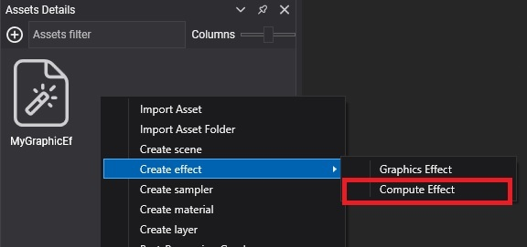
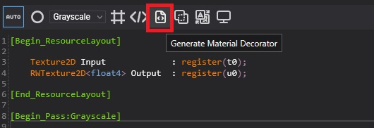
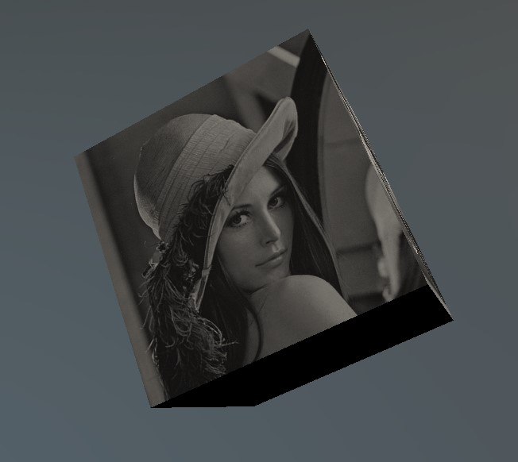

# Create Compute Tasks

---

A **compute task** runs a compute effect on the GPU. Use one for work that is massively parallel and slow on the CPU: image filters, simulations, procedural data.

## Compute Effect

First create a compute effect from the **Assets Details** panel (**Create effect > Compute Effect**) and write the compute shader in HLSL.



### Example
This compute effect converts the input texture to grayscale and writes the result to an output texture. [Create Effects](../effects/create_effects.md) explains the structure of the file.

```hlsl
[Begin_ResourceLayout]

    Texture2D Input             : register(t0);
    RWTexture2D<float4> Output  : register(u0);

[End_ResourceLayout]

[Begin_Pass:Grayscale]

    [Profile 11_0]
    [Entrypoints CS = CS]

    [numthreads(8, 8, 1)]
    void CS(uint3 threadID : SV_DispatchThreadID)
    {
        float4 color = Input.Load(float3(threadID.xy, 0));
        color.rgb = color.r * 0.3 + color.g * 0.59 + color.b * 0.11;
        Output[threadID.xy] = color;
    }

[End_Pass]
```
The pass name, `Grayscale`, is how you select it when you run the task. `[numthreads(8, 8, 1)]` sets the thread group size, which must match the group size you pass to `Run2D`.

## ComputeTask Decorator

From code you work with the compute task through a **decorator**: a generated class with one property per resource of the effect. Generate it from the [Effect Editor](../effects/effect_editor.md).



## Create a new ComputeTask from code

This scene runs the `GPUFilter` compute effect above through its generated `GPUFilter` decorator, and shows the result on a spinning cube.

```csharp
using Evergine.Common.Graphics;
using Evergine.Components.Graphics3D;
using Evergine.Framework;
using Evergine.Framework.Graphics;
using Evergine.Framework.Graphics.Effects;
using Evergine.Framework.Graphics.Materials;
using Evergine.Framework.Services;
using Evergine.Mathematics;

public class ComputeScene : Scene
{
    protected override void CreateScene()
    {
        var graphicsContext = Application.Current.Container.Resolve<GraphicsContext>();
        var assetsService = Application.Current.Container.Resolve<AssetsService>();

        Texture inputTexture = assetsService.Load<Texture>(EvergineContent.Textures.lena_png);
        uint width = inputTexture.Description.Width;
        uint height = inputTexture.Description.Height;

        // UnorderedAccess lets the compute shader write it; ShaderResource lets the material read it.
        var outputTextureDesc = new TextureDescription()
        {
            Type = TextureType.Texture2D,
            Usage = ResourceUsage.Default,
            Flags = TextureFlags.UnorderedAccess | TextureFlags.ShaderResource,
            Format = PixelFormat.R8G8B8A8_UNorm,
            Width = width,
            Height = height,
            Depth = 1,
            MipLevels = 1,
            ArraySize = 1,
            CpuAccess = ResourceCpuAccess.None,
            SampleCount = TextureSampleCount.None,
        };
        Texture outputTexture = graphicsContext.Factory.CreateTexture(ref outputTextureDesc);

        Effect computeEffect = assetsService.Load<Effect>(EvergineContent.Effects.GPUFilter);

        var task = new GPUFilter(computeEffect)
        {
            Input = inputTexture,
            Output = outputTexture,
        };

        // One thread per pixel, in 8x8 groups to match [numthreads(8, 8, 1)].
        task.Run2D(width, height, pass: "Grayscale");

        var material = new StandardMaterial(assetsService.Load<Effect>(DefaultResourcesIDs.StandardEffectID))
        {
            LayerDescription = assetsService.Load<RenderLayerDescription>(DefaultResourcesIDs.OpaqueRenderLayerID),
            BaseColorTexture = outputTexture,
            BaseColorSampler = assetsService.Load<SamplerState>(DefaultResourcesIDs.LinearClampSamplerID),
        };

        Entity cube = new Entity("filteredCube")
            .AddComponent(new Transform3D())
            .AddComponent(new MaterialComponent() { Material = material.Material })
            .AddComponent(new CubeMesh())
            .AddComponent(new Spinner() { AxisIncrease = new Vector3(0.1f, 0.2f, 0.3f) })
            .AddComponent(new MeshRenderer());

        this.Managers.EntityManager.Add(cube);
    }
}
```

The result:



> [!NOTE]
> The overloads without a `CommandBuffer` record the dispatch, submit it to the compute queue and wait until the GPU finishes. That is simple for one-off work at load time. For work that repeats every frame, pass your own command buffer so the dispatch runs with the rest of the frame instead of stalling it.
