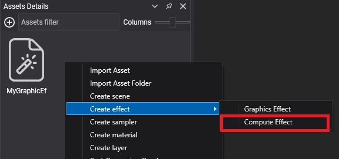
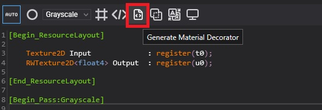
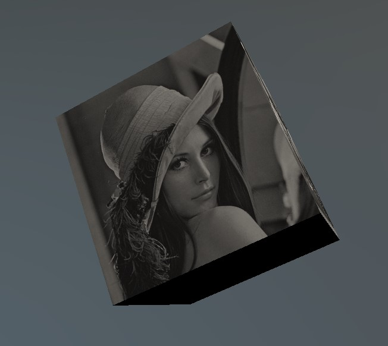

# Create Compute Tasks

**Compute Tasks** allow running tasks on the GPU. Compute tasks are associated with a compute effect. This is very useful to improve the performance of tasks that run slowly on the CPU.

## Compute Effect
Before creating a compute task, you need to create a compute effect from the Assets Details panel and code the task using the [HLSL](https://docs.microsoft.com/en-us/windows/win32/direct3d11/direct3d-11-advanced-stages-compute-shader) language.



### Example
This is an example of a compute task. In this case, the compute task applies a grayscale filter to the input texture and stores the result in an output texture. In [Create Effects](../effects/create_effects.md) you will find the structure of this code.

```csharp
[Begin_ResourceLayout]

    Texture2D Input             : register(t0);
    RWTexture2D<float4> Output  : register(u0);

[End_ResourceLayout]

[Begin_Pass:Grayscale]

    [Profile 11_0]
    [Entrypoints CS = CS]

    [numthreads(8, 8, 1)]
    void CS(uint3 threadID : SV_DispatchThreadID)
    {
        float4 color = Input.Load(float3(threadID.xy, 0));
        color.rgb = color.r * 0.3 + color.g * 0.59 + color.b * 0.11;
        Output[threadID.xy] = color;
    }

[End_Pass]
```
## ComputeTask Decorator

To use a compute task from code, you need a compute effect and the compute task decorator associated with it. You can generate the compute task decorator from the [Effect Editor](../effects/effect_editor.md).



## Create a new ComputeTask from code
The following sample code can be used to create a new `ComputeTask` and run it in your scene. The example assumes that you have a compute effect `GPUFilter` and its compute task decorator created.

```csharp
protected override void CreateScene()
{
    var graphicsContext = Application.Current.Container.Resolve<GraphicsContext>();
    var assetsService = Application.Current.Container.Resolve<AssetsService>();

    // Load input texture
    Texture inputTexture = assetsService.Load<Texture>(EvergineContent.Textures.lena_png);
    uint width = inputTexture.Description.Width;
    uint height = inputTexture.Description.Height;

    // Create output texture
    var outputTextureDesc = new TextureDescription()
    {
        Type = TextureType.Texture2D,
        Usage = ResourceUsage.Default,
        Flags = TextureFlags.UnorderedAccess | TextureFlags.ShaderResource,
        Format = PixelFormat.R8G8B8A8_UNorm,
        Width = width,
        Height = height,
        Depth = 1,
        MipLevels = 1,
        ArraySize = 1,
        Faces = 1,
        CpuAccess = ResourceCpuAccess.None,
        SampleCount = TextureSampleCount.None,
    };
    Texture outputTexture = graphicsContext.Factory.CreateTexture(ref outputTextureDesc);

    // Load compute effect
    Effect computeEffect = assetsService.Load<Effect>(EvergineContent.Effects.GPUFilter);

    // Create compute task decorator
    GPUFilter task = new GPUFilter(computeEffect);
    task.Input = inputTexture;
    task.Output = outputTexture;

    task.Run2D(width, height, pass: "Grayscale");

    // Load the Material and apply output texture.
    Material material = assetsService.Load<Material>(EvergineContent.Materials.DefaultMaterial);
    StandardMaterial standardMaterial = new StandardMaterial(material);
    standardMaterial.BaseColorTexture = outputTexture;

    // Apply to an entity
    Entity primitive = new Entity()
            .AddComponent(new Transform3D())
            .AddComponent(new MaterialComponent() { Material = material })
            .AddComponent(new CubeMesh())
            .AddComponent(new Spinner() { AxisIncrease = new Vector3(0.1f, 0.2f, 0.3f) })
            .AddComponent(new MeshRenderer());

    this.Managers.EntityManager.Add(primitive);

}
```

The result of the above code is:

