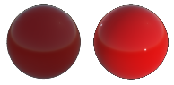
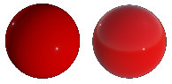
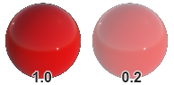
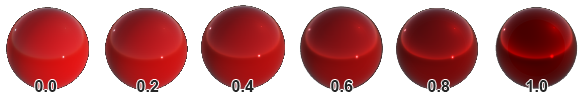
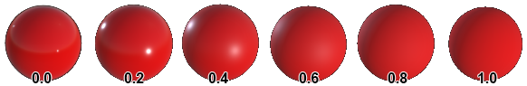
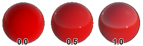

# Built-in Effects

---

The Evergine.Core package, which every project references, includes the effects the engine and its components need. You use most of them indirectly: the Standard effect through the default material, the particle effect through particle systems, the text effect through `Text3D`. This page describes what each one is for and the parameters you can set on its materials.

| Effect | Used by |
| --- | --- |
| [Standard](#standard-effect) | The default material and most imported materials. |
| [SSS](#sss-effect) | Skin and other translucent materials, with the [SSS post-processing effect](../postprocessing_graph/default_postprocessing_graph/subsurface_scattering.md). |
| [Distortion](#distortion-effect) | Heat haze, glass and other refractive surfaces. |
| [Skybox](#skybox-effect) | Skies from an equirectangular HDR image. |
| [Atmospheric](#atmospheric-effect) | The procedural sky of the [sky atmosphere](../environment/sky_atmosphere.md). |
| [Billboard](#billboard-effect) | [Billboards](../billboard/index.md). |
| [Particles](#particles-effect) | [Particle systems](../particles/index.md). |
| [SDFText](#sdftext-effect) | [3D text](../fonts/index.md). |
| [Line](#line-effect) | [Line meshes](../lines_3d.md). |
| LineBatch, RenderQuad, BackgroundImage | Internal: the [line batch](../linebatch/index.md), the copy of each camera's image to its target, and texture previews in Evergine Studio. |

## Standard Effect

The Standard effect is a physically based metallic-roughness shader. It is what the **DefaultMaterial** of Evergine.Core uses, and the defaults below are that material's values.

| Property | Default | Description |
| --- | --- | --- |
| **Lighting enabled** | On | Whether the material is lit by the scene's lights. Unlit materials show their base color as is.    |
| **IBL enabled** | On | Whether the material reflects the environment.    |
| **Base Color** | White | Color of the surface. |
| **Alpha** | 1 | Opacity. It only has an effect with a render layer that blends, such as **Alpha**.    |
| **Vertex Color** | Off | Multiply the base color by the vertex colors of the mesh. |
| **Base Color Texture** | none | Albedo texture. |
| **Base Color Sampler** | none | Sampler for the albedo texture. |
| **UVOffset0** | (0, 0) | Offset added to the texture coordinates. Animate it to scroll a texture. |
| **Texture Tiling** | (1, 1) | Scale of the texture coordinates: (2, 2) repeats textures twice in each direction. Use a wrapping [sampler](../samplers.md) to tile. |
| **Texture Rotation** | 0 | Rotation of the texture coordinates, in degrees in Evergine Studio and radians in code. |
| **Metallic** | 0 | From 0 (dielectric: plastic, wood, stone) to 1 (metal). Real materials are almost always one or the other.    |
| **Roughness** | 0 | From 0 (mirror-smooth) to 1 (fully rough).    |
| **Reflectance** | 0.5 | Reflectance of dielectrics at normal incidence, in place of an index of refraction. 0.5 (4%) suits most materials.    |
| **Alpha Cutout** | 0 | Pixels with alpha below this value are discarded. Any value above 0 enables alpha testing, for foliage and fences. **Reference Alpha** edits the same value without switching alpha testing on. |
| **AllowInstancing** | Off | Let meshes that share this material be drawn with instancing. |
| **OrderBias** | 0 | Moves the material earlier or later within its render layer. |
| **LayerDescription** | Opaque | The [render layer](../renderlayers/index.md) the material is drawn in. |

### Metallic and roughness map

| Property | Description |
| --- | --- |
| **MetalRoughness Texture** | Metallic in the blue channel and roughness in the green channel, per pixel, instead of the constant values above. |
| **MetalRoughness Sampler** | Sampler for the texture. |

### Normal map

| Property | Description |
| --- | --- |
| **Normal Texture** | Tangent-space normal map, which adds surface detail without more polygons. |
| **Normal Sampler** | Sampler for the texture. |

### Ambient occlusion map

| Property | Description |
| --- | --- |
| **Occlusion Texture** | How much ambient light reaches each point, in the red channel, from 0 (none) to 1 (all). |
| **Occlusion Sampler** | Sampler for the texture. |

### Emissive

| Property | Description |
| --- | --- |
| **Emissive Color** | Color of the light the surface emits, for screens, neon and lamps. It is added on top of the lit color. |
| **Emissive Compensation** | Exposure compensation of the emission, in EV. Positive values make the surface brighter than the camera exposure would; negative values darker. With [bloom](../postprocessing_graph/default_postprocessing_graph/bloom.md), bright emission glows. |
| **Emissive Texture** | Per-pixel emission color. |
| **Emissive Sampler** | Sampler for the texture. |

### Clear coat

A clear coat is a thin, transparent varnish over the base layer, as on car paint or lacquered wood.

| Property | Description |
| --- | --- |
| **ClearCoat** | Strength of the clear coat, from 0 to 1. |
| **ClearCoat Roughness** | Roughness of the clear coat, from 0 to 1. |
| **ClearCoat Normal Texture** | Normal map for the clear coat, independent of the base layer's. |
| **ClearCoat Normal Sampler** | Sampler for the texture. |

## SSS Effect

A variant of the Standard effect for materials where light scatters under the surface, such as skin, wax or marble. It has the same base parameters plus:

| Parameter | Default | Description |
| --- | --- | --- |
| **SSSScatter** | 0.03 | How far light scatters under the surface. Requires the **SSSScatter** directive. |
| **SSSIntensity** | 0.1 | Strength of the scattering. |
| **SSSTranslucency** | (0.64, 0.094, 0.063) | Color of light passing through thin parts. Requires the **SSSTranslucency** directive. |
| **SSSBias** | 0.005 | Depth bias used to estimate thickness for translucency. |
| **SSSScatterTexture**, **SSSTranslucencyTexture** | none | Per-pixel versions of the two effects. |

The scattering itself is computed by the [Subsurface Scattering](../postprocessing_graph/default_postprocessing_graph/subsurface_scattering.md) post-processing effect, which must be enabled.

## Distortion Effect

Offsets the image behind the surface, for heat haze, glass or water. The material writes the offset into the GBuffer, and the **Distortion** option of the [tone mapping](../postprocessing_graph/default_postprocessing_graph/tonemapping.md#distortion) node applies it, so that option must be enabled. Evergine.Core includes a ready material, **DistortionMat**.

| Parameter | Default | Description |
| --- | --- | --- |
| **Intensity** | 1 | Strength of the distortion. |
| **Distortion Texture** | none | Texture that encodes how far each point offsets the image behind it. |
| **Sampler** | none | Sampler for the texture. |
| **LayerDescription** | | The render layer of the material. |

## Skybox Effect

Draws an equirectangular (360°) texture as the sky, usually on a large sphere in the **Skybox** render layer. [Environment Textures](../environment/environment_textures.md) shows how to use it for image-based lighting.

| Parameter | Default | Description |
| --- | --- | --- |
| **Texture** | none | The equirectangular texture, ideally HDR. |
| **Intensity** | 1 | Brightness multiplier of the sky. |

## Atmospheric Effect

Renders the physically based sky of the [sky atmosphere](../environment/sky_atmosphere.md), with the sun disk.

| Parameter | Default | Description |
| --- | --- | --- |
| **SunDisk** | directive | Draw the sun disk. |
| **SunSize** | 0.02 | Angular size of the sun disk. |
| **SunSizeConvergence** | 500 | Sharpness of the sun disk's edge. |

## Billboard Effect

Draws [billboards](../billboard/index.md): textured quads that face the camera. Its only resource is the billboard texture.

## Particles Effect

Draws [particle systems](../particles/index.md). Its directives are set by the particle system from its properties: a texture (`Diffuse`), rotation (`Angle`), local or world space (`Space`), GPU simulation (`SBuffer`) and highlight preservation for additive particles (`PreserveHighlights`).

## SDFText Effect

Draws text from a signed distance field font atlas, which stays sharp at any size. `Text3D` uses it.

| Parameter | Default | Description |
| --- | --- | --- |
| **ForegroundColor** | White | Text color. |
| **Thickness** | 0.7 | Distance threshold of the glyph edge, which sets the weight of the text. |
| **PxRange** | 1 | Distance range of the atlas, in pixels. |
| **TextureSize** | (256, 256) | Size of the atlas texture. |

## Line Effect

Draws [line meshes](../lines_3d.md).

| Parameter | Default | Description |
| --- | --- | --- |
| **DiffuseTexture** | none | Texture along the line, with the `Diffuse` directive. |
| **TextureOffset** | (0, 0) | Offset of the texture coordinates. |
| **TextureTiling** | (1, 1) | Tiling of the texture coordinates. |
| **Align** | directive | Orient the line towards the camera. |
