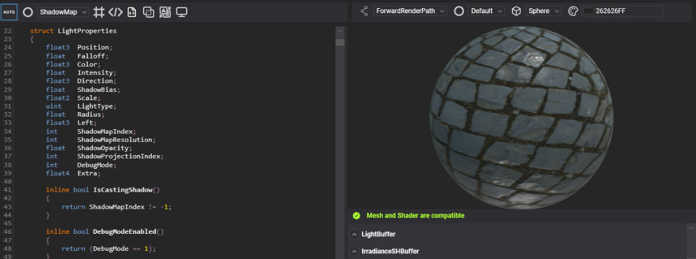
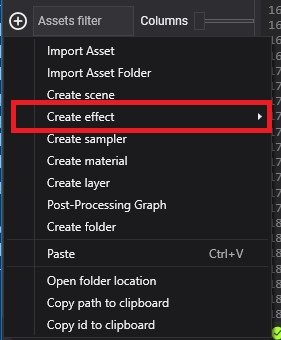
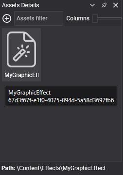
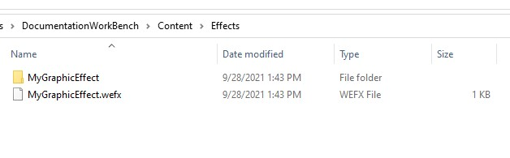

# Create Effects

---



An **effect** is an _uber-shader_: one source file that describes a single shader or a large family of related shaders. This page shows how to create one in Evergine Studio or from code, and walks through the parts of an effect file. There are three kinds of effects:

| Effect type      | Description |
|------------------|-------------|
| Graphics Effect  | Defines a rasterization pipeline with vertex, hull, domain, geometry and pixel shaders. Materials are built from graphics effects. |
| Compute Effect   | Defines a compute pipeline with a compute shader. [Compute tasks](../compute_tasks/index.md) and [post-processing graph](../postprocessing_graph/index.md) nodes are built from compute effects. |
| Library Effect | Defines constants, structures, directives and functions that graphics and compute effects include. Libraries keep shared shader code in one place. See [Library Effects](library_effect.md). |

## Create an Effect Asset in Evergine Studio

Click the  button in the [Assets Details](../../evergine_studio/interface.md) panel and choose **Create effect**, then **Graphics Effect**, **Compute Effect** or **Library Effect**.



### Inspect Effects in Asset Details

You can find the effect assets in the [**Assets Details**](../../evergine_studio/interface.md) panel when you select a folder in the [**Project Explorer**](../../evergine_studio/interface.md).



### Effect Files in the Content Directory

The effect asset has the `.wefx` extension and is always accompanied by a folder with the same name. That folder holds the HLSL source:



## Effect Source Code Example

Effects are written in HLSL, extended with [metatags](effect_metatags.md) in square brackets that tell Evergine how to build, bind and render the shader.

A typical effect looks like this:

```hlsl
[Begin_ResourceLayout]

    [Directives:UseTexture TEX_OFF TEX]

    cbuffer PerDrawCall : register(b0)
    {
        float4x4 WorldViewProj    : packoffset(c0);    [WorldViewProjection]
    };

    cbuffer Parameters : register(b1)
    {
        float3 Color            : packoffset(c0);   [Default(1, 1, 1)]
    };
    
    Texture2D ColorTexture       : register(t0);
    SamplerState ColorSampler    : register(s0);

[End_ResourceLayout]

[Begin_Pass:Default]
    [Profile 10_0]
    [Entrypoints VS=VertexShaderCode PS=PixelShaderCode]

    struct VS_IN
    {
        float4 Position : POSITION;
        #if TEX
        float2 TexCoord : TEXCOORD;
        #endif
    };

    struct PS_IN
    {
        float4 Pos : SV_POSITION;
        #if TEX
        float2 Tex : TEXCOORD;
        #endif
    };

    PS_IN VertexShaderCode(VS_IN input)
    {
        PS_IN output = (PS_IN)0;

        output.Pos = mul(input.Position, WorldViewProj);
        
        #if TEX
        output.Tex = input.TexCoord;
        #endif

        return output;
    }

    float4 PixelShaderCode(PS_IN input) : SV_Target
    {
        float4 color = float4(Color,1);
        
        #if TEX
        color *= ColorTexture.Sample(ColorSampler, input.Tex);
        #endif
        
        return color;
    }

[End_Pass]
```

An effect file in Evergine is divided into the following sections:
* Resource Layout definition
* List of Passes

### Resource Layout Definition

This block declares every resource the passes use: constant buffers, structured buffers, textures and samplers. It sits between the `[Begin_ResourceLayout]` and `[End_ResourceLayout]` tags.

```hlsl
[Begin_ResourceLayout]

    [Directives:UseTexture TEX_OFF TEX]

    cbuffer PerDrawCall : register(b0)
    {
        float4x4 WorldViewProj    : packoffset(c0);    [WorldViewProjection]
    };

    cbuffer Parameters : register(b1)
    {
        float3 Color            : packoffset(c0);   [Default(1, 1, 1)]
    };
    
    Texture2D ColorTexture        : register(t0);
    SamplerState ColorSampler    : register(s0);

[End_ResourceLayout]
```

In this example:
* `[Directives:UseTexture TEX_OFF TEX]` declares a **directive** named `UseTexture`, a switch that turns a feature of the effect on or off.
  * Its two values, `TEX_OFF` and `TEX`, select whether the shader samples a color texture. You can declare as many directives as you need, but every directive multiplies the number of shader combinations that can be compiled.
  * The shader code tests the values with `#if`, `#else` and `#endif`.
* Two constant buffers, a `Texture2D` and a `SamplerState`. Registers of each kind must be consecutive, starting at 0 (`b0`, `b1`...; `t0`...; `s0`...).
* Metatags after a constant buffer field either give it a default value or ask the engine to fill it:
  * `[WorldViewProjection]` makes the engine write the object's world-view-projection matrix into `WorldViewProj` for every draw call.
  * `[Default(1, 1, 1)]` sets the initial value of `Color`, white in this case. Materials created from the effect start with that value.

The [Effect Metatags](effect_metatags.md) page lists every tag.

### List of Passes

After the resource layout come one or more passes, each between `[Begin_Pass:Name]` and `[End_Pass]`. The name tells the render path when to run the pass. The default render pipeline looks for these names:

| Pass name | Run by | Purpose |
| --- | --- | --- |
| `ZPrePass` | `ForwardRenderPath` | Depth prepass that fills the depth buffer before shading. Only materials whose render layer tests and writes depth take part. |
| `GBuffer` | `ForwardRenderPath` | Writes normals, roughness and metallic, motion vectors and distortion to three render targets that post-processing reads. |
| `Default` | `ForwardRenderPath` | The main shading pass. Every graphics effect needs one. |
| `ShadowMap` | `ShadowRenderPath` | Renders depth from a light's point of view to build its shadow map. |

A pass that an effect does not define is skipped for materials of that effect. See [Rendering Overview](../rendering_overview.md) for when each pass runs.

The example effect defines only a `Default` pass:

```hlsl
[Begin_Pass:Default]
    [Profile 10_0]
    [Entrypoints VS=VertexShaderCode PS=PixelShaderCode]

    struct VS_IN
    {
        float4 Position : POSITION;
        #if TEX
        float2 TexCoord : TEXCOORD;
        #endif
    };

    struct PS_IN
    {
        float4 Pos : SV_POSITION;
        #if TEX
        float2 Tex : TEXCOORD;
        #endif
    };

    PS_IN VertexShaderCode(VS_IN input)
    {
        PS_IN output = (PS_IN)0;

        output.Pos = mul(input.Position, WorldViewProj);
        
        #if TEX
        output.Tex = input.TexCoord;
        #endif

        return output;
    }

    float4 PixelShaderCode(PS_IN input) : SV_Target
    {
        float4 color = float4(Color,1);
        
        #if TEX
        color *= ColorTexture.Sample(ColorSampler, input.Tex);
        #endif
        
        return color;
    }

[End_Pass]
```

In this pass:
* `[Profile 10_0]` selects the shader model the pass is compiled with.
* `[Entrypoints VS=VertexShaderCode PS=PixelShaderCode]` names the function that runs at each stage: `VertexShaderCode` for the vertex shader and `PixelShaderCode` for the pixel shader.
* The rest is ordinary HLSL. You can declare structures and functions and use every resource from the resource layout.

## Create an Effect from Code

`EffectFromCode` compiles an effect from a source string at runtime. It is convenient for prototypes and generated shaders, but each combination is compiled on the device the first time it is used, so prefer effect assets for anything you ship.

```csharp
using Evergine.Common.Graphics;
using Evergine.Components.Graphics3D;
using Evergine.Framework;
using Evergine.Framework.Graphics;
using Evergine.Framework.Graphics.Effects;
using Evergine.Framework.Services;

public class MyScene : Scene
{
    private const string ShaderSource = @"
        [Begin_ResourceLayout]

            cbuffer PerDrawCall : register(b0)
            {
                float4x4 WorldViewProj : packoffset(c0); [WorldViewProjection]
            };

            cbuffer Parameters : register(b1)
            {
                float3 Color : packoffset(c0); [Default(1.0, 0.0, 0.0)]
            };

        [End_ResourceLayout]

        [Begin_Pass:Default]
            [Profile 10_0]
            [Entrypoints VS=VS PS=PS]

            struct VS_IN
            {
                float4 Position : POSITION;
                float3 Normal   : NORMAL;
                float2 TexCoord : TEXCOORD;
            };

            struct PS_IN
            {
                float4 Pos : SV_POSITION;
            };

            PS_IN VS(VS_IN input)
            {
                PS_IN output = (PS_IN)0;
                output.Pos = mul(input.Position, WorldViewProj);
                return output;
            }

            float4 PS(PS_IN input) : SV_Target
            {
                return float4(Color, 1);
            }

        [End_Pass]
    ";

    protected override void CreateScene()
    {
        var graphicsContext = Application.Current.Container.Resolve<GraphicsContext>();
        var assetsService = Application.Current.Container.Resolve<AssetsService>();

        Effect effect = new EffectFromCode(graphicsContext, ShaderSource);

        // A material needs a render layer to know its blend, depth and cull state.
        Material material = new Material(effect)
        {
            LayerDescription = assetsService.Load<RenderLayerDescription>(DefaultResourcesIDs.OpaqueRenderLayerID),
        };

        Entity sphere = new Entity("sphere")
            .AddComponent(new Transform3D())
            .AddComponent(new MaterialComponent() { Material = material })
            .AddComponent(new SphereMesh())
            .AddComponent(new MeshRenderer());

        this.Managers.EntityManager.Add(sphere);
    }
}
```
