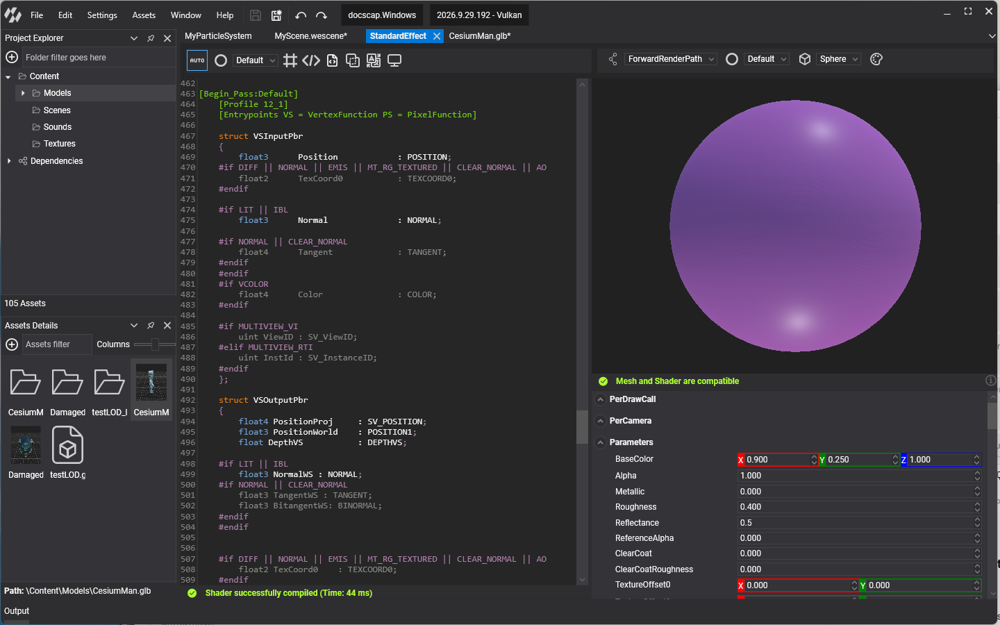
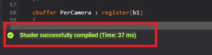
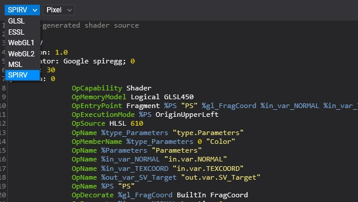
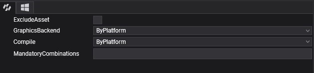
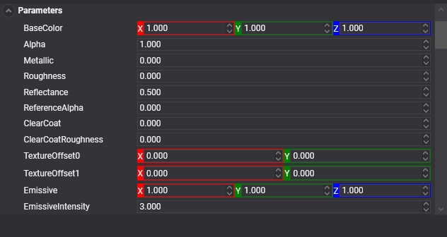

# Effect Editor

---

The **Effect Editor** is where you write and test effects. Double-click an effect asset in [Assets Details](../../evergine_studio/interface.md) to open it. It has two parts: the shader text editor and the viewport.

## **Shader Text Editor**

The shader text editor is where you write the effect in [HLSL](https://learn.microsoft.com/windows/win32/direct3dhlsl/dx-graphics-hlsl) with [metatags](effect_metatags.md). It marks errors, highlights syntax and completes code (`Ctrl+Space`).

| Actions  | Description |
|----------|-------------|
| Ctrl+Space | Code completion. |
| Ctrl+F     | Search word toolbox. |
| Alt+Left mouse button | Edit multiple code lines. |

The effect is compiled automatically while you are writing the shader, and at the bottom of the editor, you can see the compilation process result.

When the compilation results in errors, you can click on the error text, and the editor will mark the error line and scroll the view to it.

### **Toolbox**

The shader text editor has a toolbox that helps you with several important tasks such as enabling/disabling directives, generating the associated material decorator, or configuring effect asset properties. The complete options list is:

| Icon  | Description |
|-------|-------------|
| | Toggle button to indicate if the automatic compilation mode is enabled or manual compilation mode _(Key `F5`)_ is enabled. |
| | Combo box to enable the current effect pass. |
| | Shows the effect directive list and allows enabling/disabling combinations. |
| | Allows adding common snippet codes into your effects. |
| | Generates the Material Decorator class in your project. |
| | Compiles all directive combinations and shows the combinations with errors. |
| | Shows the HLSL translated to the language of another backend: `SPIRV` (Vulkan), `GLSL` and `ESSL` (OpenGL and OpenGL ES), `WebGL1` and `WebGL2`, `MSL` (Metal) or `WGSL` (WebGPU). |
| | Allows configuring the asset profile, such as excluding an effect on a single platform or pre-compiling an effect for a single platform. |

### Translation Panel

The translation panel is shown below the shader text editor after clicking on the  button. It shows the current pass and directive combination translated to another language. One combo box selects the language (`GLSL`, `ESSL`, `WebGL1`, `WebGL2`, `WGSL`, `MSL` or `SPIRV`) and the other the stage (for example _Vertex_, _Pixel_ or _Compute_).

### Profile Panel

This panel allows configuring the effect asset properties by platform. The first tab is the default or global configuration, but you can modify the default configuration using the platform tabs.

The effect asset properties are:

| Property       | Values                                            | Description |
|----------------|---------------------------------------------------|-------------|
| ExcludeAsset   | True, false                                       | If enabled, the effect asset will be excluded in the building project for the platform. If enabled in the Default configuration tab, the asset will never be included in the build project process. |
| GraphicsBackend | ByPlatform, DirectX11, DirectX12, OpenGL, OpenGLES, Metal, Vulkan, WebGL1, WebGL2, or WebGPU | Defines the backend and languages that the effect will be translated and compiled for. The ByPlatform value indicates that the data will be retrieved from project settings (`weproj` file).|
| Compile       | ByPlatform, Yes, or No                             | Defines if the effect will be pre-compiled or not. The ByPlatform value indicates that the data will be retrieved from project settings (`weproj` file). |

## **Viewport**

The viewport shows the result of the current effect in real-time. Text at the bottom of the viewport indicates whether the primitive mesh vertex input is compatible with the vertex input shader because otherwise, it will be impossible to display the result.

| Actions              | Description |
|----------------------|-------------|
| Left mouse button    | Rotate the camera around the primitive. |
| Right mouse button   | Rotate two lights around the primitive. |
| Mouse wheel          | Zoom in/out camera. |

### **Toolbox**

The viewport toolbox is on the top side of the Viewport and has the following options:

| Icon  | Description |
|-------|-------------|
|  | The render path of the viewport. `DebugRenderPath`, the default, draws only the pass selected next to it, which lets you check each pass of the effect on its own. `ForwardRenderPath` renders the primitive as a scene camera would, with all its passes. |
|              | The pass `DebugRenderPath` draws. |
|    | Allows changing the primitive used by the viewport. |
|   | Allows changing the background color of the viewport. |

### **Input Resources and Properties**

The property list panel below the viewport allows testing the effect with different values for constant buffer properties, textures, or samplers. The viewport updates automatically with these changes.

The resources and properties update automatically with any change in the effect resource layout block. The values are not stored and are only useful for testing purposes.