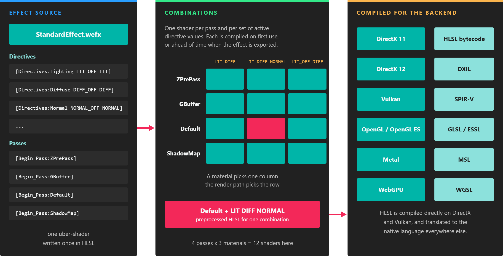

# Effects

---

An **effect** is an _uber-shader_: a single source that describes a whole family of GPU programs. It declares the resources its shaders read, the **directives** that switch features on and off, and the **passes** the render pipeline runs. Every material is an instance of an effect with its own parameter values and active directives.

Effects are written in [HLSL](https://learn.microsoft.com/windows/win32/direct3dhlsl/dx-graphics-hlsl), extended with [metatags](effect_metatags.md). HLSL is compiled directly for DirectX and Vulkan and translated automatically to GLSL, ESSL, MSL or WGSL for the other backends, so you write each effect once.

## Built-in effects

The Evergine.Core package, which every project references, includes the effects the engine needs. The most important is the [Standard effect](builtin_effects.md#standard-effect), a physically based shader used by the default material. See [Built-in Effects](builtin_effects.md) for all of them.

Effects are assets with their own editor, the [Effect Editor](effect_editor.md).

## In this section

* [Create Effects](create_effects.md)
* [Library Effects](library_effect.md)
* [Effect Metatags](effect_metatags.md)
* [Using Effects](using_effects.md)
* [Effect Editor](effect_editor.md)
* [Built-in Effects](builtin_effects.md)
