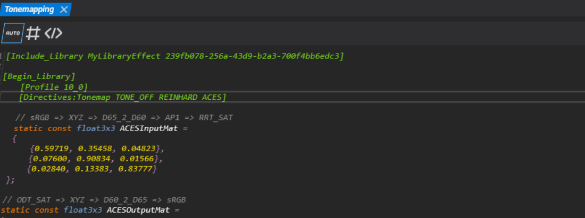
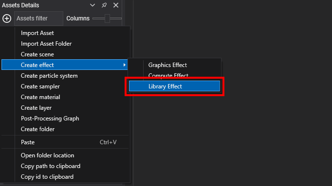
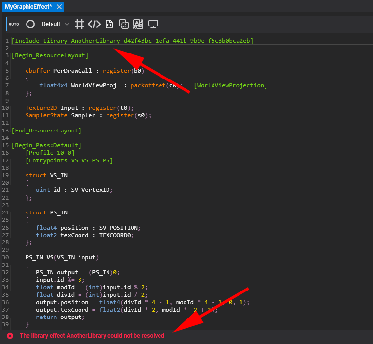
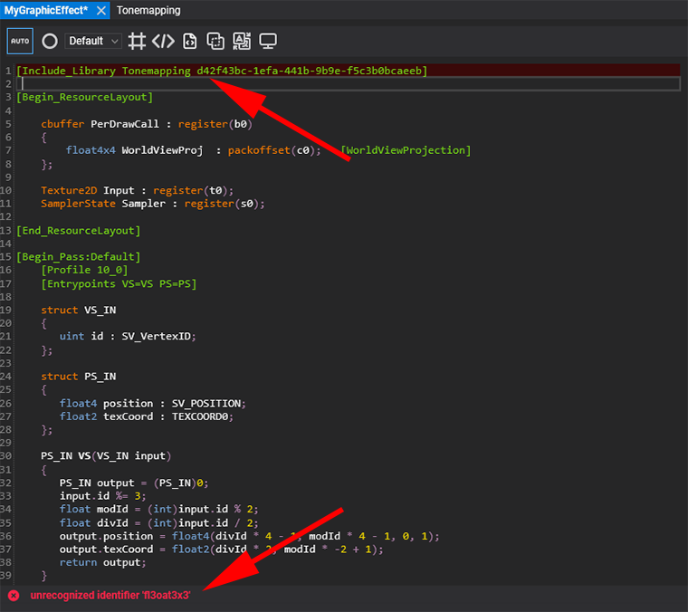
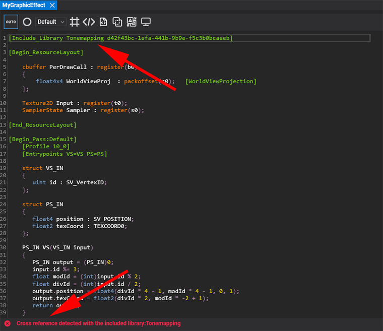

# Library Effects

---



A **library effect** holds shader code that several effects share: constants, structures, directives and functions. Graphics and compute effects include it with one line, so a fix or an improvement in the library reaches every effect that uses it. The Standard effect itself is built this way, from the `Common`, `Structures`, `Lighting`, `Shadow` and `Material` libraries of Evergine.Core.

## Create a library effect

In the **Assets Details** panel, click the  button, or right-click, and choose **Create effect > Library Effect**.



## Define a library effect

A library is a single `[Begin_Library]` ... `[End_Library]` block, with no resource layout or passes. It needs a `[Profile]` because Evergine compiles it on its own, which reports errors in the library before any effect includes it.

This library implements an approximation of the ACES tone mapping curve:

```hlsl
[Begin_Library]
    [Profile 10_0]

    // Curve fit of the ACES filmic tone mapping curve.
    float3 ACESFitted(float3 color)
    {
        const float a = 2.51;
        const float b = 0.03;
        const float c = 2.43;
        const float d = 0.59;
        const float e = 0.14;
        return saturate((color * (a * color + b)) / (color * (c * color + d) + e));
    }

[End_Library]
```

## Include a library

Add an `[Include_Library]` line at the top of the effect, before the resource layout:

`[Include_Library LibraryName LibraryId]`

* **LibraryName**: a readable name for the library.
* **LibraryId**: the GUID of the library effect asset.

Because the reference is the asset id, you can move or rename the library without breaking the effects that include it. The quickest way to get the line right is to drag the library asset from **Assets Details** into an effect open in the Effect Editor, which writes it for you:


A compute effect that tone maps its input with the library above:

```hlsl
[Include_Library Tonemapping 3f1b2c4d-5e6f-4a7b-8c9d-0e1f2a3b4c5d]

[Begin_ResourceLayout]

    Texture2D Input : register(t0);
    RWTexture2D<float4> Output : register(u0); [Output(Input)]

[End_ResourceLayout]

[Begin_Pass:Default]
    [Profile 11_0]
    [Entrypoints CS=CS]

    [numthreads(8, 8, 1)]
    void CS(uint3 threadID : SV_DispatchThreadID)
    {
        float3 hdr = Input[threadID.xy].rgb;
        Output[threadID.xy] = float4(ACESFitted(hdr), 1);
    }

[End_Pass]
```

Replace the GUID with the id of your library asset.

## Libraries that include libraries

A library can include other libraries the same way, so shared code forms a dependency tree. Each library is added once, however many times it is included.

```hlsl
[Include_Library Common 7efb1394-cf61-4617-8dad-8dc5c7d46164]

[Begin_Library]
    [Profile 10_0]

    // PI comes from the Common library of Evergine.Core.
    float3 LambertDiffuse(float3 albedo)
    {
        return albedo / PI;
    }

[End_Library]
```

## Directives in libraries

A library can declare [directives](effect_metatags.md#directives) inside its block. When an effect includes the library, those directives are merged with the effect's own and with those of every other library it includes, into a single set. Materials of the effect can then switch them like any other directive.

```hlsl
[Begin_Library]
    [Profile 10_0]

    [Directives:ToneCurve CURVE_ACES CURVE_REINHARD]

    float3 ToneMap(float3 color)
    {
    #if CURVE_REINHARD
        return color / (1 + color);
    #else
        return ACESFitted(color);
    #endif
    }

[End_Library]
```

> [!TIP]
> A pass only creates combinations for the directives it actually tests. When a directive is tested inside a library function the pass calls, list it in the pass's `[UsedDirectives ...]` so that the pass is compiled for each of its values.

## Errors in libraries

The Effect Editor analyzes includes as you type and reports three kinds of problems:

1. **Unresolved reference.** The id in `[Include_Library]` does not match any library asset.

   

2. **Error in the library.** The include line is marked in your effect, and the error is shown inside the library.

   

3. **Cyclic reference.** Two libraries include each other, directly or through other libraries.

   
