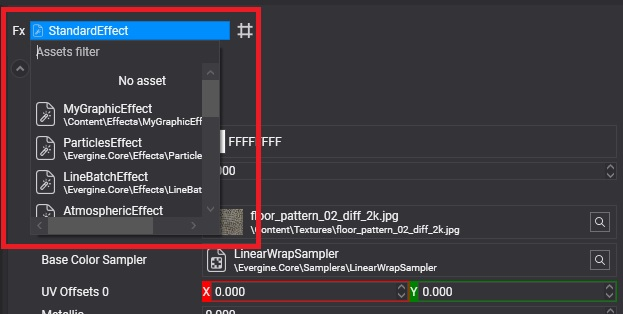

# Using Effects

---


You rarely use an effect directly. An effect becomes visible through a **material** that references it and sets its parameters, and the material is what you assign to meshes. This page shows how to pick the effect of a material, how to create a material from an effect in code, and how effects are compiled for each platform.

## Choose the effect of a material in Evergine Studio

In the [Material Editor](../materials/material_editor.md), the effect selector at the top of the properties sets the effect the material uses:



## Create a material from an effect in code

```csharp
using Evergine.Common.Graphics;
using Evergine.Components.Graphics3D;
using Evergine.Framework;
using Evergine.Framework.Graphics;
using Evergine.Framework.Graphics.Effects;
using Evergine.Framework.Services;

public class MyScene : Scene
{
    protected override void CreateScene()
    {
        var assetsService = Application.Current.Container.Resolve<AssetsService>();

        Effect standardEffect = assetsService.Load<Effect>(DefaultResourcesIDs.StandardEffectID);

        Material material = new Material(standardEffect)
        {
            LayerDescription = assetsService.Load<RenderLayerDescription>(DefaultResourcesIDs.OpaqueRenderLayerID),
        };

        Entity sphere = new Entity("sphere")
            .AddComponent(new Transform3D())
            .AddComponent(new MaterialComponent() { Material = material })
            .AddComponent(new SphereMesh())
            .AddComponent(new MeshRenderer());

        this.Managers.EntityManager.Add(sphere);
    }
}
```

A `Material` created this way exposes the effect's parameters through its constant buffers and texture slots. For typed access, use the [material decorator](../materials/material_decorators.md) generated for the effect, such as `StandardMaterial` for the Standard effect.

## Compile on demand or ahead of time

Each combination of pass and directives is a separate shader. Evergine can compile them in two ways:

* **On demand.** The first time a material needs a combination, the effect is compiled on the device. Nothing is prepared in advance, but that first use causes a hitch while it compiles. This is the default for Windows profiles.
* **Ahead of time.** When the project is built, every combination the project needs is compiled and stored with the effect, and nothing is compiled on the device. This is the default for web, Android and iOS profiles, where compiling at runtime is slow or unavailable.

For ahead-of-time compilation, Evergine collects the combinations from the materials in your project, the mandatory combinations of the effect and the **Additional Effect Technique Combinations** of the [profile](../../evergine_studio/settings/project_profiles.md), which lists combinations that only appear at runtime, such as shadow filtering or the kinds of lights in the scene.

The **Compile** setting in the profile panel of the [Effect Editor](effect_editor.md#profile-panel) overrides this per effect: `ByPlatform` follows the project profile, and `Yes` or `No` force it.

> [!IMPORTANT]
> With ahead-of-time compilation, a combination nobody declared is missing at runtime. If you switch directives from code, or create materials in code with combinations no material asset uses, add those combinations to the profile's list.
