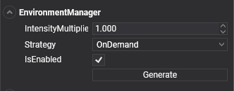

# Environment Manager

---

The **EnvironmentManager** is a [SceneManager](../../basics/scenes/scenemanagers.md) responsible for controlling and providing the environmental lighting of the scene.

## EnvironmentManager

| Properties            | Default           | Description                                                                                                                                                                                                                                                                                    |
|-----------------------|-------------------|------------------------------------------------------------------------------------------------------------------------------------------------------------------------------------------------------------------------------------------------------------------------------------------------|
| **IntensityMultiplier** | 1.0               | This value modifies the overall intensity of the environmental lighting. It is useful for increasing or reducing the IBL intensity. *This property doesn't affect regular Lights (DirectionalLights, PointLights, etc...).*                                                                 |
| **IBLReflectionProbe**  | scene probe       | The `ReflectionProbe` asset with the IBL of the scene: `IBLRadianceTexture` (specular), `IBLIrradianceTexture` (diffuse) and `IBLIrradianceSH` (diffuse as spherical harmonics). Evergine Studio generates it; you can also assign one. |
| **Strategy**            | `Automatically`   | This property indicates to Evergine Studio how often the Environment will be generated. <ul><li>**Automatically:** Evergine Studio updates the scene IBL automatically every time it detects that an update is needed (Sun direction changes, skybox material changes, etc...)</li><li>**OnDemand:** Only updates the scene IBL on demand, when the user wants it. When this option is selected, a `Generate` button appears. Clicking this button forces Evergine Studio to recreate the scene IBL.</li></ul> |

| **SunLight** | the light with a `SunComponent` | The directional light used as the sun by the sky atmosphere and by the `[SunDirection]`, `[SunColor]` and `[SunIntensity]` effect parameters. |

> [!NOTE]
> Older projects configured the environment with an `EnvironmentComponent`. It is obsolete: configure the `EnvironmentManager` in the **Scene Managers** panel instead.

## "Skybox" entity tag

By default, Evergine Studio automatically creates environmental lighting for each scene. To do this, it creates a cubemap from the (0,0,0) position and includes all [entities](../../basics/component_arch/entities/index.md) with the "Skybox" tag property.

When you create a new scene in Evergine Studio, it will by default create a Sphere Dome entity called "SkyAtmosphere," which renders a sky environment controlled by a DirectionalLight marked as Sun.