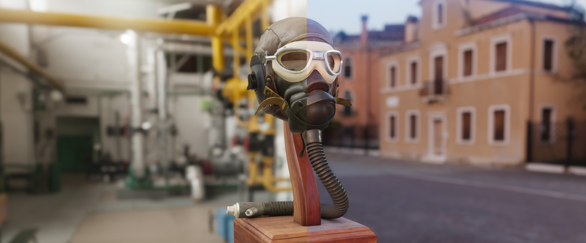
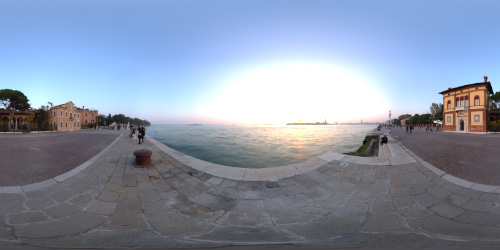

# Environment Textures

This is the best way to transfer the illumination of an equirectangular HDR image to your scene.

## Equirectangular Textures

An equirectangular image is created to convert a 360º view into a 2D texture. It usually has an aspect ratio of 2:1. 

Using HDR equirectangular images (generally `.hdr` format) will produce more realistic illumination. On the [Poly Haven](https://polyhaven.com/hdris) site, you can find many environment textures grouped by categories (outdoor, skies, indoor, night, etc.)

## SkyboxEffect

In Evergine, to create environment lighting from an equirectangular image, you need to create an environment sphere dome with a SkyboxEffect material that will use the HDR environment texture.

The SkyboxEffect only has 3 useful properties:

| Property | Description |
| --- | --- |
| **Texture** | The equirectangular image to use as the environment. |
| **TextureSampler** | The SamplerState used to sample the texture. |
| **Parameters_Intensity** | A factor that modifies the intensity of the texture. This is used to increase or reduce the brightness of the texture. |

> [!WARNING]
> If you want to use this effect with a common SphereMesh, use the **Skybox** layer in the LayerDescription property.

## Using Skybox Material

Steps to create environmental lighting using an equirectangular image:

1. Import an equirectangular HDR image into your Evergine project.
2. Create a new SkyboxEffect material.
3. Edit the new SkyboxEffect material, and set the Texture property with the imported equirectangular image.
4. Assign the Skybox LayerDescription to the new SkyboxEffect material.
5. Now you have two options:
    - **Option A (reuse the SkyAtmosphere):** 
      - Select the SkyAtmosphere entity, and in the MaterialComponent, set the new SkyboxEffect material. This will override the AtmosphereController appearance.
    - **Option B (create a new sky dome):**
      1. Create a new Sphere primitive in your scene, and assign the new SkyboxEffect material.
      2. In the new entity, set the Tag property to "Skybox".
      3. Delete the SkyAtmosphere entity.