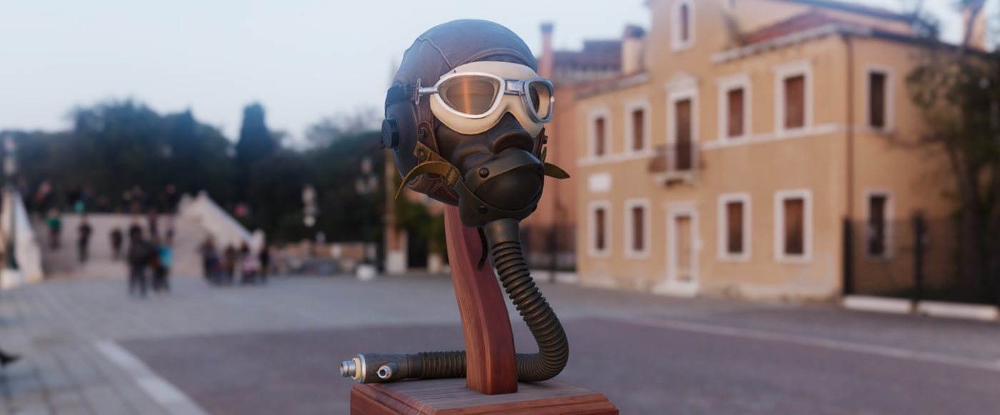
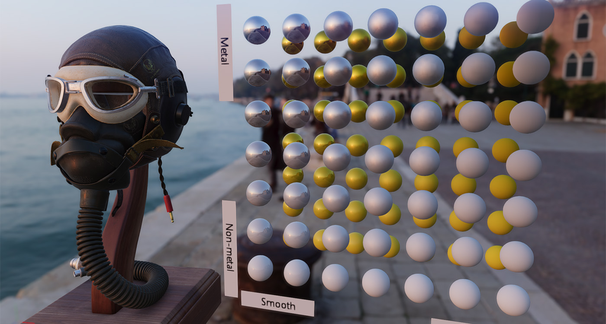
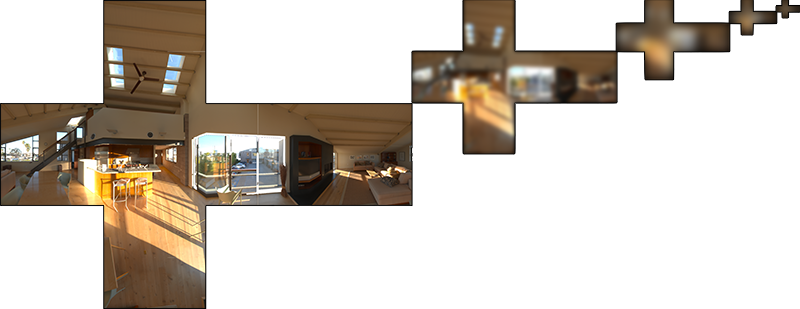
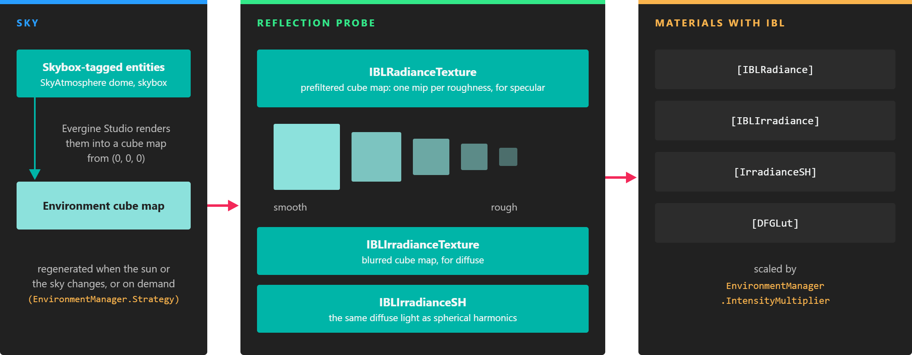

# Environment

---

The **environment** is the light that comes from everywhere around the scene: the sky, distant surroundings, a studio backdrop. Evergine lights scenes with it through **image-based lighting**, which gives materials their ambient light and reflections. This section explains how the environment is produced and how to control it.

## Image Based Lighting (IBL)

**Image Based Lighting (IBL)** is a rendering technique that involves capturing an omnidirectional representation of real-world light information as an image, typically using a 360° camera. This image is then projected onto a dome or sphere, similar to environment mapping, and is used to simulate the lighting for objects in the scene. This allows highly detailed real-world lighting to be used to light a scene instead of trying to accurately model illumination using an existing rendering technique.

Image-based lighting often uses **high-dynamic-range** (HDR) imaging for greater realism.

IBL involves the creation of two lighting components:
- **Irradiance map** (Diffuse): For the diffuse illumination, we need what is called an Irradiance Map. This usually involves a cubemap (or Spherical Harmonics) that stores the amount of light coming from each direction.
- **Radiance map** (Specular): For specular illumination, we need a texture called **Pre-filtered Mip-Mapped Radiance Environment Map (PMREM)**. This is another cubemap that pre-calculates the reflected environment. Additionally, it stores different reflections for various roughness values in its MipMap levels.  [*Credits LearnOpenGL*](https://learnopengl.com/PBR/IBL/Specular-IBL)

In Evergine, the environment comes from the entities tagged **Skybox** (by default, the sky atmosphere dome). Evergine Studio captures them into a cube map and filters it into a `ReflectionProbe`, which the `EnvironmentManager` of the scene hands to every material with IBL enabled:

*The radiance texture keeps one mip per roughness level, so rough materials read blurrier reflections. The irradiance gives the diffuse ambient light.*

## In this section

* [Environment Manager](environment_manager.md)
* [Sky Atmosphere](sky_atmosphere.md)
* [Environment Textures](environment_textures.md)