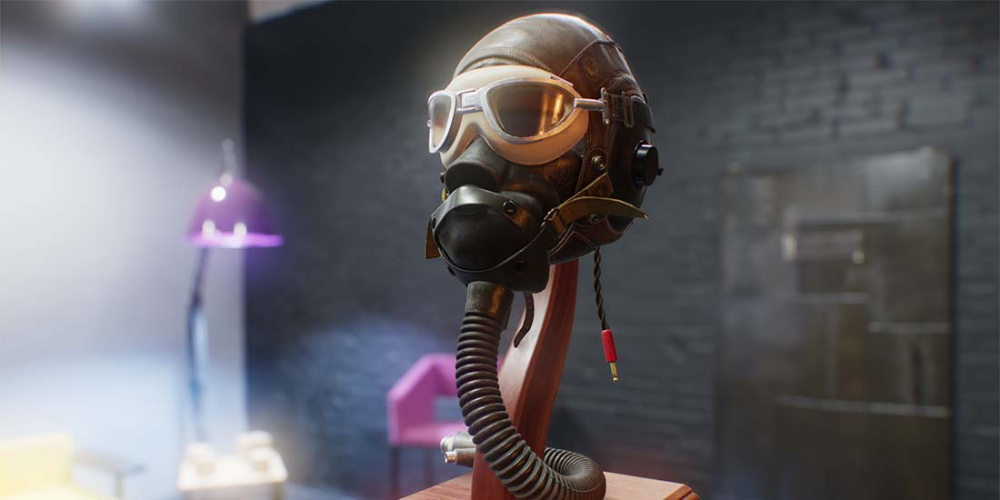
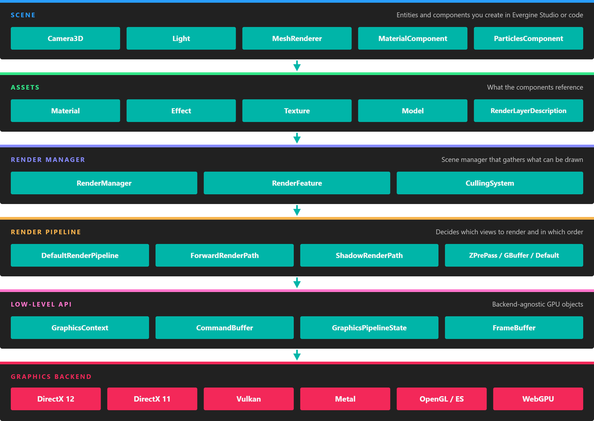

# Graphics

---

Evergine renders with a physically based, forward rendering pipeline that runs on DirectX, Vulkan, Metal, OpenGL and WebGPU from the same content, on platforms from phones and standalone XR headsets to desktop. This section covers everything that decides how a scene looks: cameras and lights, the effects, materials and textures that describe surfaces, the geometry they are applied to, and the post-processing that finishes the image.

## How the pieces fit

*You work at the top two layers. Components reference assets; the render manager and the render pipeline turn them into GPU work through the low-level API, which each backend implements.*

* The **scene** holds entities with graphics components: a [camera](cameras.md) to look through, [lights](lights.md), and drawables such as `MeshRenderer`, [particles](particles/index.md), [billboards](billboard/index.md), [lines](lines_3d.md) and [text](fonts/index.md).
* Those components reference **assets**, many of them provided by the [Evergine.Core package](evergine_core.md): [models](models/index.md) and [meshes](meshes/index.md) for geometry, [materials](materials/index.md) built from [effects](effects/index.md) for the surface, [textures](textures/index.md) and [samplers](samplers.md), and [render layers](renderlayers/index.md) that set blending and draw order.
* The **render manager** of the scene collects everything that can be drawn, and the **render pipeline** renders it for each camera, with shadow maps for the lights and the [post-processing graph](postprocessing_graph/index.md) at the end. [Rendering Overview](rendering_overview.md) explains a frame step by step.
* Everything reaches the GPU through the [low-level API](low_level_api/index.md), which runs on each of the [supported graphics backends](supported_backends/index.md).

## In this section

* [Rendering Overview](rendering_overview.md)
* [Supported Graphics Backends](supported_backends/index.md)
* [Cameras](cameras.md)
* [Lights](lights.md)
* [Effects](effects/index.md)
* [Materials](materials/index.md)
* [Textures](textures/index.md)
* [Samplers](samplers.md)
* [Render Layers](renderlayers/index.md)
* [Models](models/index.md)
* [Meshes](meshes/index.md)
* [Primitives](primitives.md)
* [Post-Processing Graph](postprocessing_graph/index.md)
* [Particle System](particles/index.md)
* [Compute Tasks](compute_tasks/index.md)
* [Environment](environment/index.md)
* [Line Batch](linebatch/index.md)
* [Lines 3D](lines_3d.md)
* [Billboards](billboard/index.md)
* [Fonts and Texts](fonts/index.md)
* [Evergine.Core Package](evergine_core.md)
* [Low-level API](low_level_api/index.md)
